# Setup

<table class="components noBorder">
<tr><td>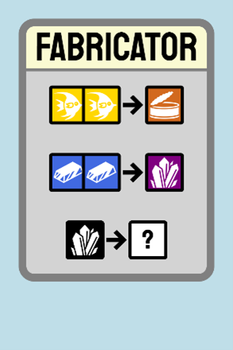</td><td>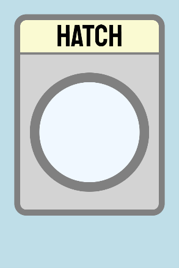</td><td>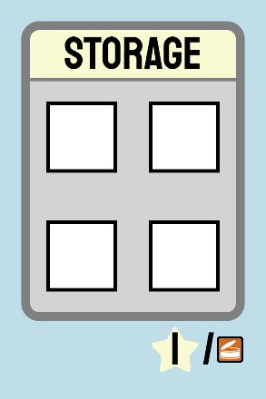</td></tr>
</table>

1. Each player takes a “Fabricator”, “Hatch”, and “Storage” card. These form their starting habitat.

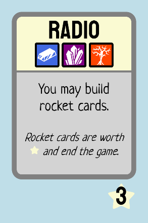

2. Each player takes a “Radio” card. This forms their starting hand.

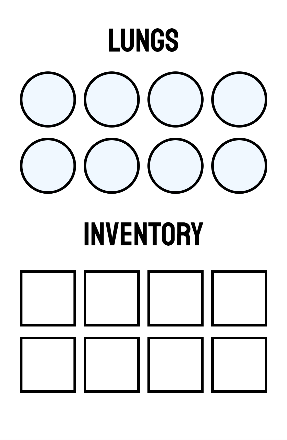

3. Each player takes a large “Lungs/Inventory” player board
  - 3.1. Cover up 2 columns of “Lungs” with the “Rebreather” and “Air Tank” tiles
  - 3.2. Cover up 2 columns of “Inventory” with the “Swim Bag” and “Back Pack” tiles

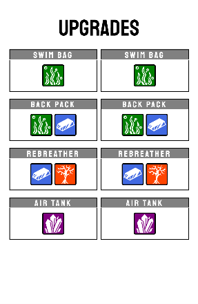

4. Each player takes a large “Upgrades” player board
  - 4.1. Cover up “Fins”, “Knife”, and “Sea Glide” with the corresponding tiles
  - 4.2. Cover up the “Explore” milestones with the corresponding “40m”, “60m”, “80m”, and “100m” tiles

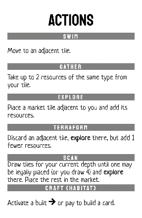

5. Optionally each player may take an “Actions” player aid card
6. Give each player 4 air tokens, which they place on their “Lungs” grid.

<table class="components">
<tr><th>20m</th><th>40m</th><th>60m</th><th>80m</th><th>100m</th></tr>
<tr><td>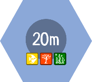</td><td>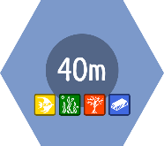</td><td>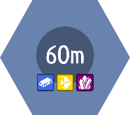</td><td>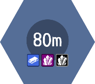</td><td>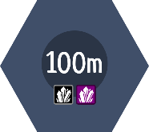</td></tr>
</table>

7. Separate all hex tiles into different stacks separated by depth (20m, 40m, etc.)
8. Shuffle each hex tile stack.
9. Create room below the stacks for a hex tile market.
10. Shuffle the blueprint cards and set aside as a face-down deck.
11. Set the rocket cards aside.
12. Form a supply of resource tokens (fish, kelp, coral, titanium, quartz, diamond)
13. <mark>Use the set aside starting tiles to create the initial board</mark>
  - <mark>13.1. Place resources on those tiles</mark>
14. Each player chooses a player pawn and places it in their Hatch
15. Randomly determine a starting player

# Your Turn
On your turn you take up to 2 actions, and then breathe.
- You may perform the same action more than once
- You may take 0 or 1 actions if you like

## Action
### Swim
Move your player pawn from its current hex tile to an adjacent hex tile.
- The contents of the hex tile (water, land) don’t inhibit movement.
- <mark>You may consider your Hatch to be an adjacent to hexes</mark>

### Gather
Take up to 2 resources of the same type from your current hex tile. Put those resources in open cells in your inventory grid.
- You may voluntarily return any resources in your inventory to the supply in order to make room for new gathered resources

### Explore
Place a tile from the tile market adjacent to your current tile. Add the resources on the tile from the supply.

#### Legal tile placement
- A tile may only be placed if its edge types (either water or rock) match the connected edge types of all adjacent tiles. Water edges cannot touch rock edges.
- Tiles have a fixed orientation. You may not rotate them. 

#### Achievements
- When you explore a new depth for the first time you gain a bonus. Remove the matching depth tile from your “Upgrades” board. Draw a blueprint card.

### Scan
Determine your current depth by counting depth lines between your current hex and <mark>the surface</mark>. You may choose any of the hex tile decks of your current depth or lower (e.g. if you are at 40m you may choose the 40m deck or the 20m deck).

Draw hex tiles from that deck until you draw a tile that may be <mark>legally placed</mark> adjacent to your current tile, or until you have drawn 4 tiles.

Place the legal tile in a spot adjacent to your current tile. Add the resources specified on the tile from the supply.

Put all tiles that were drawn and not placed in the hex tile market. If there are more than 4 tiles in the market choose and return tiles to the bottom of their decks until there are 4 tiles in the market.

### Terraform
Perform an Explore action as above, but the new tile may be placed on top of an existing adjacent tile as long as the new tile would still fit the rules for legal placement. Return all resources on the old tile to the supply. The new tile gets one fewer resource (of your choice) than it would normally.

### Convert
While in your habitat you may use any of your built cards (including your “Fabricator” to convert resources. These abilities show the <mark>-></mark> icon. You may pay resources from your “Inventory” or from your “Storage” to fuel these conversions. Return the spent resources to the supply.

<mark>You may freely move resources between your “Inventory” and “Storage” as a free action while in your habitat.</mark>

### Craft
While in your habitat you may pay resources (from a combination of your “Inventory” and your “Storage”) to build habitat cards or rocket cards.

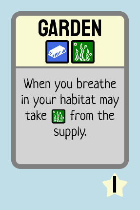 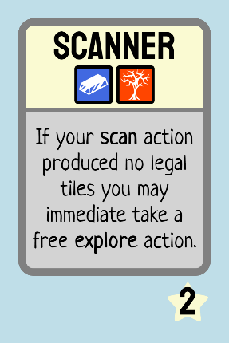 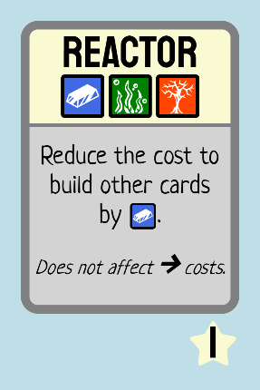
     
The resources required are listed at the top of the card. Once built the card goes in front of you. It will be worth victory points equal to the starred number at the bottom of the card, and generally it will also have an ability.

#### Upgrades
You may also craft the upgrades on your “Upgrades” board. These have costs on the tiles. When paid for as your Craft action you remove the tile and return it to the game box. You now have the revealed ability that was underneath the tile.
- You may look at the ability underneath the tiles at any time.

#### Rocket Cards
Rocket cards can only be crafted once you have completed your “Radio” blueprint. The rocket cards are communal; you don’t need to have them in your hand to complete them. When the last rocket card is completed the game is over.

## Breathe
After taking your actions you must breathe.
- You are “in your habitat” if you are on a Hatch space.

If you are not in your habitat you must spend one air token from your “Lungs”. Otherwise you drown. When you drown you lose 1 resource from your “Inventory” (chosen randomly) for <mark>each depth level between you and the surface</mark>. Then fill up your “Lungs” with air tokens until half of the grid spaces are covered.

If instead you are in your habitat add air tokens until your “Lungs” grid is full.

# End of Game
The game is over when the last rocket card has been completed.

Players tally their completed blueprints, rocket cards, completed upgrades/achievements, and food resources in their “Storage”. The player with the most points wins. In the case of a tie, the player who completed the final rocket card decides the tie.
