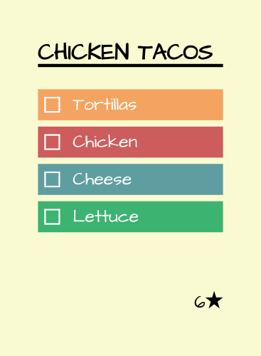
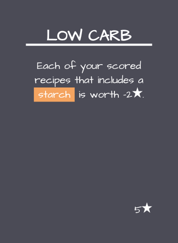
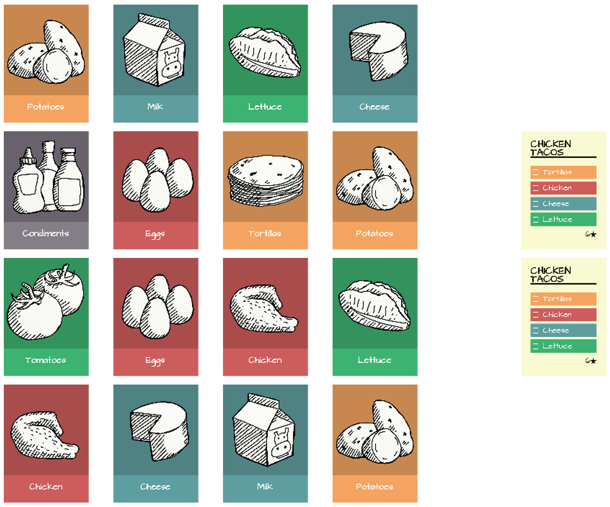

You and your friends have all gathered to cook a tremendous feast! But you all need to work from the contents of the same refridgerator… and some of the food inside has started to look questionable. Be creative and get as many dishes to the table as you can!

# Components
42 two-faced ingredient cards

| Fresh | Spoiled |
| --- | --- |
|  |  |

22 recipe cards

<mark>?? goal cards</mark>

# Setup

1. Shuffle the recipe cards to form a face-down deck
2. Shuffle the ingredient cards to form a deck (ideally keeping the spoiled side face-down, but it’s okay if they get mixed up).
3. Deal out 16 ingredient cards in a 4x4 grid with the spoiled side face-down. This is the fridge.
4. Deal 2 recipes face-up next to the fridge. These are the public recipes that anyone can complete.
5. Deal each player 1 recipe that they get to keep secret for themselves. These are their private recipes.
6. The first player is the player to most recently prepare a meal with tomatoes.

# Goal
Use ingredients that you have gathered from the fridge to complete recipes (either the public shared ones or the private one in your hand). When a player has completed their 5th recipe the game end has been triggered. Finish the round and continue to Scoring.

# Turn
Turns occur in clockwise order starting with the first player. On your turn you may take one action, then optionally complete one recipe:

## 1A) Take an ingredient from the fridge
You make take any of the ingredient cards in the fridge and place it in front of you. It maintains its orientation, so if it was spoiled in the fridge it remains spoiled in front of you.

If removing the ingredient causes any row of ingredients to have only one item in it, that single remaining item spoils.
1. If that item was not already spoiled flip it to its spoiled side. If that ingredient had already been spoiled, it rots and is discarded.
2. Any fresh ingredients in the same column are also flipped to their spoiled side.
3. Afterwards fill the row left to right with ingredients from the ingredient deck. If you run out ingredients in the deck shuffle the discard pile and create a new deck.

> Note: Ingredients always come into the fridge fresh (spoiled side down).

> Note: Condiments are risilient. Their spoiled side is the same as their fresh side.

## 1B) Exchange your secret recipe
Discard the recipe in your hand. Draw a new one from the recipe deck.

## 2) Complete a recipe
You may complete a public or private recipe with the ingredients in front of you.
1. Add the recipe to your score pile.
2. Discard all fresh ingredients used for the recipe.
3. Add all spoiled ingredients used for the recipe to your score pile.
4. Discard all remaining spoiled ingredients in front of you.
5. Flip the remaining fresh ingredients in front of you to their spoiled side.

# Scoring
Each completed recipe in your score pile is worth its listed point value.

Each spoiled ingredient is worth -1 point.

The player who used the most spoiled ingredients is deemed the Creative Chef and gains 5 points (no one gets this reward if there is a tie).

# Goal Cards
Alternatively you may play with the provided goal cards. During game setup each player is dealt one secret goal card. When the game ends each player reveals their goal card and scores it for points if the conditions have been met.

<mark>TODO: This isn’t an alternate, this is just how the game works now…</mark>
