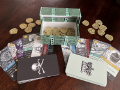
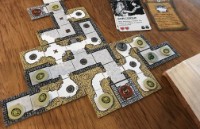

## Published
These games are completed and available for purchase online or at retail.

### [Studies in Sorcery](studies-in-sorcery/index.html)
Scavenge the local cemetery so that you can reanimate skeletons, brew potions, perform rituals, and finally graduate from the Academy of the Dark Arts.

## In Development with a Publisher
These games are currently under contract with a publisher.

### [Rum Runner](rum-runner/index.html)
Pirates and the Crown compete over rum in an asymmetric card game.

### [Mice Heist](heist/index.html)
Compete among a gang of rodent thieves to pull off a big job and feed your whole colony.

## Ready to Pitch
These games are far enough along in their design process to be ready for a publisher to look at.

### [Dragon Family](dragon-family/index.html)
Map making, Area control, Meal planning

### [Heroes Beware!](heroes-beware/index.html)
Simultaneous dungeon building

### [Undiscovered](undiscovered/index.html)
Space Exploration. Deck building. Ship building

## Prototypes
These prototypes are earlier in the design process and may be in playtesting but are not ready for a publisher yet.

- [Ark Ship](ark-ship/index.html)
- [Deeper](deeper/index.html)
- [Fridge Feast](fridge-feast/index.html)
- [Pixel Pusher](pixel-pusher/index.html)
- [Slither](slither/index.html)

## Gallery
