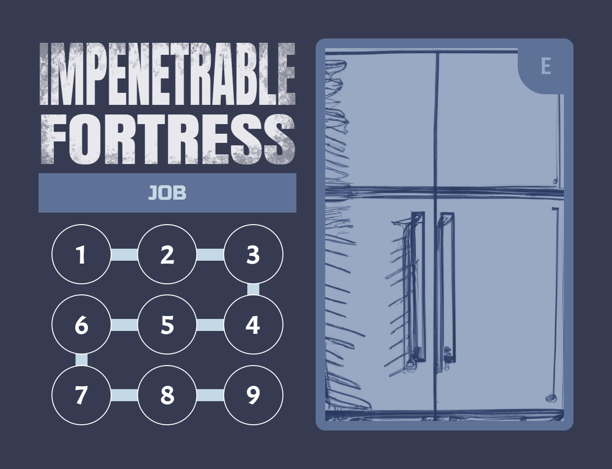

Work with a gang of fellow thieves to pull off one last job.

# COMPONENTS
Modifier tokens

<table class="components">
<tr><th>Blue</th><th>Green</th><th>Yellow</th><th>Orange</th><th>Red</th><th>Purple</th></tr>
<tr><td></td><td></td><td></td><td></td><td></td><td></td></tr>
<tr><td></td><td></td><td></td><td></td><td></td><td></td></tr>
<tr><td>x7</td><td>x9</td><td>x12</td><td>x9</td><td>x7</td><td>x6</td></tr>
</table>

<table class="components">
<tr><td></td><td></td></tr>
<tr><td>7 identity cards</td><td>4 job cards</td></tr>
<tr><td></td><td></td></tr>
<tr><td>28 obstacle cards</td><td>1 heat track card</td></tr>
</table>

<table class="components">
<tr><td></td><td></td><td></td></tr>
<tr><td>15 secret cards</td><td>44 assist cards</td><td>34 trick cards</td></tr>
</table>

<table class="components">
<tr><td></td><td></td><td></td></tr>
<tr><td>4 rules reminder cards</td><td>1 opaque bag</td><td><mark>Active job marker</mark></td></tr>
</table>

# SETUP
1. Randomly deal 1 identity card face-up in front of each player. Return the rest to the game box.
2. Randomly deal 1 secret card face-down to each player. They may look at this card but not share it with other players. Return the rest to the game box.
3. Arrange the 4 Job cards (A,B,C,D) face-up in a grid in the middle of the table.
4. Place the Obstacle cards face-up on their corresponding job card (e.g. place A5 on job A) in numeric order with the lowest number on top (e.g. place A1 on top)
5. Place the following tokens in the bag:

| Yellow | Red | Purple |
| --- | --- | -- |
|  |  |  |

6. For each additional player in the game beyond the first, add the following combination of tokens to the bag:

| Yellow | Yellow | Orange |
| --- | --- | -- |
|  |  |  |

7. Put the heat track card in the center of the play area. For each 2 players in the game (rounded up) add 1 of the token indicated on each space of the heat track.
8. Shuffle the Trick cards and Assist cards together to form a face-down resource deck. Leave room next to it for a face-up discard pile.
9. Deal each player 5 cards from the resource deck.
10. Randomly determine a starting player.

# GOAL
There are a set of jobs that you all are looking to pull off. Each job can only be completed by overcoming a sequence of obstacles. Players will test their skill against these obstacles. When the game ends players are paid out according to how well they helped. Each player also has a secret that provides an way to increase their take. The player with the largest payout is the winner.

# YOUR IDENTITY

<table class="components">
<tr><td width="66%"></td><td width="33%"></td></tr>
</table>

You start the game with an identity card that provides your starting skills. There are 3 skills:
	 
| Agility | Charm | Dexterity |
| --- | --- | --- |
|  |  |  |

The number of icons you have of a particular skill is your skill score. For example, the Cat Burglar starts with 2 Agility and 1 Dexterity.

You also start the game with a Secret. These cards represent your unique background that provides your motivation for the heist. Meeting the criteria on your Secret will award you a larger take at the end of the game.

# YOUR TURN
Players each take a turn in clockwise order. On your turn choose an Obstacle and place the active job marker on that Obstacle card. 

## FACING AN OBSTACLE

Each obstacle may have the following elements:
- One or more required skills with a target number
- Failure penalty
- Success reward 
- Payout (bottom right)
- Associated Job (bottom right)

But all obstacles will incur a <strong>test</strong>.

Resolving a test is done with the following steps:
1. Evaluate Skill
2. Get Help
3. Draw Tokens
4. Play Tricks
5. Resolve (Success or Failure)
6. Prepare

### 1. EVALUATE SKILL
An obstacle will test one or more of your skills. Each of your skills has a score, which is the sum of the icons on your identity card and all assist and trick cards that have been added to your identity card.

If an obstacle is testing multiple skills, add the score of all skills indicated.

<mark>TODO: For “or” choice obstacles do you choose up front (before assists) or at the end? Or is it just whichever is higher, no choice required?</mark>

### 2. GET HELP
Each other player has an opportunity to play an Assist card to help the current player. They simultaneously reveals either nothing or an Assist card to commit from their hand to the upcoming test. 

 

Assist cards may modify the test result if they include a number in a circle. They may also modify the bag contents or have other effects. These are all resolved prior to making the test, in a clockwise order. Leave the Assist card in front of the player who committed them until the test is completed.

<mark>You may only commit an assist card if your player pawn is at the location of the active job marker. You may discard one card to move your pawn to the active player's location. You only need to pay this cost after assist cards are revealed. If you cannot pay this cost (you have no more cards in your hand) then your committed assist card is discarded.</mark>

### 3. DRAW TOKENS
Then you draw 2 tokens from the bag and without looking at them place them on the table. 

### 4. PLAY TRICKS

 

At this time you (and only you) may play any number of Trick cards to modify the token results. These could involve flipping tokens, adding additional tokens, or any number of effects.

### 5. RESOLVE
Add the revealed modifiers from tokens and assist cards to your skill score. If the sum is less than the target number for that skill you have <strong>failed</strong> the Obstacle. Otherwise you <strong>succeeded</strong>.

The drawn tokens remain in front of you until the end of the round.

#### FAILURE
- Apply the "failure" effect of the Obstacle (if any).
- Unless the Obstacle says it is “Mandatory”, returrn the Obstacle card to the game box.
- Discard any assist cards that were played.
- If you played a Trick card that has a score (cheese) value, add it to your score pile.
- You may use the “Failure” (bottom) effect of one Trick card you played or of a Trick card from your hand. These are added to your identity card to upgrade your skills.
- Discard any other played Trick cards.

#### SUCCESS
- Apply the "success" effect of the Obstacle (if any).
- Add the Obstacle card to your score pile.
- All players who played assist cards with a score (cheese) value adds their assist card to their score pile.
- Any player who played an assist card with a “Success” (bottom) effect adds that card to their identity card. These will upgrade their skills.
- Discard any played Trick cards.

### 6. PREPARE
You draw resource cards from the deck until you have 5 cards in your hand.

## END OF THE ROUND
After each player has had a turn the round is over. Add the tokens for the current round number from the heat track to the bag.

Return all tokens in front of players to the bag.

If there are no more rounds on the heat track the game is over, proceed to End Game & Scoring.

# END GAME & SCORING
- Check your Secret to see if you met the conditions. Empty the bag onto the table, as many Secrets care about the contents of the bag at the end of the game. If you have met the conditions of your Secret you add that card to your score pile.
- Tally the points on all cards in your score pile. If a Job was completed each Obstacle from that Job is worth 1 additional point.

The player with the most points is the winner. If there is a tie the player with the most scored Obstacle cards is the winner. If there’s still a tie the players share the victory.