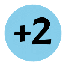
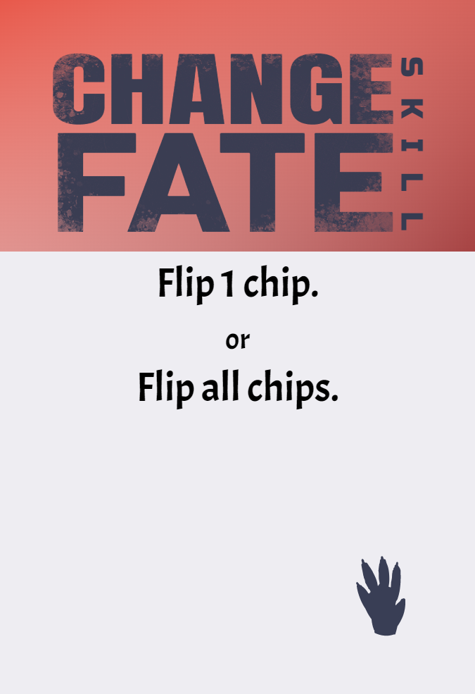

Work with a gang of fellow thieves to pull off one last job.

# COMPONENTS
Modifier tokens

<table class="components">
<tr><th>Blue</th><th>Green</th><th>Yellow</th><th>Orange</th><th>Red</th><th>Purple</th></tr>
<tr><td></td><td></td><td></td><td></td><td></td><td></td></tr>
<tr><td></td><td></td><td></td><td></td><td></td><td></td></tr>
<tr><td>x7</td><td>x9</td><td>x12</td><td>x9</td><td>x7</td><td>x6</td></tr>
</table>

<table class="components">
<tr><td></td><td></td></tr>
<tr><td>7 identity cards</td><td>4 job cards</td></tr>
<tr><td></td><td></td></tr>
<tr><td>28 obstacle cards</td><td>1 heat track card</td></tr>
</table>

<table class="components">
<tr><td></td><td></td><td></td></tr>
<tr><td>15 secret cards</td><td>44 assist cards</td><td>34 trick cards</td></tr>
</table>

<table class="components">
<tr><td></td><td></td><td></td></tr>
<tr><td>4 rules reminder cards</td><td>1 opaque bag</td><td><mark>Active job marker</mark></td></tr>
</table>

# SETUP
1. Randomly deal 1 identity card face-up in front of each player. Return the rest to the game box.
2. Randomly deal 1 secret card face-down to each player. They may look at this card but not share it with other players. Return the rest to the game box.
3. Arrange the 4 job cards (A,B,C,D) face-up in a grid in the middle of the table.
4. Place the obstacle cards face-up on their corresponding job card (e.g. place A5 on job A) in numeric order with the lowest number on top (e.g. place A1 on top)
5. Place the following tokens in the bag:

| Yellow | Red | Purple |
| --- | --- | -- |
|  |  |  |

6. For each additional player in the game beyond the first, add the following combination of tokens to the bag:

| Yellow | Yellow | Orange |
| --- | --- | -- |
|  |  |  |

7. For each 2 players in the game (rounded up) add 1 of the token indicated on each space of the heat track.
8. Shuffle the trick cards and assist cards together to form a resource deck.
9. Deal each player 5 cards from the resource deck.
10. Randomly determine a starting player.

# GOAL
There are a set of jobs that you all are looking to pull off. Each job can only be completed by overcoming a sequence of obstacles. Players will test their skill against these obstacles. When the game ends players are paid out according to how well they helped. Each player also has a secret that provides an way to increase their take. The player with the largest payout is the winner.

# YOUR IDENTITY

<table class="components">
<tr><td></td><td></td></tr>
</table>

You start the game with an identity card that provides your starting talents. There are 3 talents:
	 
| Agility | Charm | Skill |
| --- | --- | --- |
|  |  |  |

The number of icons you have of a particular talent is your talent score. For example, the Cat Burglar starts with 2 Agility and 1 Skill.

You also start the game with a Secret. These cards represent your unique background that provides your motivation for the heist. Meeting the criteria on your Secret will award you a larger take at the end of the game.

# YOUR TURN
Players each take a turn in clockwise order. On your turn choose a job and place the active job marker on that job card. 

## FACING AN OBSTACLE

Each obstacle may have the following elements:
- One or more required talents with a target number
- Failure penalty
- Success reward 
- Payout (bottom right)
- Job (bottom left)

Resolving an obstacle is done with the following steps:
1. Get Help
2. Draw Tokens
3. Play Tricks
4. Resolve (Success or Failure)

### 1. GET HELP
After selecting an obstacle to face every player in clockwise order (other than you) has an opportunity to play an assist card.

### 2. DRAW TOKENS
Then you draw 2 tokens from the bag and without first looking at them place them on the table. 

### 3. PLAY TRICKS

### 4. RESOLVE
Add the revealed modifiers from tokens and assist cards to your talent score (the combination granted by your identity card and any upgrade cards you’ve added). If the sum is less than the target number for that talent you have failed the obstacle. Otherwise you succeed.

Some obstacles require multiple talents. You sum your scores from both talents.

<mark>TODO: For “or” choice obstacles do you choose up front (before assists) or at the end? Or is it just whichever is higher, no choice required?</mark>

#### FAILURE
If you fail apply the failure effect of the obstacle (if any).

Unless the obstacle says it is “Mandatory”, discard the obstacle card.

Discard any assist cards that were played.

You may resolve the “Failure” (red bottom) effect of one trick card you played or of a trick card from your hand.

#### SUCCESS
If you succeed apply the success effect of the obstacle (if any).

Add the obstacle card to your score area.

Any player who played an assist card adds that card to their score area (or resolve its “Success” (green bottom) effect).

# END OF THE ROUND
After each player has had a turn the round is over. Add the tokens for the current round number from the heat track to the bag. If there are no more rounds on the track the game is over, proceed to End Game & Scoring.

If any jobs were completed (the last obstacle card was removed) during the round a draft is started before resuming the next round.

# DRAFT
Deal each player a hand of 6 cards from the resource deck.

Each player chooses a card from their hand and places it face-down in front of them. Once each player has drafted a card in this way, they pass the remaining cards to the player on their left. They then draft another card from their new hand. This continues until all cards have been drafted.

# END GAME & SCORING
Each player should check their Secret to see if they met the conditions. Empty the bag onto the table, as many Secrets care about the contents of the bag at the end of the game. If a player has met the conditions of their Secret they add that card to their score pile.

If a Job was completed each Obstacle from that Job is worth 1 additional point.

Add up the payout value on each scored Obstacle, Assist, and Secret.

The player with the largest sum payout value is the winner. If there is a tie the player with the most scored Obstacle cards is the winner. If there’s still a tie the players share the victory.