

In Mice Heist you are mice from a colony seeking to steal food from a human household. The player who returns with the best food will be the hero of the colony. But the food is protected by obstacles and traps, so you may have to reluctantly work together to overcome them and get the largest portion.

# COMPONENTS
Modifier chips

<table class="components">
<tr><th>Blue</th><th>Green</th><th>Yellow</th><th>Orange</th><th>Red</th><th>Purple</th></tr>
<tr><td></td><td></td><td></td><td></td><td></td><td></td></tr>
<tr><td>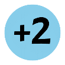</td><td></td><td></td><td></td><td></td><td></td></tr>
<tr><td>x1</td><td>x2</td><td>x4</td><td>x2</td><td>x1</td><td>x1</td></tr>
</table>

<table class="components">
<tr><td colspan="3">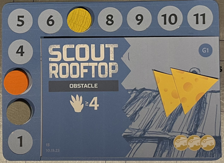</td><td colspan="1">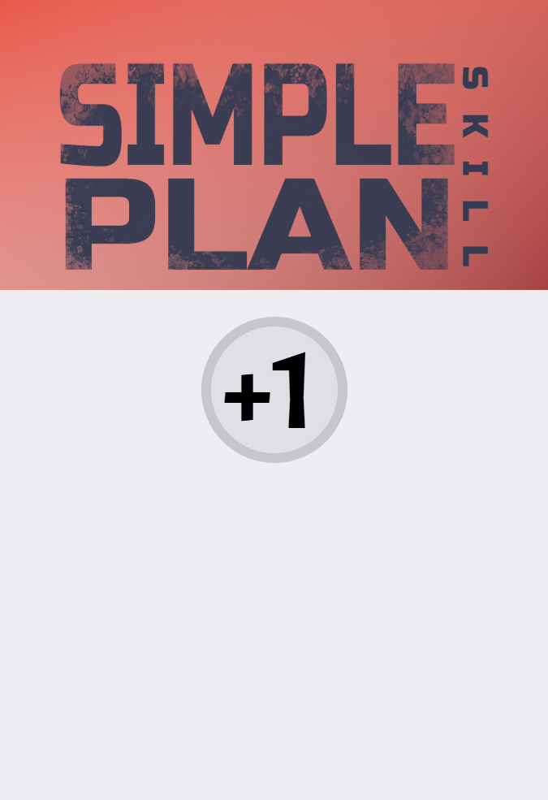</td></tr>
<tr><td colspan="3">4 contribution tracks</td><td colspan="1">37 upgrade skill cards</td></tr>
<tr><td colspan="2">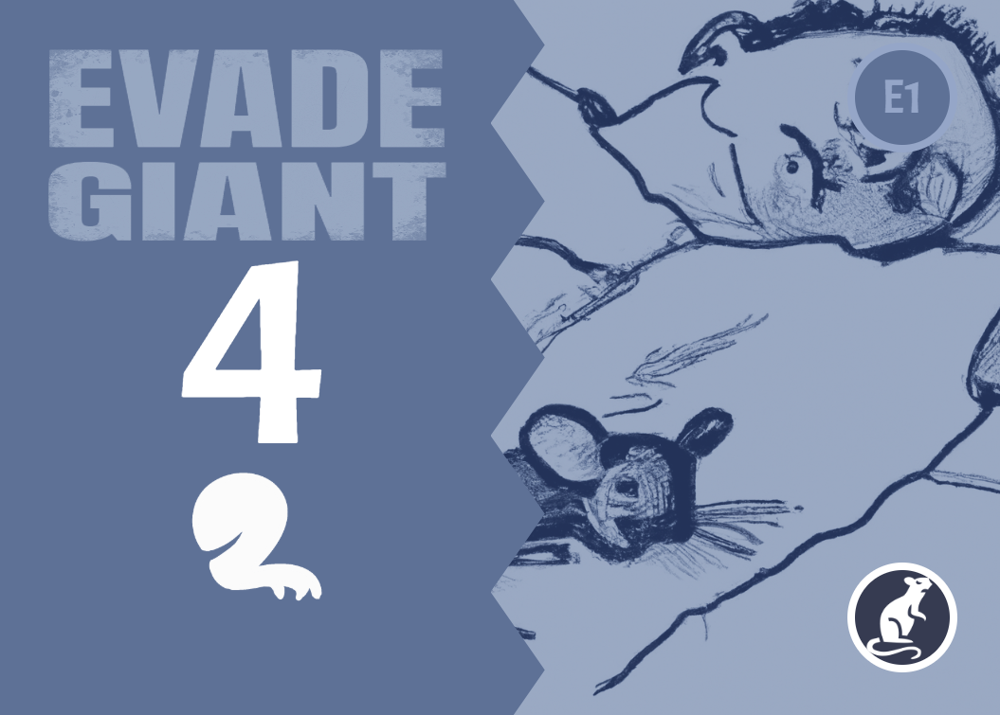</td><td colspan="2">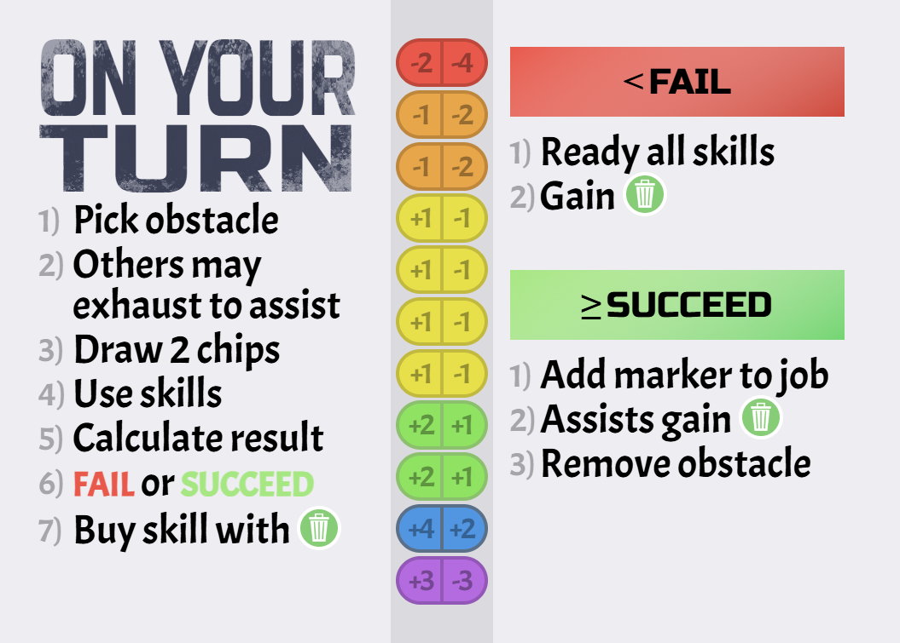</td></tr>
<tr><td colspan="2">20 obstacle cards (5 per job)</td><td colspan="2">4 rules reminder cards</td></tr>
</table>

<table class="components">
<tr><td>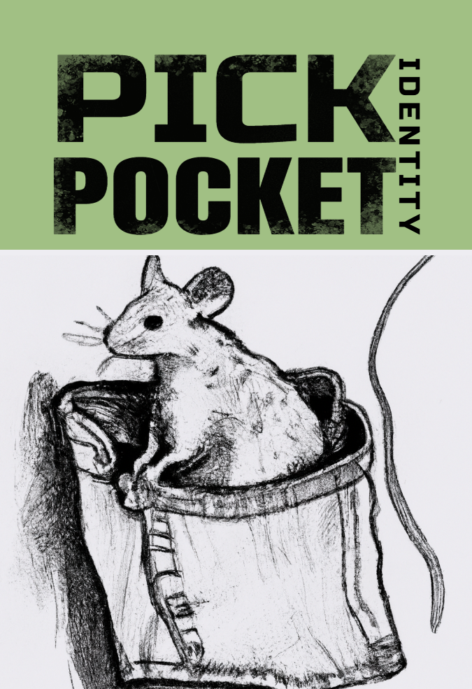</td><td></td><td>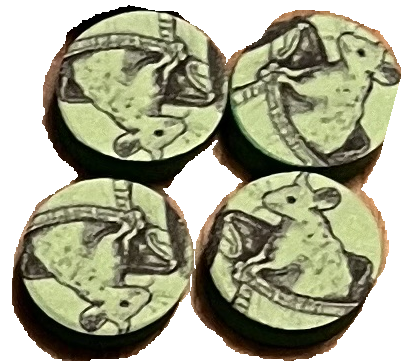</td></tr>
<tr><td>18 starting skill cards (3 of each player color)</td><td> (1 of each player color)</td><td>24 contribution markers (8 of each player color)</td></tr>
</table>

<table class="components">
<tr><td>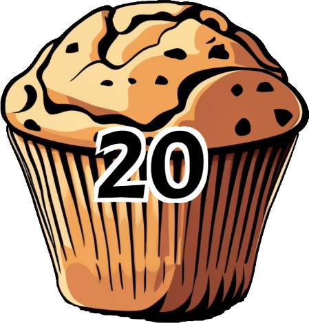</td><td>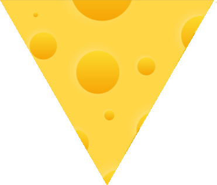</td><td>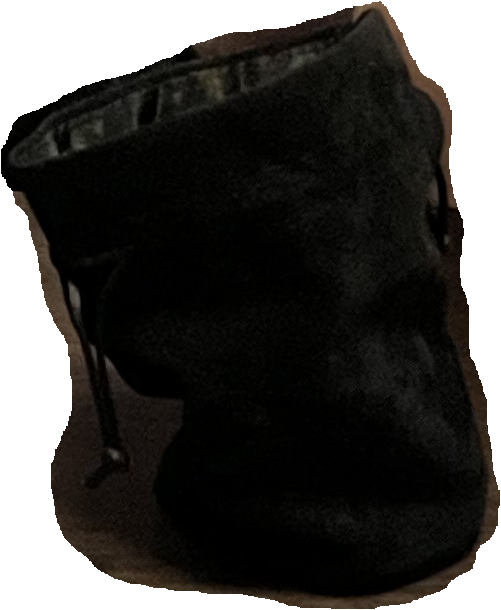</td></tr>
<tr><td>12 food tokens (4 each in values 20, 10, and 5)</td><td>20 trash tokens</td><td>1 opaque bag</td></tr>
</table>

# SETUP

### Player Components
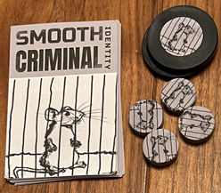
<mark>Update image to remove player chips</mark>

1. Randomly assign each player one of available the player colors.
1. Each player takes the components that match their player color and image.
   - 3 starting skill cards
   - 8 contribution markers
1. Return the remaining player components to the game box.

### Jobs
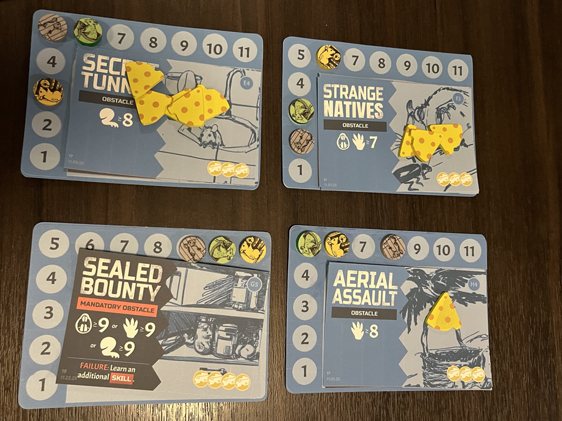
<mark>Need updated picture for beginning of game, not end. And should include food.</mark>

1. Place the 4 contribution tracks in the center of the table.
1. Separate the obstacle cards by job set letter (e.g. "A") displayed in the top right corner (e.g. set "A" has cards A1-A5).
1. Sort each in numeric order so that the lowest number is on top (e.g. for job A obstacle A1 will be on top and A5 will be on the bottom).
1. Place each sorted stack on top of a contribution track.
1. For each job randomly select a 20 point, 10 point, and 5 point food item and place it next to the track.

<mark>
Alternate setup option: Separate obstacle cards by difficulty and shuffle each difficulty tier into a pile. For each job randomly deal out deal out:
- 1 difficulty 1
- 3 difficulty 2
- 1 difficulty 3
- 1 finale.
</mark>

### Skill market
1. Shuffle the upgrade skill cards to form a face-down deck.
1. Deal out 4 cards from the deck and place them next to the deck as a face-up market.

### The rest
1. Put the remaining trash in a central supply.
1. Place all modifier chips in the bag.
1. Randomly determine a starting player (you can use the player contribution markers for this). That player takes the bag.

# GOAL
You are all attempting to pull off jobs to score food for your colony. Each job has a sequence of obstacles, which will test each player's skill and luck. When the game ends players are each paid out in food according to how much they contributed. The player with the highest value food stash wins.

## Contribution

Each job has a contribution track. When you contribute to the success of that job (by directly overcoming obstacles or by assisting others), you will add your player-colored contribution marker to that track. The player with the most markers on the track will receive the most points. When adding to the track, add to the next available spot on the track, indicating who contributed last (which will break ties). 

## Skills
You begin the game with 3 skills that can be used to help you overcome obstacles. You can gain more skills as the game progresses. Each skill is either in a **ready** state (face-up) or **exhausted** state (face-down). 

To **use** a skill card, it must be ready. Execute the text on the card. Then flip it face-down.

To **exhaust** a skill card, it must be ready. Flip it face-down but ignore the text on the card.

To **ready** a skill, flip it face-up.

To **learn** a skill, choose an upgrade skill from the market. Add it face-up in front of you alongside your other skills. Deal out a new skill card from the deck face-up to the market.

# YOUR TURN
Players each take a turn in clockwise order. On a player's turn they are considered the **testing player**. Any reference to "you" is to the testing player.

On your turn you will resolve a test against an obstacle. 

Each obstacle will have the following elements:
- A <strong>target rating</strong> number
- Zero or more associated skill icons (e.g. <mark>🤚🦵👄</mark>)

There are a couple of extra pieces of information only used for setup (they have no effect during gameplay):
- Difficulty (e.g. 🐀🐀🐀)
- Associated job and order in that job (e.g. "B1")

Resolving a test is done with the following steps:

1. Select Obstacle
2. Others May Assist
3. Draw Chips
4. Use Skills
5. Calculate Result
6. Resolve (Success or Failure)
7. Buy a Skill
8. Cleanup

### 1. SELECT OBSTACLE

Choose an obstacle and place <mark>some sort of marker</mark> on that obstacle to let other players know where you will be testing. 

### 2. OTHERS MAY ASSIST
Everyone else (each non-testing player) has an opportunity to bet on the outcome of your upcoming test. They may choose to exhaust one of their skill cards in order for a reward if the test is successful. Players choose to do this simultaneously, and must do so before the testing player proceeds. Any player who pays this exhaust cost is considered to be as **assisting** player. 

### 3. DRAW CHIPS
You now draw 2 chips from the bag without looking, at place them on the table.

The chips have mismatched sides. Do not look and choose the sides of the chips as you draw them. Leave them randomly assigned as they come out of the bag.

At times you may need to draw a chip when there are no chips remaining in the bag. When this happens, return all chips from the play area _except the ones already drawn for this test_ to the bag. Then proceed drawing.

### 4. USE SKILLS

 

At this time you may use any number of ready skills one at a time to modify the chip results. Skill effects could involve flipping chips (to change which modifier value is showing), drawing additional chips, adding numeric modifiers, or any number of effects.

Note that some skills will indicate that they only have an effect when activated for obstacles that have a matching skill icon. <mark>TODO: Provide an example</mark>

### 5. CALCULATE RESULT

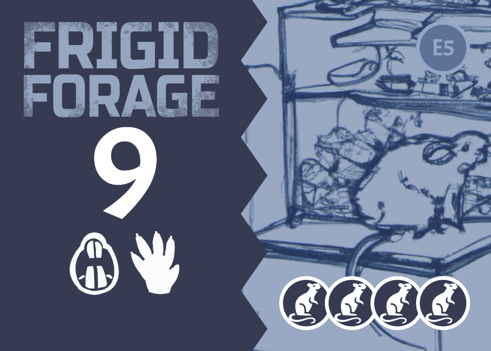

Add the following together:
- The modifiers on all chips drawn for this test
- The modifiers granted by any skills used for this test.

This value is your **test rating**. 

If the test rating is less than the target rating you <strong>failed</strong>. Otherwise you <strong>succeeded</strong>.

### 6. RESOLVE

#### FAILURE
- Ready all of your skill cards
- Take 1 trash token from the supply.

#### SUCCESS
- Add one of your contribution markers to job's track.
- All assisting players take 1 trash from the supply.

### 7. BUY A SKILL
You may optionally return 1 trash to the supply in order to learn a skill from the market.

### 8. CLEANUP
If the obstacle is a "Finale Obstacle":
- Failure: Skip the rest of this step (the obstacle remains in play).
- Success: The game is over. Continue to "End Game & Scoring" below.

Otherwise
- Return the obstacle to the game box.
- Move all other chips drawn for this test to the center play area (alongside with any chips drawn from previous tests).
- Pass the bag to the next player in clockwise order.

# END GAME & SCORING
The end game is triggered when one of the jobs has been completed (there are no more obstacles in its stack).

## Distribute food
For each job, players claim food tokens according to their number of contribution markers on the track. The player with the most markers gets 1st choice of food token, the 2nd place will choose next, and so on. Ties are broken by whoever among the tied players has a token furthest ahead on the track.

If all food tokens have been claimed for that job, any player with at least one contribution marker will instead take 1 trash instead.

## Most points wins
Each player calculates their total score from their tokens:
- Food
- Trash (2 points each)

The player with the largest total is the winner. If there is a tie the player with the most trash is the winner. If there’s still a tie the players share the victory.