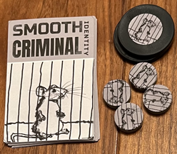

In Mice Heist you are mice from a colony seeking to steal food from a human household. The player who returns with the best food will be the hero of the colony. But the food is protected by obstacles and traps, so you may have to reluctantly work together to overcome them and get the largest portion.

# COMPONENTS
Modifier chips

<table class="components">
<tr><th>Blue</th><th>Green</th><th>Yellow</th><th>Orange</th><th>Red</th><th>Purple</th></tr>
<tr><td></td><td></td><td></td><td></td><td></td><td></td></tr>
<tr><td></td><td></td><td></td><td></td><td></td><td></td></tr>
<tr><td>x1</td><td>x2</td><td>x4</td><td>x2</td><td>x1</td><td>x1</td></tr>
</table>

<table class="components">
<tr><td></td><td></td></tr>
<tr><td>4 contribution tracks</td><td>4 rules reminder cards</td></tr>
<tr><td></td><td></td></tr>
<tr><td>37 upgrade skill cards</td><td>20 obstacle cards (5 per job)</td></tr>
</table>

<table class="components">
<tr><td></td><td> <mark>Image needed</mark></td><td></td></tr>
<tr><td>18 starting skill cards (3 of each player color)</td><td>6 player chips (1 of each player color)</td><td>24 contribution markers (4 of each player color)</td></tr>
</table>

<table class="components">
<tr><td></td><td></td><td></td></tr>
<tr><td>12 food tokens (4 each in values 12, 6, and 3)</td><td>40 cheese tokens</td><td>1 opaque bag</td></tr>
</table>

# SETUP

### Player Components

1. Randomly distribute a player chip to each player to determine their player color.
1. Each player takes the components that match their player chip color and image.
   - 3 starting skill cards
   - 4 contribution markers
   - 1 player chip
1. Return the remaining player components to the game box.
1. Each player takes 3 cheese to start their stash.

### Jobs

<mark>Need updated picture for beginning of game, not end. And should include food.</mark>

1. Place the 4 contribution tracks in the center of the table.
1. Separate the obstacle cards by job set letter (e.g. "A") displayed in the top right corner (e.g. set "A" has cards A1-A5).
1. Sort each in numeric order so that the lowest number is on top (e.g. for job A obstacle A1 will be on top and A5 will be on the bottom).
1. Place each sorted stack on top of a contribution track.
1. For each job randomly select a 12 point, 6 point, and 3 point food item and place it next to the track.

### Skill market
1. Shuffle the upgrade skill cards to form a face-down deck.
1. Deal out 4 cards from the deck and place them next to the deck as a face-up market.

### The rest
1. Put the remaining cheese in a central supply.
1. Place all modifier chips in the bag.
1. Randomly determine a starting player (you can use the player chips for this). That player takes the bag.

# GOAL
You are all attempting to pull off jobs to score food for your colony. Each job has a sequence of obstacles, which will test each player's skill and luck. When the game ends players are each paid out in food according to how much they contributed. The player with the highest value food stash wins.

## Contribution

Each job has a contribution track. When you contribute to the success of that job (by directly overcoming obstacles or by assisting others), you will increase your position on that track. Changes to your position on the track are represented by the 🐀 icon.

### Increasing contribution (+🐀)

To increase your place on the contribution track, take your player-colored contribution marker and move it up that many spaces on the track. If you are not already on the track, start counting from the first track space. If your marker's final position would land on an already occupied space, instead move to the next available space. If you have reached the end of the track and there are no more available spaces, land on the highest value available space.

### Decreasing contribution (-🐀)

To decrease your place on the contribution track, move backwards as above. However if you would land on an occupied space you instead move to the next available _lower value_ space. If there are no lower available spaces then remove your marker from the track entirely.

## Skills
You begin the game with 3 skills that can be activated with cheese to help you overcome obstacles. You can gain skills more as the game progresses. Each skill is either available (uncovered) or unavailable (covered). 

### Learning a skill
When you are prompted to learn a skill (typically after failing a test), choose an upgrade skill from the market. Add it in front of you alongside your other skills. You may have up to a maximum of 6 at a time, so if you would learn a new skill when you already have 6 first return one of your skills to the game box.

After taking a skill from the market, deal out a new one from the deck to replace it.

# YOUR TURN
Players each take a turn in clockwise order. On a player's turn they are considered the **testing player**. Any reference to "you" is to the testing player.

On your turn you will resolve a test against an obstacle. 

Each obstacle will have the following elements:
- A <strong>target rating</strong> number
- Zero or more associated skill icons (e.g. <mark>🤚🦵👄</mark>)
- Payout (e.g. 🐀🐀🐀)
- Associated job and order in that job (e.g. "B1")

Resolving a test is done with the following steps:

1. Select Obstacle
2. Get Help
3. Draw Chips
4. Activate Skills
5. Calculate Result
6. Resolve (Success or Failure)
7. Advance Obstacle
8. Cleanup

### 1. SELECT OBSTACLE

Choose an obstacle and place your player chip on that obstacle card. 

### 2. GET HELP
Everyone else (each non-testing player) has an opportunity to bet on the outcome of your upcoming test. They will choose and hold zero or more cheese in a closed fist. This cheese may come from either their personal stash or from their covered skill cards. You (the testing player) will call on everyone to simultaneously reveal how many cheese they bet.

#### Assisting
Any player who reveals one or more cheese is considered to be an **assisting player**. Stack that cheese on the assisting player's chip and put it in front of you until the test is resolved.
<mark>This cheese should go in your stash, but you also need to remember how much they bet...</mark>

#### Abstaining
Any player who reveals no cheese is considered to be an **abstaining player**. They may return one cheese from one of their covered skills to their stash.

### 3. DRAW CHIPS
You now draw 2 chips from the bag without looking, at place them on the table.

The chips have mismatched sides. Do not look and choose the sides of the chips as you draw them. Leave them randomly assigned as they come out of the bag.

At times you may need to draw a chip when there are no chips remaining in the bag. When this happens, return all chips from the play area _except the ones already drawn for this test_ to the bag. Then proceed drawing.

### 4. ACTIVATE SKILLS

 

At this time you may activate any number of skills one at a time to modify the chip results. These could involve flipping chips (to change which modifier value is showing), drawing additional chips, adding numeric modifiers, or any number of effects.

To activate a skill, it must available (uncovered). Pay a cheese from your personal stash onto the skill card, covering it. Then resolve its effect.

Note that some skills will indicate that they only have an effect when activated for obstacles that have a matching skill icon.

### 5. CALCULATE RESULT

Add the following together:
- The modifiers on all chips drawn for this test
- The modifiers on any skills activated for this test.

This value is your **test rating**. 

### 6. RESOLVE

If the test rating is less than the target rating you <strong>failed</strong>. Otherwise you <strong>succeeded</strong>.

Leave the drawn chips in the center of the play area, alongside any other chips drawn for previous tests.

#### FAILURE
- Each assisting player takes one cheese from the supply.
- You may learn one skill card from market.
- Increase your place on the job's contribution track by 1.

#### SUCCESS
- Take any cheese on the obstacle into your stash.
- All assisting players increase their place on the job's contribution track by the number of cheese they bet. These increases are resolved one player at a time in clockwise order.
- Increase your place on the job's contribution track by the <strong>payout</strong> value of the obstacle.

### 7. ADVANCE OBSTACLE
If the obstacle is a "Finale Obstacle”:
- Failure: Skip the rest of this step (the obstacle remains in play).
- Success: The game is over. Continue to "End Game & Scoring" below.

Otherwise, return the obstacle to the game box. Any cheese on it are returned to the central supply.

### 9. CLEANUP
- Return all player chips to their owning players.
- Move all other chips drawn for this test to the center play area (alongside with any chips drawn from previous tests).
- Pass the bag to the next player in clockwise order.

# END GAME & SCORING
The end game is triggered when one of the jobs has been completed (there are no more obstacles in its stack).

## Jobs pay out
For each job, players claim food tokens according to their place on the contribution track. The player in 1st place on the track gets first choice, the 2nd place will choose next, and so on. If all food tokens have been claimed for that job, that player will claim a single cheese token instead.

## Most cheese wins
Each player adds the value of their food tokens to the number of cheese in their stash. The player with the largest total is the winner. If there is a tie the player with the most cheese is the winner. If there’s still a tie the players share the victory.