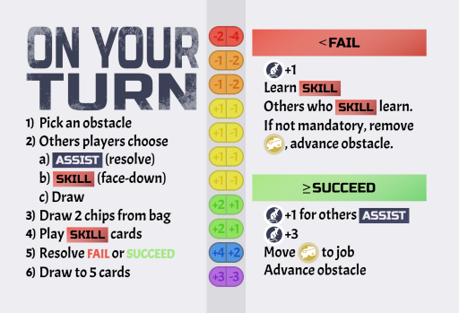
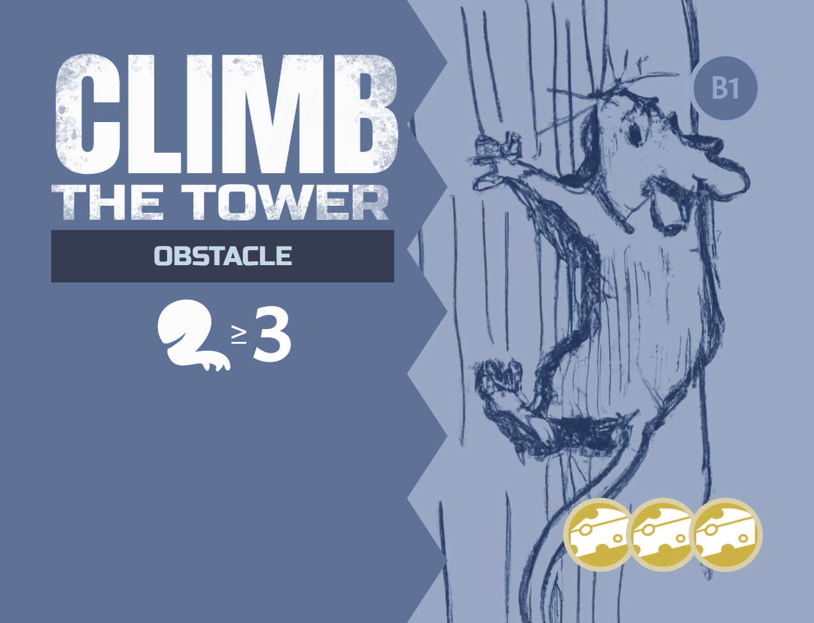

In Mice Heist you are mice from a colony seeking to steal food from a human household. The player who returns with the best food will be the hero of the colony. But the food is protected by obstacles and traps, so you may have to reluctantly work together to overcome them and get the largest portion.

# COMPONENTS
Modifier chips

<table class="components">
<tr><th>Blue</th><th>Green</th><th>Yellow</th><th>Orange</th><th>Red</th><th>Purple</th></tr>
<tr><td></td><td></td><td></td><td></td><td></td><td></td></tr>
<tr><td></td><td></td><td></td><td></td><td></td><td></td></tr>
<tr><td>x1</td><td>x2</td><td>x4</td><td>x2</td><td>x1</td><td>x1</td></tr>
</table>

<table class="components">
<tr><td></td><td></td></tr>
<tr><td>4 contribution tracks</td><td>4 rules reminder cards</td></tr>
<tr><td></td><td></td></tr>
<tr><td>6 job cards</td><td>30 obstacle cards (5 per job)</td></tr>
</table>

<table class="components">
<tr><td></td><td></td><td></td></tr>
<tr><td>6 identity cards (each a different color)</td><td>36 skill rating cards (9 of each player color)</td><td>24 contribution markers (4 of each player color)</td></tr>
</table>

<table class="components">
<tr><td></td><td></td><td> <mark>Image needed</mark></td></tr>
<tr><td>42 assist cards</td><td>37 skill cards</td><td>12 player chips (2 for each player)</td></tr>
</table>

<table class="components">
<tr><td></td><td></td><td></td></tr>
<tr><td>12 food tokens (4 each in values 12, 6, and 3)</td><td>40 cheese tokens</td><td></td></tr>
<tr><td></td><td></td><td></td></tr>
<tr><td>1 opaque bag</td><td>Active job marker</td><td></td></tr>
</table>

# SETUP

### Player Components

1. Randomly deal 1 Identity card face-up in front of each player. Return the rest to the game box.
1. Each player takes the components that match their Identity card color and image
  - 9 skill rating cards
  - 4 contribution markers
  - 2 player chips

### Skill Ratings

1. Each player places their skill rating cards in front of them in 3 stacks, separated by the 3 skill icons. In each stack the value 4 card should be placed on the bottom, the value 2 card on top of that, and the value 0 card on top of that.
1. According to what is shown on the back of their Identity card, each player increases their skill rating until their visible rating matches their identity card. See the "Increasing your skill rating" description below.

### Jobs

<mark>Need updated pciture for beginning of game, not end. And should include food.</mark>

1. Place the 4 contribution tracks in the center of the table.
1. Randomly select 4 Job cards. Place one on top of each contribution track. Return the rest to the game box.
1. Place each Job's matching Obstacle cards (e.g. set A1-A5 for job A) face-up on top of  their corresponding Job card in numeric order so that the lowest number is on top (e.g. for job A obtacle A1 will be on top and A5 will be on the bottom). Return all other unused Obstacle to the game box.
1. For each job select a 12 point, 6 point, and 3 point food item and place it above the track.

### Resource decks
1. Shuffle the Skill cards and Assist cards separately to form 2 face-down resource decks. Leave room next to each for a face-up discard pile.
1. Deal each player 3 cards from the Skill deck, forming their starting hand.

### The rest
1. Put the cheese tokens in a central supply.
1. Place all chips in the bag.
1. Randomly determine a starting player. They take the active job marker.

# GOAL
You are all looking to pull off a set of jobs. Each job is progressed by overcoming a sequence of Obstacles. Players will test their skills against these Obstacles. When the game ends players are paid out according to how well they helped with each job.

## Contribution

Each job has a contribution track. When you contribute to the success of that job, you will increase your position on that track. The player in 1st place will get the highest reward, with steadily decreasing rewards for other places (see "End Game & Scoring" below).

### Increasing your contribution

To increase your place on the contribution track, take your player-colored contribution marker and move it up that many spaces on the track. If you are not already on the track, start counting from the first track space. If your marker would land on an already occupied space, instead move to the next available space. If you have reached the end of the track and there are no more available spaces, land on the highest value available space.

To decrease your place on the contribution track, move backwards as above. However if you would land on an occupied space you instead move to the next available space _moving backwards_. If there are no previously available spaces then remove your marker from the track entirely.

If you need to increase your place on the contribution track but are already in its final space, instead take one cheese token from the supply. 

## Skills
There are 3 skills that will be tested when overcoming obstacles:
	 
| Agility | Charm | Dexterity |
| --- | --- | --- |
|  |  |  |

You start the game with an Identity card that provides your starting skill ratings. But they can be increased during the game. Your current score is tracked with your skill rating cards.

## Skill rating
You have 3 stacks of skill rating cards. The top card of each stack shows your current rating in that skill.

### Increasing your skill rating
To increase your skill flip over the corresponding skill rating card if your current value is even (0, 2, or 4) or put that skill rating card on the bottom of the stack if your current value is odd (1 or 3). The maximum skill rating is 5; any increase beyond 5 is ignored.

### Learning a skill
When learning from a Skill card, increase the rating of the matching skill displayed on the card (in the bottom right) by one, then put that card in the discard pile.

# YOUR TURN
Players each take a turn in clockwise order. On a player's turn they are considered the **testing player**. Any reference to "you" is to the testing player.

## SELECT AN OBSTACLE
On your turn choose an Obstacle and place the active job marker on that Obstacle card. 

Each Obstacle will have the following elements:
- A <strong>test</strong>, with one or more required skills and a target number
- Failure effect (for mandatory obstacles only)
- Payout (bottom right)
- Associated Job (top right)

Resolving a test is done with the following steps:
1. Evaluate Skill Rating
2. Get Help
3. Draw Chips
4. Play Skill Cards
5. Resolve (Success or Failure)
6. Draw
7. Cleanup

### 1. EVALUATE SKILL RATING
An Obstacle will test one or more of your skills. Each of your skills has a rating, as explained above.

If an Obstacle lists multiple skills, add the score of all the skill ratings indicated.

Some tests will provide an "or" choice between multiple skills. Before proceeding, choose one of these to use as the target for the test.

<mark>TODO: Add visual aid for different test types</mark>

### 2. GET HELP
Each nont-testing player has an opportunity to bet on the outcome of the testing player's upcoming test. They must choose to either **Assist** or **Abstain**. Each non-testing player will hold zero or more of their player chips in a closed fist. The testing player will call on all other players to reveal what's in thier hands simultaneously.

Any player who reveals one or more player chips is considered to be an **assisting player**. The revealed player chips are put in front of the testing player to make it clear who is assisting.

#### Resolve an Assist effect
If the Assist deck is empty, shuffle the Assist discard pile into a face-down deck.

If there is *at least one* assisting player, the testing player reveals the top card of the Assist deck and places it in front of them.

Assist cards may modify the test result with a number modifier (indicated in a circle). They may also have other effects. These effects are all resolved now, _prior_ to drawing chips for the test. The text is read from the perspective of the testing player. Any choices the testing player must make must be made now. After resolving the effects, leave the Assist card in front of the testing player until the test is resolved.

### 3. DRAW CHIPS
Draw 2 chips from the bag and without looking at them place them on the table. 

At times you may need to draw a chip when there are no chips remaining in the bag. When this happens, return all chips from the play area _except the ones already drawn for this test_ to the bag. Then proceed drawing.

### 4. PLAY SKILL CARDS

 

At this time you (and only you) may play any number of Skill cards to modify the chip results. These could involve flipping chips (to change which modifier value is showing), drawing additional chips, adding numeric modifiers, or any number of effects. Play and resolve cards one at a time. Leave all played cards in front of you until after the test is resolved.

### 5. RESOLVE

Add the revealed modifiers showing on all chips, the Assist card (if any), and any played Skill cards to your skill rating. If the sum is less than the target number for that skill you <strong>failed</strong>. Otherwise you <strong>succeeded</strong>.

Leave the drawn chips in the center of the play area, adding to any other chips revealed for previous tests.

#### FAILURE
- Apply the "failure" effect of the Obstacle (if any).
- Unless the Obstacle says it is a “Mandatory Obstacle”, return the Obstacle card to the game box and any cheese tokens on it to the central supply.
- You may **learn** one Skill card you played, a Skill card from your hand, or the top Skill card from the Skill deck.
- All non-assisting players may either **learn** a Skill card in their hand or draw a Skill card from the deck.
- Increase your place on the job's contribution track by 1.

#### SUCCESS
- Move any cheese tokens on the Obstacle to your Identity card.
- Return the Obstacle card to the game box.
- All assisting players increase their place on the job's contribution track by the number of their player chips they revealed. These increases are resolved one player at a time in clockwise order.
- Increase your place on the job's contribution track by the <strong>payout</strong> value of the obstacle.

### 6. DRAW
You may discard any number of cards from your hand. Then draw Skill cards from the deck until you have a total of 3 cards in your hand.

At times you may need to draw a card when the deck is empty. When this happens, shuffle the discard pile to form a new face-down deck.

### 7. CLEANUP
- Discard the revealed Assist card (if any).
- Discard any played Skill cards (if any).
- If the Obstacle was discarded then a new one was likely revealed underneath it. If there was no Obstacle underneath, then the job is complete and the game is over (see below).

# END GAME & SCORING
The end game is triggered when one of the jobs has been completed (there are no more Obstacle cards in its stack).

## Jobs pay out
For each job, players claim food tokens according to their place on the contribution track. The player in 1st place on the track gets first choice, the 2nd place will choose next, and so on. If all food tokens have been claimed for that job, that player will claim a single cheese token instead.

## Most cheese wins
Each player adds the value of their food tokens to the number of cheese tokens they may have accumulated over the course of the game. The player with the largest total is the winner. If there is a tie the player with the highest sum of skill ratings is the winner. If there’s still a tie the players share the victory.