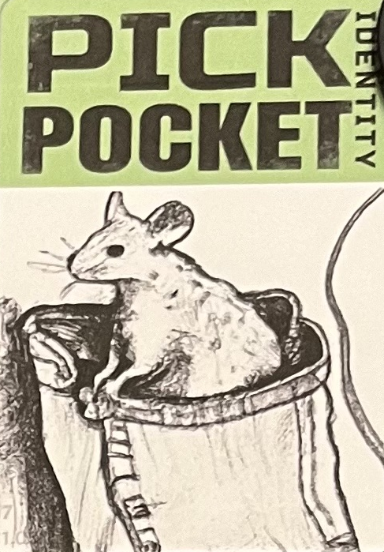
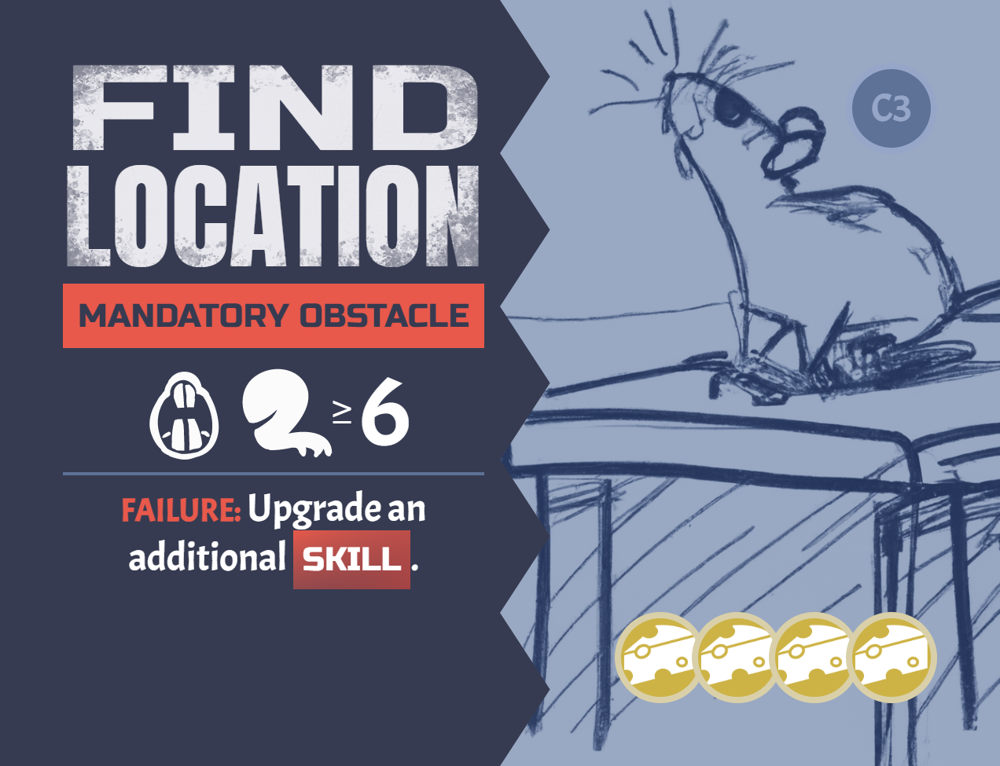

# COMPONENTS
Modifier tokens

<table class="components">
<tr><th>Blue</th><th>Green</th><th>Yellow</th><th>Orange</th><th>Red</th><th>Purple</th></tr>
<tr><td></td><td></td><td></td><td></td><td></td><td></td></tr>
<tr><td></td><td></td><td></td><td></td><td></td><td></td></tr>
<tr><td>x7</td><td>x9</td><td>x12</td><td>x9</td><td>x7</td><td>x6</td></tr>
</table>

<table class="components">
<tr><td></td><td></td></tr>
<tr><td>7 identity cards</td><td>6 job cards</td></tr>
<tr><td></td><td></td></tr>
<tr><td>32 obstacle cards</td><td>1 heat track card</td></tr>
</table>

<table class="components">
<tr><td></td><td></td><td></td></tr>
<tr><td>4 award cards</td><td>42 assist cards</td><td>37 trick cards</td></tr>
</table>

<table class="components">
<tr><td></td><td></td><td></td></tr>
<tr><td>4 rules reminder cards</td><td>1 opaque bag</td><td><mark>Active job marker</mark></td></tr>
</table>

# SETUP
1. Randomly deal 1 identity card face-up in front of each player. Return the rest to the game box.
2. Randomly select Job cards equal to the number of players. Place them in the center of the table.
3. Place the Obstacle cards face-up on their corresponding Job card (e.g. place A5 on job A) in numeric order with the lowest number on top (e.g. place A1 on top)
4. Place the following tokens in the bag, based on the number of players:

| Token | 2 players | 3 players | 4 players | 5 players | 6 players |
| --- | --- | --- | -- | --- | --- |
|  | 3 | 5 | 7 | 9 | 11 |
|  | 1 | 2 | 3 | 4 | 5 |
|  | 1 | 1 | 1 | 1 | 1 |
|  | 1 | 1 | 1 | 1 | 1 |

5. Put the heat track card in the center of the play area. For each 2 players in the game (rounded up) add 1 of the token indicated on each space of the heat track, as indicated in this chart:

| 2 players | 3 players | 4 players | 5 players | 6 players |
| --- | --- | -- | --- | --- |
| 2 | 2 | 4 | 4 | 5 |

6. Shuffle the Trick cards and Assist cards together to form a face-down resource deck. Leave room next to it for a face-up discard pile.
7. Deal each player 5 cards from the resource deck.
8. Randomly determine a starting player.

# GOAL
There are a set of jobs that you all are looking to pull off. Each job can only be completed by overcoming a sequence of obstacles. Players will test their skill against these obstacles. When the game ends players are paid out according to how well they helped. There are also awards granted for having the highest of each skill. The player with the largest payout is the winner.

# YOUR IDENTITY

You start the game with an identity card that provides your starting skills. There are 3 skills:
	 
| Agility | Charm | Dexterity |
| --- | --- | --- |
|  |  |  |

The number of icons you have of a particular skill is your skill score. For example, the Cat Burglar starts with 2 Agility and 1 Dexterity.

# YOUR TURN
Players each take a turn in clockwise order. On your turn choose an Obstacle and place the active job marker on that Obstacle card. 

## FACING AN OBSTACLE

Each Obstacle may have the following elements:
- One or more required skills with a target number
- Failure penalty
- Success reward 
- Payout (bottom right)
- Associated Job (bottom right)

But all Obstacles will incur a <strong>test</strong>.

Resolving a test is done with the following steps:
1. Evaluate Skill
2. Get Help
3. Draw Tokens
4. Play Tricks
5. Resolve (Success or Failure)
6. Prepare

### 1. EVALUATE SKILL
An Obstacle will test one or more of your skills. Each of your skills has a score, which is the sum of the icons on your identity card and all Assist and Trick cards that have been added to your identity card.

If an Obstacle is testing multiple skills, add the score of all skills indicated.

<mark>TODO: For “or” choice Obstacles do you choose up front (before assists) or at the end? Or is it just whichever is higher, no choice required?</mark>

### 2. GET HELP
Each other player has an opportunity to play an Assist card to help (or potentially hinder) the current player. They simultaneously reveal either nothing or an Assist card to commit from their hand to the upcoming test. If they reveal nothing they draw a card from the resource deck, and then discard until they have no more than 5 cards in their hand.

 

Assist cards may modify the test result if they include a number in a circle. They may also modify the bag contents or have other effects. These are all resolved prior to making the test, in a clockwise order. Leave the Assist card in front of the player who committed them until the test is completed.

<mark>You may only commit an Assist card if your player pawn is at the location of the active job marker. You may discard one card to move your pawn to the active player's location. You only need to pay this cost after Assist cards are revealed. If you cannot pay this cost (you have no more cards in your hand) then your committed Assist card is discarded.</mark>

### 3. DRAW TOKENS
Draw 2 tokens from the bag and without looking at them place them on the table. 

Note that some Obstacle cards may modify how many tokens are drawn from the default of 2.

If any tokens had previously been set aside for your next test, they are added now.

### 4. PLAY TRICKS

 

At this time you (and only you) may play any number of Trick cards to modify the token results. These could involve flipping tokens (to change which modifier value is showing), drawing additional tokens, or any number of effects.

### 5. RESOLVE

Add the revealed modifiers showing on all tokens and committed Assist cards to your skill score. If the sum is less than the target number for that skill you <strong>failed</strong>. Otherwise you <strong>succeeded</strong>.

The drawn tokens remain in front of you until the end of the round.

#### FAILURE
- Apply the "failure" effect of the Obstacle (if any).
- Unless the Obstacle says it is a “Mandatory Obstacle”, return the Obstacle card to the game box.
- All players who played Assist cards that have a "Failure" (bottom) effect adds their card to their identity card. Discard any other Assist cards.
- If you played a Trick card that has a score (cheese) value, add it to your score pile.
- You may use the “Failure” (bottom) effect of one Trick card you played or of a Trick card from your hand. These are added to your identity card to upgrade your skills.
- Discard any other played Trick cards.

#### SUCCESS
- Apply the "success" effect of the Obstacle (if any).
- Add the Obstacle card to your score pile.
- All players who played Assist cards with a score (cheese) value adds their Assist card to their score pile.
- Any player who played an Assist card with a “Success” (bottom) effect adds that card to their identity card. These will upgrade their skills.
- Discard any played Trick cards.

### 6. PREPARE
You may discard any number of cards from your hand. Then draw resource cards from the deck until you have 5 cards in your hand.

Some Obstacle are labeled as "mandatory". These function the same as normal, except that if the test fails the 

## END OF THE ROUND
After each player has had a turn the round is over. Add the tokens for the current round number from the heat track to the bag.

Return all tokens in front of players to the bag.

If there are no more rounds on the heat track the game is over, proceed to _End Game & Scoring_.

# OTHER DETAILS

## DECK RUNS OUT
The resource deck may run out of cards and you need to draw a card. When this happens, shuffle the discard pile into a new face-down resource deck.

# END GAME & SCORING
- Tally the points on all cards in your score pile. 
- If a Job was completed each player who completed at least 1 Obstacle from that Job scores 1 point.
- For each of the 3 skills, the player with the highest value for that skill is awarded 3 points. If there is a tie, all tied players receive the 3 points.
- The player with te most scored Assist cards is awarded 3 points. If there is a tie, all tied players receive the 3 points.

The player with the most points is the winner. If there is a tie the player with the most scored Assist cards is the winner. If there’s still a tie the players share the victory.