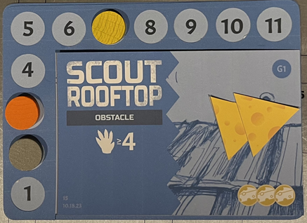

# COMPONENTS
Modifier chips

<table class="components">
<tr><th>Blue</th><th>Green</th><th>Yellow</th><th>Orange</th><th>Red</th><th>Purple</th></tr>
<tr><td></td><td></td><td></td><td></td><td></td><td></td></tr>
<tr><td></td><td></td><td></td><td></td><td></td><td></td></tr>
<tr><td>x1</td><td>x2</td><td>x4</td><td>x2</td><td>x1</td><td>x1</td></tr>
</table>

<table class="components">
<tr><td></td><td></td></tr>
<tr><td>7 identity cards</td><td>4 rules reminder cards</td></tr>
<tr><td></td><td></td></tr>
<tr><td>6 job cards</td><td>30 obstacle cards (5 per job)</td></tr>
<tr><td></td><td></td></tr>
<tr><td>4 contribution tracks</td><td>20 player markers (5 of each player color)</td></tr>
</table>

<table class="components">
<tr><td></td><td></td><td></td></tr>
<tr><td>42 assist cards</td><td>37 skill cards</td><td>36 skill rating cards (9 for each player)</td></tr>
</table>

<table class="components">
<tr><td></td><td></td><td></td></tr>
<tr><td>60 cheese tokens</td><td>1 opaque bag</td><td><mark>Active job marker</mark></td></tr>
<tr><td></td><td></td><td></td></tr>
<tr><td>12 food tokens (4 each in values 12, 6, and 3)</td><td></td><td></td></tr>
</table>

# SETUP
### Skills
1. Randomly deal 1 Identity card face-up in front of each player. Return the rest to the game box.
1. Each player takes one set of 9 skill rating cards. Place them in 3 stacks, with the 4/5 on bottom, the 2/3 on top of that, and the 0/1 on top of that (so that the 0 is showing). <mark>TODO: Needs visual aid</mark>
1. According to their identity card, each player flips or removes skill rating cards until their rating matches the identity card. <mark>TODO: This is nonesense without a visual aid</mark>
1. Each player chooses a player color and takes all contribution markers of that color.
### Jobs
1. Place the 4 contribution tracks in the center of the table.
1. Randomly select 4 Job cards. Place one in each contribution track. Return the rest to the game box.
1. Place the Obstacle cards face-up on top of  their corresponding Job card (e.g. place A5 on job A) in numeric order with the lowest number on top (e.g. place A1 on top). Return all other unused Obstacle to the gabe box.
1. For each job select a 12 point, 6 point, and 3 point food item and place it above the track.
### Resource decks
1. Shuffle the Skill cards and Assist cards separately to form 2 face-down resource decks. Leave room next to each for a face-up discard pile.
1. Deal each player 3 cards from the Skill deck and 2 cards Assist deck, forming their starting 5 card hand.
### The rest
1. Put the cheese in a central supply.
1. Place all chips in the bag.
1. Randomly determine a starting player. They take the active job marker.

# GOAL
You are all looking to pull off a set of jobs. Each job is progressed by overcoming a sequence of Obstacles. Players will test their skill against these Obstacles. When the game ends players are paid out according to how well they helped with each job.

## Contribution

Each job has a contribution track. When you contribute to the success of that job, you will increase your position on that track. When an Obstacle is overcome, cheese is added to that job's payout. The player in 1st place will get most of the cheese, with steadily decreasing rewards for other places (see "End Game & Scoring" below).

# YOUR IDENTITY

You start the game with an Identity card that provides your starting skills. There are 3 skills:
	 
| Agility | Charm | Dexterity |
| --- | --- | --- |
|  |  |  |

The number of icons you have of a particular skill is your skill score. For example, the Cat Burglar starts with 2 Agility and 1 Dexterity.

## Skill rating
<mark>This section should explain the skill rating cards. Previously: </mark>
Your skill rating is the sum of the icons on your Identity card and all Skill cards that have been added to your Identity card.

## Learning a skill
When you learn a skill, you increase your rating in that skill by one. Flip over the corresponding skill rating card if your current value is even (0, 2, or 4) or return that skill rating card to the game box if your current value is odd (1 or 3). The maximum skill rating is 5; any increase beyond 5 is ignored.

When learning due to playing a Skill card, learn the matching skill displayed on the back of the card (also shown in the bottom right of the front of the card), then put that card in the discard pile.

# YOUR TURN
Players each take a turn in clockwise order. On your turn choose an Obstacle and place the active job marker on that Obstacle card. 

## FACING AN OBSTACLE

Each Obstacle will have the following elements:
- A <strong>test</strong>, with one or more required skills and a target number
- Failure effect (for mandatory obstacles only)
- Payout (bottom right)
- Associated Job (top right)

Resolving a test is done with the following steps:
1. Evaluate Skill
2. Get Help
3. Draw Chips
4. Play Skills
5. Resolve (Success or Failure)
6. Prepare

On your turn you are considered the <strong>testing player</strong>.

### 1. EVALUATE SKILL
An Obstacle will test one or more of your skills. Each of your skills has a rating, as explained above.

If an Obstacle is testing multiple skills, add the score of all skills indicated.

Some tests will provide an "or" choice between multiple skills. Before proceeding, choose one of these to use as the target for the test.

<mark>TODO: Add visual aid</mark>

### 2. GET HELP
Each other player has an opportunity to bet on the outcome of the testing player's upcoming test. Simultaneously, each player will choose one of the following:

#### A) Bet for
Play a Assist card to help (or potentially hinder) the active player, and share in their success. They are considered an <strong>assisting player</strong>

#### B) Bet against

Play a Skill card facedown (ignoring the text on the front of the card) to learn from the active player's failure.

#### C) Abstain

Play no card, but draw a card from either the Skill or Assist deck.

#### Resolving Assist cards

Once all players have chosen how to bet, their choice is revealed. <mark>TODO: Clarify how to show your bet</mark>. Any players who chose to abstain draw a card. Then, in clockwise order (starting with the player to the left of the testing player), any played Assist cards are resolved.

Assist cards may modify the test result with a number modifier (indicated in a circle). They may also have other effects. These effects are all resolved now, _prior_ to drawing chips for the test. After resolving the effects, leave the Assist card in front of the player who committed them until the test is resolved.

### 3. DRAW CHIPS
Draw 2 chips from the bag and without looking at them place them on the table. 

At times you may need to draw a chip when there are no chips remaining in the bag. When this happens, return all chips from the play area _except the ones already drawn for this test_ to the bag. Then proceed drawing.

### 4. PLAY SKILLS

 

At this time you (and only you) may play any number of Skill cards to modify the chip results. These could involve flipping chips (to change which modifier value is showing), drawing additional chips, adding numeric modifiers, or any number of effects.

### 5. RESOLVE

Add the revealed modifiers showing on all chips and committed Assist cards to your skill rating. If the sum is less than the target number for that skill you <strong>failed</strong>. Otherwise you <strong>succeeded</strong>.

Leave the drawn chips in the center of the play area.

#### FAILURE
- Apply the "failure" effect of the Obstacle (if any).
- Unless the Obstacle says it is a “Mandatory Obstacle”, return the Obstacle card to the game box and any cheese on it to the central supply.
- Discard any played Assist cards.
- You may **learn** one Skill cards you played, a Skill card from your hand, or the top Skill card from the Skill deck.
- Discard any played Skill cards.
- Increase your place on the job's contribution track by the <strong>payout</strong> value of the obstacle.

#### SUCCESS
- Take all cheese on the Obstacle.
- Return the Obstacle card to the game box.
- All assisting players (those who played Assist cards) increase their place on the job's contribution track by 1. Discard these Assist cards.
- All Skill cards bet by other players are returned to those player's hands.
- Discard any played Skill cards.
- Increase your place on the job's contribution track by 1.

#### The contribution track

To increase your place on the contribution track, take your player-colored contribution marker and move it up that many spaces on the track. If you are not already on the track, start counting from the first track space. If your marker would land on an already occupied space, instead move to the next available space. If you have reached the end of the track and there are no more available spaces, land on the highest value available space.

To decrease your place on the contribution track, move backwards as above. However if you would land on an occupied space you instead move to the next available space _moving backwards_. If there are no previously available spaces then remove your marker from the track entirely.

#### Alternate payout

Whenever you would increase your place on the contribution track, you may alternatively take one cheese from the supply. This is true if you are the testing player or an assisting player.

#### Reveal the next obstacle

If the Obstacle was discarded then a new one was likely revealed underneath it. If there was no Obstacle underneath, then the job is complete and the end game has been triggered (see below).

### 6. PREPARE
You may discard any number of cards from your hand. Then draw resource cards (in whatever combination you like) from their deck until you have a total of 5 cards in your hand. You must decide what mix of cards you want to draw before looking at those cards.

# OTHER DETAILS

## CHIPS RUN OUT
When a player is asked to draw a chip and there are none in the bag return all chips to the bag. Then continue drawing.

## DECK RUNS OUT
Either deck may run out of cards and you need to draw a card. When this happens, shuffle the discard pile of that deck to form a new face-down deck.

# END GAME & SCORING
The end game is triggered when one of the jobs has been completed (there are no more Obstacle cards in its stack).

## Job's pay out

For each job, players claim food tokens according to their place on the contribution track. The player in 1st place on the track gets first choice, the 2nd place will choose next, and so on. If all food tokens have been claimed for that job, that player gets a single cheese token instead.

## Most cheese wins

Each player adds the value of their food tokens to the number of cheese tokens. The player with the largest total is the winner. If there is a tie the player with the highest sum of skill ratings is the winner. If there’s still a tie the players share the victory.