
# SUMMARY

| Players | Time | Age |
| --- | --- | --- |
| 1-4 players | 45 minutes | 8+ years old |

You are the head engineer of a peaceful and prosperous underground colony. Unfortunately, greedy surface dwellers have been invading your colony, slaying your residents and stealing your gold. You must relocate and rebuild… but this time you will be prepared with traps!

# COMPONENTS

<table class="components">
<tr><th colspan="4">134 tiles</th></tr>
<tr><td colspan="3">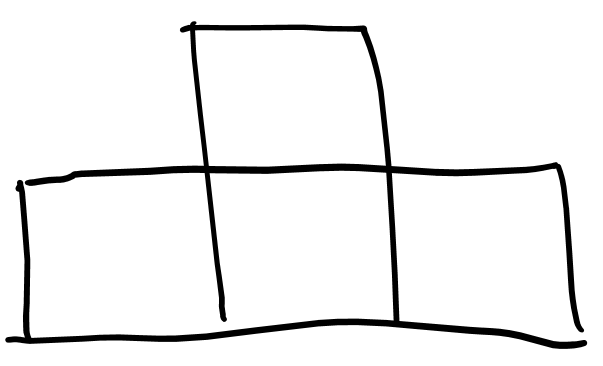</td><td>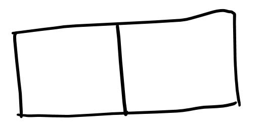</td></tr>
<tr><td colspan="3">4 entrance T-shaped tiles (4 squares)</td><td>18 special I-shaped tiles (2 squares)</td></tr>
<tr><td colspan="2">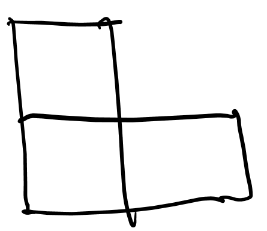</td><td>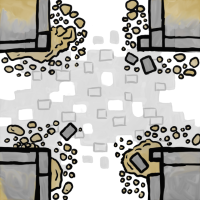</td><td>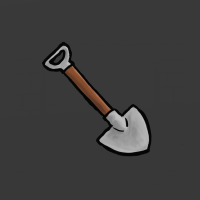</td></tr>
<tr><td colspan="2">9 special L-shaped tiles (3 squares)</td><td>8 patch tiles (1 square)</td><td>104 square tiles (1 square)</td></tr>
</table>

<table class="components">
<tr><th colspan="3">36 cards</th></tr>
<tr><td></td><td></td><td>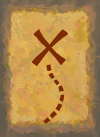</td></tr>
<tr><td>17 invader cards</td><td>8 event cards</td><td>11 map cards</td></tr>
</table>

<table class="components">
<tr><th colspan="5">144 tokens</th></tr>
<tr><td></td><td></td><td></td><td></td><td></td></tr>
<tr><td>64 Gold</td><td>24 Guards</td><td>16 Traps</td><td>16 Prisoners</td><td>24 Gems</td></tr>
</table>

4 meeples (visual aids to help you walk through your dungeon)

# SETUP
1. Each player takes a entrance T-shaped tile. Return any remaining entrance tiles to the game box.
2. Shuffle the L-shaped tiles and set aside in a face-down stack.
3. Shuffle the I-shaped tiles and set aside in a face-down stack.
4. Give each player 1 _Patch_ tile for their reserve. Set aside a supply of the remaining _Patch_ tiles.
5. Put all square tiles face-down in a pile in the center of the table within reach of all players. 
6. Shuffle these cards into three separate decks:
  - Invader cards 
  - Event cards
  - Map cards
7. Set aside the supply of gold , guard , trap , gem , and prisoner  tokens.

# OVERVIEW
The game is played over 3 rounds. During each round, players will simultaneously construct their own colony from the shared pile of tiles. After the colonies are built, all of them will be simultaneously invaded by surface dwellers, who will attempt to steal the treasure contained within. After each invasion, players will abandon that colony but stash their surviving treasure to carry over to the next colony. At the end of the last round the player with the most valuable treasure stash will be the winner. 

Each round is broken down into 6 phases:
1. Build
2. Inspection
3. Populate
4. Invasion
5. Profit
6. Planning

## 1. BUILD PHASE

### Prepare the pile
Gather up all the square tiles into a face-down pile in the center of the table. Return to pile any square tiles that were removed from the game during previous rounds. Flip all tiles in the pile face-down and give it a good swirl to sufficiently randomize it.

If playing with fewer than 4 players you will need to remove some tiles from the center pile. Remove (without looking at them) a number of tiles based on the chart below. The set aside tiles will not be needed during this round, but should be returned for future rounds before starting another Build Phase.

| 1 player | 2 players | 3 players | 4 players |
| --- | --- | --- | --- |
| Remove 60 (44 remain) | Remove 40 (64 remain) | Remove 20  (84 remain) | Remove 0 (Play with all tiles) |

Before continuing, make sure all players are ready to start, as the following part of the phase happens in real time (no turns).

### Real-time tile selection
All players simultaneously may now collect tiles to add to their colony.

You may take a face-down or face-up tile from the central pile into your hand, one at a time. If the tile was face-down, flip it face-up and look at it. Then you either add the tile to your personal colony or return it to the central pile face-up. 

Tiles must be placed adjacent and connected to tiles already in your colony. The rules for how you should connect tiles are covered below.

If you have any tiles in your personal reserve, they can be added during this phase. Any unused reserve tiles at the end of the build phase remain in your reserve (they are not lost).

After all the tiles in the central pile are gone or all players chose to stop building (no one wants the remaining tiles) begin the inspection phase.

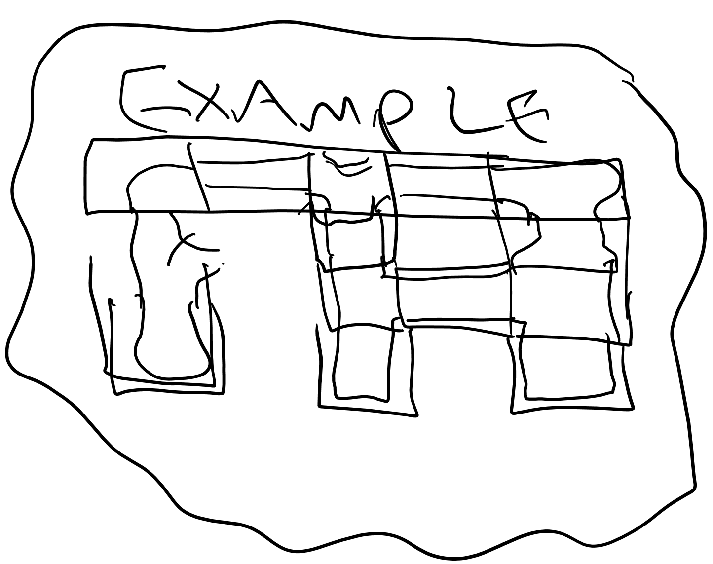

### Tile placement rules

Tiles have a mix of **open edges** (with a pathway) and **closed edges** (no way through). Each edge also has a type:
- **cavern**, with a narrow pathway
- **stone**, with a wide pathway

For a valid connection:
- At least one open edge must connect to an existing adjacent tile.
- Adjacent tile edges must either both be closed or both be open.
- If open, adjacent tile edges must match edge type (cavern or stone). 

| ✔️ | ❌ |
| --- | --- |
| 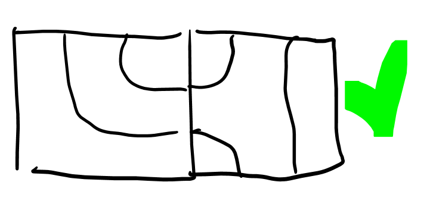 | 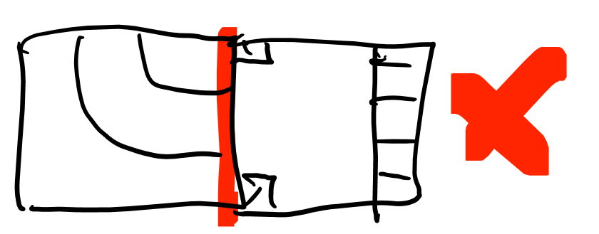 |
| 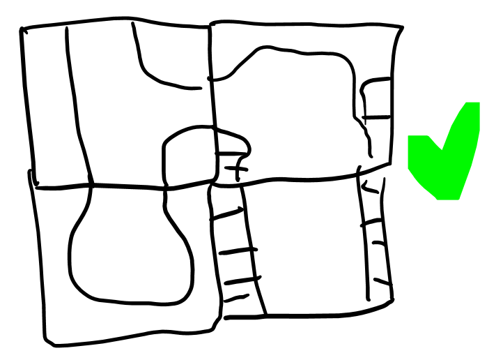 | 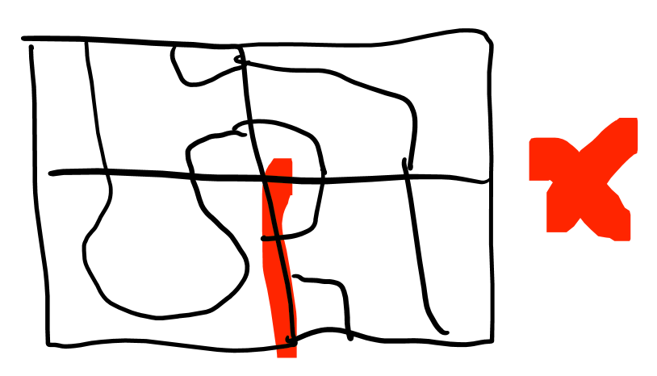 |

## 2. INSPECTION PHASE
Set aside all square tiles that were not added to any player's colony.

Now look at your neighbor’s colonies. It’s possible they have made invalid connections during the build phase (e.g. there are tiles that have mismatched open edges). These need to be addressed.

| ❌ |
| --- |
|  |

If an invalid connection is discovered in your colony, you must choose and remove tiles from your colony until there are no longer any invalid connections.

If at any point a tile is no longer connected through a pathway to the colony entrance that tile is removed from the colony.

| ❌ |
| --- |
| 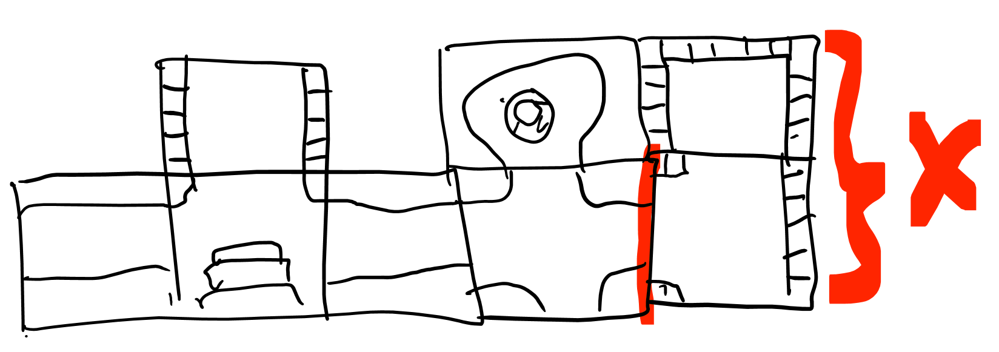 |

Instead of removing tiles to address invalid connections you may replace a tile in your colony with a _Patch_ tile from your reserve. _Patch_ tiles's edges are always considered to be valid (they may have mismatched edges types or have open edges that connect to closed edges). If you do not have any _Patch_ tiles you may choose to purchase one from the supply by returning a gem  token from your stash to the supply.

## 3. POPULATE PHASE
During this phase you will place tokens from the supply and your stash onto tiles in your colony. Consult the “Tiles” appendix to know which which tiles populate which tokens.

Tiles that have any unconnected open edge do not populate any tokens.

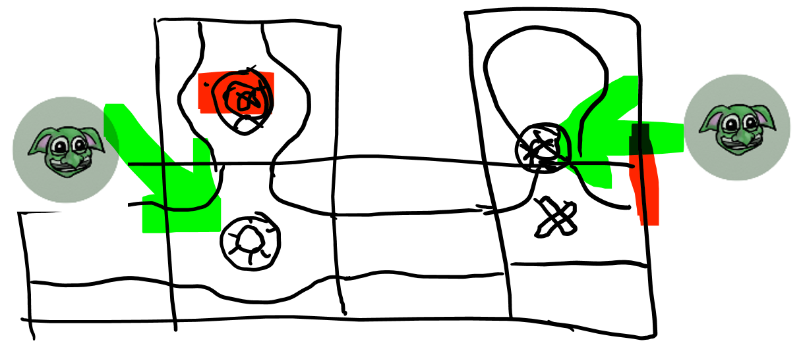

### YOUR STASH
You may have gem  and/or gold  tokens in a stash from previous rounds. Your gem  tokens will need to be stored in your colony or they will be lost. These may be placed on _Treasure Chest_ tiles instead of populating a gold  token.

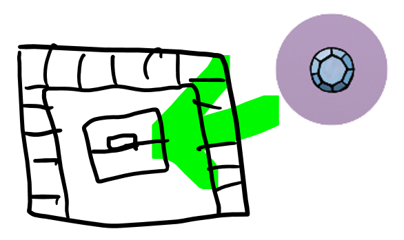

You may purchase guard  tokens from the supply with tokens from your stash. The cost is:
- 1 gem  token
- (or) 2 gold  tokens

Return the spent tokens to the supply in exchange for the guard  tokens. Each of these purchased tokens can be placed on a square in your colony that does not already have a token.

At the end of the populate phase, any remaining tokens in your stash are returned to the supply.

## 4. INVASION PHASE
Create the shared invasion deck by shuffling together a number of invader cards and event cards depending on the current round:

| ROUND 1 | ROUND 2 | ROUND 3 |
| --- | --- | --- |
| 4 invader cards | 4 invader cards | 5 invader cards |
| 1 event card | 2 event cards | 2 event cards |

When shuffling the deck, ensure that the top card is not an event.

<mark>Instead, it’s possible to create separate decks for each round during setup. They can be covered with ROUND 1, ROUND 2, ROUND 3 cover cards. If this seems like the better path, update the components list and these instructions (including moving them to the Setup section).</mark>

Draw and reveal one card from of the invasion deck. Each player will resolve that same card. After each player has completed resolving the card, draw another card from the invasion deck and repeat the process. The phase ends after the last card from the invasion deck has been resolved for all players.

### INVADER CARD
If that card is an invader (<mark>TODO: Invader cards should have a map icon</mark>) also draw a card from the map deck.

The invader card defines who is invading the colony and the map card describes how they will move through the colony.

| Invader | Map |
| --- | --- |
| 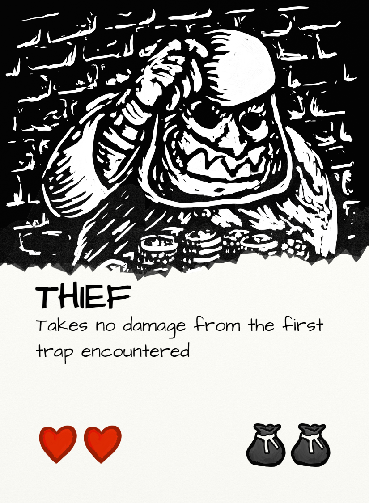 | 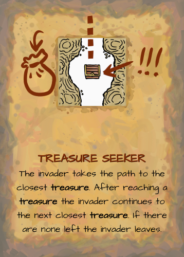 |

Each invader has a number of **hearts** ❤️ and a number of **bags** 💰. They may also have additional rules text. 

The invader starts at the entrance tile for each player’s colony. Each player handles the same type of invader and map traversal, but against their own colony and with their own instance of that invader.

> Important: Heart ❤️ and bag 💰 status is not shared across players.

The invader will then follow the rules outlined on their map until one of the following happens:
- If the invader takes total damage equal to their number of hearts ❤️ they are **defeated** and leave the colony.
- If the invader collects gold  tokens equal to their number of bags 💰 they are **successful** and leave the colony.
- If an invader collects a gem  token they are **successful** and leave the colony.
- The map may have a condition that causes the invader to leave the colony. 

Some notes:
- Even if the invader is defeated any gold  collected by that invader prior to being defeated is lost.
- When an invader leaves they are removed immediately. They do not traverse back towards the entrance.
- If there is ever a tie in how an invader wants to traverse your dungeon (there are two options equal distance apart) you decide how to break that tie.
- Both gold  tokens and gem  tokens are considered “treasure”.

<mark>TODO: Example of resolving an invader (for now consult the video)</mark>

#### Token Effects
As the invader moves through the colony they encounter each square. If there is a token in that square something happens:

| Name | Token | Effect |
| --- | --- | --- |
| Trap |  | Deal 1 ❤️ damage to the invader. Remove the token. |
| Guard |  | Ddeal 1 ❤️ damage to the invader. Remove the token. |
| Gem |  | The invader leaves the colony (even if they had bag 💰 space remaining). Remove the token. |
| Gold |  | The invader uses up 1 of its bags 💰. Remove the token. |
| Prisoner |  | Nothing happens |

If there are multiple tokens in a square, they are processed one at a time in the order of your choice. This means that a guard  token may be encountered before dealing with a gold  token, for example.

#### Re-arm Traps
After each invader has been resolved you may decide to re-arm the traps in your colony. To do so remove one gold  token or one guard  token from your colony, then add trap  tokens to all _Trap_ tiles that do not have an open edge (e.g. the same criteria used during the Populate Phase). You must decide to re-arm traps before the next card is drawn from the invasion deck.

### EVENT CARD
Events cards are resolved by executing the text on the card for all players.

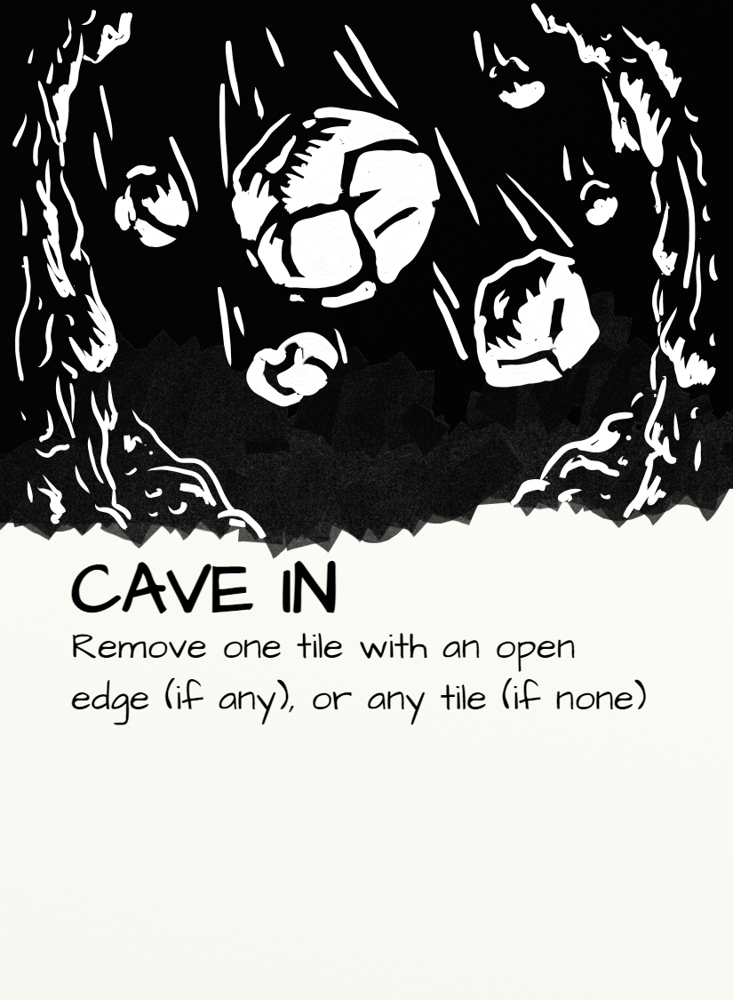

## 5. PROFIT PHASE
After all colonies have been invaded, extract as much treasure as possible from your colony into your **stash**.
1. Return all trap  tokens to the supply. They have no use anymore.
2. Count the guard  tokens remaining in your colony, and return them to the supply. The player with the most adds a gem  token to their stash. If there is a tie for most, all tied players will receive a gem (unless the tied value is zero).
3. For each prisoner  token, return it to the supply and add 2 gold  tokens from the supply to your stash (e.g. if you have 2 prisoners you return them to the supply and take 4 gold tokens).
4. Move all gold  tokens and gem  tokens in your colony to your stash.

At this point there should be no remaining tokens on your colony tiles.

#### Take it apart

Dismantle your colony. Set aside your entrance tile and any of your I-shaped, L-shaped, or _Patch_ tiles into your **reserve**. Return all other square tiles to the center pile.

#### Make change

Each player then _must_ exchange each 5 gold  tokens in their stash for 1 gem  token. They keep any remaining gold  tokens in their stash.

> Important: Skip this exchange during the final round. Proceed to End of Game.

## 6. PLANNING PHASE
> Important: Skip this phase during the final round.

<mark>TODO: Include picture of the special tiles laid out as for a draft</mark>

Between each round you will get new reserve tiles that can be added to your future colonies. Deal out L-shaped, I-shaped, and _Patch_ tiles into the center of the table based on the number of players:

|  | 1 player | 2 players | 3 players | 4 players |
| --- | --- | --- | --- | --- |
| L-shaped tiles | 1 | 2 | 3 | 4 | 
| I-shaped tiles | 2 | 3 | 4 | 5 |
| Patch tiles | 1 | 2 | 3 | 4 |

#### Draft order

Count up the total **treasure value** of your stash:
- Gold  tokens are worth 1.
- Gem  tokens are worth 5.

Your treasure value determines the reverse order you will be able to draft. The player with the _lowest_ treasure value will go first, followed by the player with the second least treasure value, etc. If there is a tie <mark>flip a coin or something</mark>? 

On your draft turn, take one of the special tiles (L-shaped, I-shaped, or _Patch_). When everyone has taken one tile repeat the process in the same order so that each player ends up with 2 new tiles. Return any remaining unchosen tiles to the game box.

These reserve tiles can be added to your colony during the build phase. They can be added at any time (including after all the normal square tiles have been taken). They are kept from round to round, even if they are not used during the build phase. If they are ever removed from your colony they will return to you to use in the next round.

# END OF GAME
After playing all 3 rounds the winner is the player with the highest treasure value (totaled the same way as during the draft phase). If there is a tie the player with the most gem  tokens wins. If a tie remains the players share the victory.

# VARIANT: TURN-BASED BUILD PHASE

As an alternate to the real-time Build Phase, the following rules can be used. 

### Setup 
Takes 5 tiles from the central pile and form a left-to-right **queue** in front of you. Flip all tiles in your queue face-up.

You will be passing 1 tile each turn to the player on your right. Place the supplied passing podium <mark>(TODO: Add to components list</mark>) between you, and use it for placing the passed tile.

#### Draft action
Take a simultaneous turn doing one of the following:

| Action | Description |
| --- | --- |
| Build from queue | Add up to 3 tiles from your queue to your colony (using normal placement rules). Then add an equivalent number of face-down tiles from the central pile to the _left_ of your queue. Pass the _right-most_ tile in your queue. |
| Reveal | Choose a tile from _anywhere_ in your queue to pass. Then flip all tiles in your queue face-up. |
| Build from reserve | Add a tile from your reserve to your colony. Pass the _right-most_ tile in your queue. |

Regardless of which action you took, you should have 4 tiles in your queue and 1 tile passed to the player to your right.

Once _all_ players have take their action, take the tile passed from the player on your left and add it to the _left_ of your queue. You all should now have 5 tiles in front of you (potentially a mix of face-up and face-down), and can all simultaneously take another turn.

<table class="noInnerBorder">
<tr><th colspan="5">Build example</th></tr>
<tr><td>⬆️</td><td>⬆️</td><td></td><td></td><td>⬆️</td></tr>
<tr><td>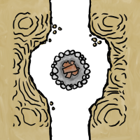</td><td>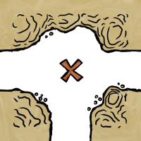</td><td>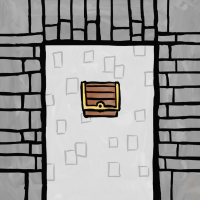</td><td>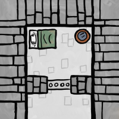</td><td></td></tr>
<tr><td colspan="5" class="bottomBorder">Added 3 tiles to the colony.</td></tr>
<tr><td>⬇️</td><td>⬇️</td><td>⬇️</td><td></td><td></td></tr>
<tr><td></td><td></td><td></td><td></td><td></td></tr>
<tr><td colspan="5" class="bottomBorder">Refill 3 tiles from the center pile to the left.</td></tr>
<tr><td></td><td></td><td></td><td></td><td>➡️</td></tr>
<tr><td></td><td></td><td></td><td></td><td></td></tr>
<tr><td colspan="5" class="bottomBorder">Pass the remaining right-most tile.</td></tr>
<tr><td>➡️</td><td></td><td></td><td></td><td></td></tr>
<tr><td>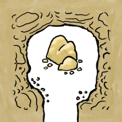</td><td></td><td></td><td></td><td></td></tr>
<tr><td colspan="5" class="bottomBorder">Receive a tile from the player to your left.</td></tr>
</table>

#### End of the draft
After finishing a draft turn, if there are fewer tiles in the center pile than number of players, this is the final turn. Take a normal turn, but there is no need to pass a tile or to refill with tiles from the center pile. After all players have finished this final turn, begin the inspection phase

# VARIANT: SHORT GAME

You can play a shorter game by skipping most of round 1. To do so start each player with 1 gem  token in their stash. Start play at the Planning Phase of round 1 (the draft of reserve tiles), then continue from there.

# SINGLEPLAYER
<mark>TODO: Enter score targets and timer requirements (2:30 standard difficulty)</mark>

# CREDITS

| | |
| --- | --- |
| Game Design | Chris Glein |
| Art | Chris Glein |
 
# TILES
## STANDARD TILES

| Tile | Description |
| --- | --- |
| 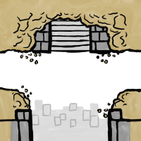 | **Entrance** Invaders will start on this tile. |
|  | **Treasure Chest** Populates 1 gold  token. May alternatively be used to store a gem  token from your stash. |
|  | **Campfire** Populates 1 guard  token. |
|  | **Trap** Populates 1 trap  token. |
|  | **Ore Vein** Populates 2 gold  tokens if the shortest path between this and the entrance is at least 5 squares (not including the entrance square or the ore square) |
|  | **Cell** Whenever an invader is defeated you place a prisoner  token on one of your cell tiles that does not already have a prisoner token. These tokens may be ransomed at the end of the round for 2 gold  each. |

## SPECIAL TILES
The following tiles only appear on special tiles which are drafted between rounds 1 and 2 and rounds 2 and 3:

| Tile | Description |
| --- | --- |
|  | **Patch** Connections with the edges of this tile are never considered invalid (whether closed or open, regardless of edge type). |
| 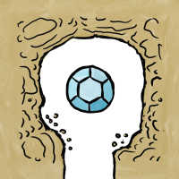 | **Gem Vein** Populates 1 gem  token if the shortest path between this and the entrance is at least 10 squares (not including the entrance square or the gem square) |
| 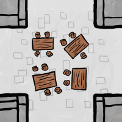 | **Mess Hall** Populates 1 guard  token. At the end of the populate phase you may move guard tokens from anywhere in your colony to any adjacent connected squares to a Mess Hall square. |
| 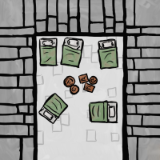 | **Infirmary** After each invader leaves your colony (or is defeated) you may add one guard  token to a _Campfire_ tile that has no open edges (e.g. following the same rules as the Populate Phase). |

