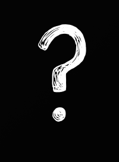
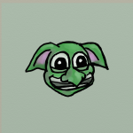
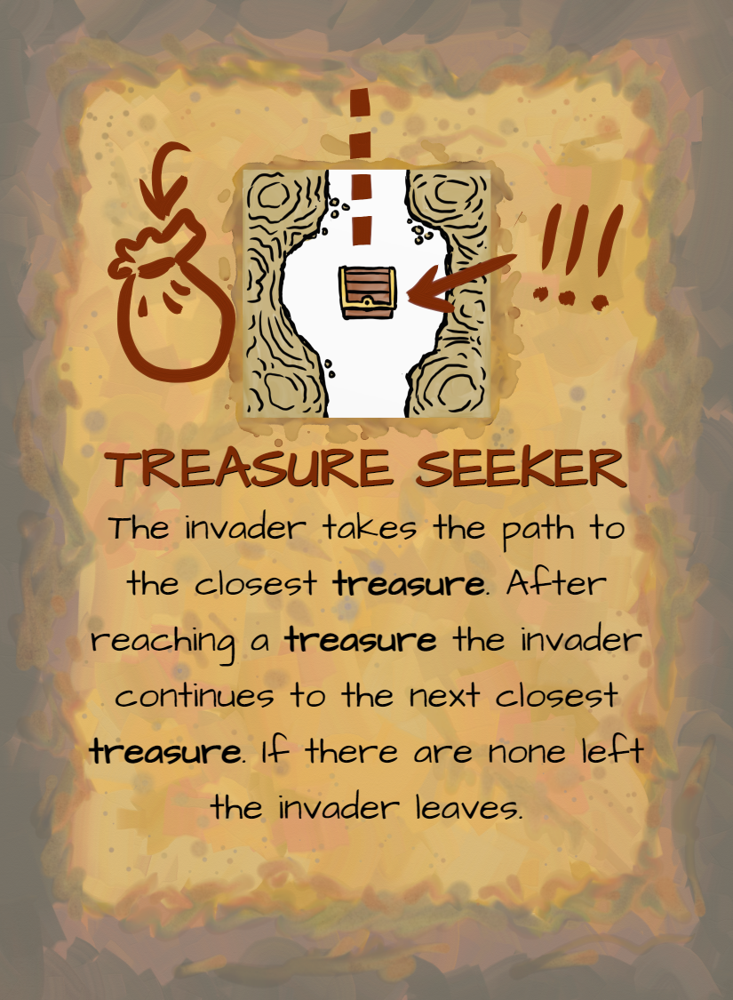

# SUMMARY

| Players | Time | Age |
| --- | --- | --- |
| 1-4 players | 45 minutes | 8+ years old |

You are the head engineer of a peaceful and prosperous underground colony. Unfortunately, greedy surface dwellers have been invading your colony, slaying your residents and stealing your gold. You must relocate and rebuild… but this time you will be prepared with traps and guards!

# COMPONENTS
134 tiles

<table class="components">
<tr><td></td><td></td></tr>
<tr><td>4 dungeon entrance T-shaped tiles (4 squares)</td><td>9 special L-shaped tiles (3 squares)</td></tr>
<tr><td></td><td></td></tr>
<tr><td>18 special I-shaped tiles (2 squares)</td><td>104 square tiles (1 square)</td></tr>
</table>

36 cards

<table class="components">
<tr><td></td><td></td><td></tr></td>
<tr><td>17 invader cards</td><td>8 event cards</td><td>11 map cards</td></tr>
</table>

144 tokens

<table class="components">
<tr><td></td><td></td><td></td><td></td><td></tr></td>
<tr><td>64 Gold</td><td>24 Guards</td><td>16 Traps</td><td>16 Prisoners</td><td>24 Gems</tr></td>
</table>

4 meeples (visual aids to help you walk through your dungeon)

# SETUP
1. Each player takes a dungeon entrance T-shaped tile. Return any remaining dungeon entrance tiles to the game box.
2. Shuffle the L-shaped tiles and set aside in a face-down stack
3. Shuffle the I-shaped tiles and set aside in a face-down stack
4. Put all square tiles face-down in a pile in the middle of the table within reach of all players. 
5. Shuffle these cards into three separate decks:
  - Invader cards 
  - Event cards
  - Map cards
6. Set aside the supply of gold, guard, trap, gem, and prisoner tokens.

# OVERVIEW
The game is played over 3 rounds. During each round, players will each simultaneously construct a dungeon from the shared pool of tiles. After the dungeons are built all of them will be simultaneously invaded by surface dwellers, who will attempt to steal any treasure stashed within. After each round, players will abandon that dungeon but take their remaining treasure with them to the next one. At the end of the last round the player with the most treasure will be the winner. 

Each round is broken down into these phases:
1. Build
2. Inspection
3. Populate
4. Invasion
5. Profit
6. Draft

## BUILD PHASE
If playing with fewer than 4 players you will need to remove some tiles from the center pile. Choose the tiles to remove randomly and do not look at them.

| 1 player | 2 players | 3 players | 4 players |
| --- | --- | --- | --- |
| Remove 60 (44 remain) | Remove 40 (64 remain) | Remove 20 | (84 remain) | Play with all tiles |

Once all players are ready, players simultaneously start collecting tiles to build their dungeon. You may take a face-down or face-up tile from the central pile into your hand, one at a time. If the tile was face-down you flip it face-up and look at it. Then you either add the tile to your personal dungeon or return it to the central pile face-up. 

The added tile must connect to at least one existing tile in your dungeon. All open edges of the new tile must either connect to nothing or to matching open edges of an existing tile. 
- You cannot match an open edge to a closed edge.
- You cannot match an open tunnel edge (cavern, small) to an open hallway edge (dungeon, large).

| | |
| --- | --- |
|  ✔️ |  ❌ |
|  ✔️ |  ❌ |

After all the tiles in the central pile are gone or all players have chosen to stop building (no one wants the remaining tiles) begin the inspection phase.

<mark>TODO: Show an example built dungeon</mark>

## INSPECTION PHASE
Take this opportunity to look at your neighbor’s dungeons. It’s possible they have made mistakes during the build phase and have tiles that are invalidly placed (e.g. have mismatched open edges).

| |
| --- |
|  ❌ |

If a mistake is discovered in your dungeon, you must choose and remove tiles from your dungeon until there are no longer any invalid tiles.

If at any point a tile is no longer connected through a path to the dungeon entrance that tile is invalid removed from the dungeon.

| |
| --- |
|  ❌ |

Instead of removing tiles you may make replace a tile with a “patch” tile from the supply (<mark>TODO: Add to components list</mark>). Patch tiles are always considered valid (they may have mismatched open edges or have open edges that connect to closed edges). If you choose to take a patch tile you must return a gem token from your stash (see: Profit Phase) to the supply, if able. You may take a patch tile even if you have no gem tokens.

## POPULATE PHASE
During this phase you will place tokens from the supply (and potentially your stash of gem tokens) on your dungeon. Consult the “Tiles” appendix to know which tokens go on which tiles.

> Important: Tiles that have an open edge do not receive any tokens.

You may have gem and gold tokens leftover in your stash from previous rounds. The gem tokens must be stored in your dungeon or they are lost. They may be placed on dungeon treasure tiles instead of placing a gold token there.

If you do not have a valid tile to place your gem token on you may instead exchange the gem token for a guard token from the supply and place that guard token on any square of your dungeon that does not already have a guard token.

Any leftover gold tokens are safe. Set yours aside until the profit phase.

Once all dungeons are populated the dungeons will be invaded. 

## INVASION PHASE
Create the shared invasion deck by shuffling together a number of invader cards and event cards depending on the current round:

| ROUND 1 | ROUND 2 | ROUND 3 |
| --- | --- | --- |
| 4 invader cards | 4 invader cards | 5 invader cards |
| 1 event card | 2 event cards | 2 event cards |

<mark>It’s possible to create 3 decks at setup with the ROUND I, II, II cards. Update these instructions for that. As is this section lacks mention of shuffling old invaders/events (if needed).</mark>

Draw and reveal one card from of the invasion deck. If that card is an invader (<mark>TODO: Invader cards should have a map icon</mark>) also draw a card from the map deck.

The invader card defines who is invading the dungeon and the map card describes how they will move through the dungeon.

| Invader | Map |
| --- | --- |
|  |  |

Each invader has a number of hearts and a number of bags. They may also have additional rules text. 

The invader starts at the entrance tile for each player’s dungeon. Each player handles the same type of invader and map traversal, but against their own dungeon and with their own instance of that invader.

> Important: Heart and bag status is not shared across players.

The invader will then follow the rules outlined on their map until one of the following happens and that invader is considered to be “resolved”:
- A) If the invader has taken total damage equal to their number of hearts they are **defeated** and leave the dungeon (or are added to an unoccupied cell tile).
- B) If the invader collects gold tokens equal to their number of bags they leave the dungeon.
- C) If an invader collects a gem token they leave the dungeon.
- D) The map may have a condition that causes the invader to leave the dungeon. 

Some notes:
- Even if the invader is defeated any gold collected by that invader prior to being defeated is lost.
- When an invader leaves they are removed immediately. They do not traverse back towards the entrance.
- If there is ever a tie in how an invader wants to traverse your dungeon (there are two options equal distance apart) you decide how to break that tie.
- Both gold tokens and gem tokens are considered “treasure”.

<mark>TODO: Example of resolving an invader (for now consult the video)</mark>

### TOKEN EFFECTS
As the invader moves through the dungeon they encounter each square. If there is a token in that square something happens:
- A) If the square contains a **trap** token remove the token and deal 1 damage to the invader.
- B) If the square contains a **guard** token remove the token and deal 1 damage to the invader.
- C) If the square contains a **gem** token remove the token and the invader leaves the dungeon (even if they had bag space remaining).
- D) If the square contains a **gold** token remove the token and the invader uses up 1 of its bags.

Nothing happens when a **prisoner** token is encountered.

If there are multiple tokens in a square, they are processed one at a time in the order of your choice. This means that a guard token may be encountered before dealing with a gold token, for example.

### EVENT CARDS
Events cards trigger the text on the card and are then considered resolved. You do not need to draw a matching map card for an event card.

 
### RE-ARM TRAPS
After the card from the invasion deck has been resolved you may decide to re-arm the traps in your dungeon. To do so remove one gold token or one guard token from your dungeon, then add trap tokens to all trap tiles that do not have an open edge (e.g. the same criteria used during the Populate Phase). You must decide to re-arm traps before the next card is drawn from the invasion deck.

After each player has resolved the invader and had a chance to re-arm traps draw another card from the invasion deck and repeat the process. Continue until the invasion deck is empty.

## PROFIT PHASE
After the dungeons have been invaded you extract as much gold as possible from your dungeon.
1. Count the guard tokens remaining in your dungeon. The player with the most receives one gem token. If there is a tie all players with that value receive a gem, unless that value is zero. Return all guard tokens to the supply.
2. Ransom your prisoner tokens for 2 gold tokens each (e.g. if you have 2 prisoners you return them to the supply and take 4 gold tokens).
3. Return all trap tokens to the supply. They have no use anymore.
4. Take all gold tokens or gem tokens in your dungeon.

Dismantle your dungeon (setting aside your dungeon entrance tile and any of your other I-shaped or L-shaped tiles), returning all square tiles to the center of the table in a pile face-down and sufficiently randomized.

Each player then _must_ exchange each 5 gold tokens they have into gem tokens. They keep any remaining gold tokens set aside.

> Important: Skip the exchange in the 3rd round. Proceed to End of Game.

## DRAFT PHASE
> Important: Skip this phase during the 3rd round.

<mark>TODO: Include picture of the special tiles laid out as for a draft</mark>

Between each round you will get new special tiles that can be added to your future dungeons. 
1. For each player in the game deal out 1 L-shaped special tile (e.g. in a 3 player game deal out 3).
2. For each player in the game deal out that many plus 1 I-shaped special tiles (e.g. in a 3 player game deal out 4).

Count up how much gold you have (each gold token is worth 1 and each gem token is worth 5). Your total determines the reverse order you will be able to draft. The player with the least gold will go first, followed by the player with the second least gold, etc. If there is a tie <mark>flip a coin or something</mark>? 

On your draft turn you take one of the special tiles (L-shaped or I-shaped). When everyone has taken one tile repeat the process in the same draft order so that each player ends up with 2 total new tiles. Return any remaining unchosen tiles to the game box.

These special tiles can be added to your dungeon during the build phase. They can be added at any time (including after all the normal square tiles have been taken). They are kept from round to round, even if they are not used during the build phase. If they are ever removed from your dungeon they will return to you to use in the next round.

Return any tile that were removed from the pile during the build phase or from player’s dungeons in the inspection or invasion phase to the center pile (face-down).

# END OF GAME
After playing all 3 rounds the winner is the player with the most gold (totaled the same way as during the draft phase). If there is a tie the player with the most gems wins. If a tie remains the players share the victory.

# SINGLEPLAYER
<mark>TODO: Enter score targets and timer requirements (2:30 standard difficulty)</mark>

# CREDITS

| | |
| --- | --- |
| Game Design | Chris Glein |
| Art | Chris Glein |
 
# TILES
## STANDARD TILES

| Tile | Description |
| --- | --- |
|  | **Entrance** Invaders will start on this tile. |
|  | **Treasure** Starts the round with a gold token. May alternatively be used to store a gem token. |
|  | **Campfire** Starts the round with a guard token. |
|  | **Trap** Starts the round with a trap token. |
|  | **Ore Vein** Starts the round with 2 gold tokens on it if there is a path with 5 or more squares between it and the dungeon entrance (not including the entrance square or the ore square) |
|  | **Cell** Whenever an invader is defeated you place a prisoner token on one of your cell tiles that does not already have a prisoner token. These tokens may be ransomed at the end of the round for 2 gold each. |

## SPECIAL TILES
The following tiles only appear on special tiles which are drafted between rounds 1 and 2 and rounds 2 and 3:

| Tile | Description |
| --- | --- |
|  | **Gem Vein** Starts the round with 1 gem token if there is a path with 10 or more squares between it and the dungeon entrance (not including the entrance square or the gem square) |
|  | **Mess Hall** Starts the round with a guard token. At the end of the populate phase you may move guard tokens from anywhere in your dungeon to any adjacent connected squares to a Mess Hall square. |
|  | **Infirmary** After each invader leaves your dungeon (or is defeated) you may add one guard token to a Campfire tile that has no open edges (e.g. following the same rules as the Populate Phase). |

