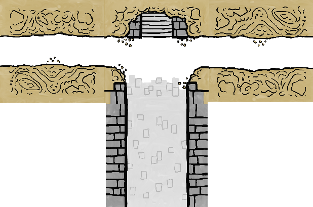
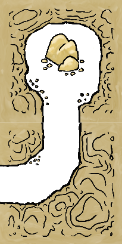
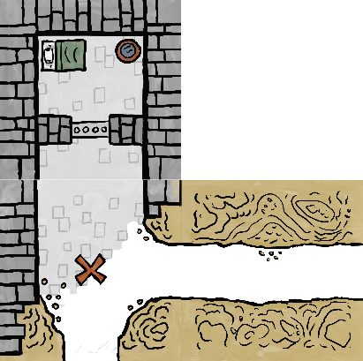

# SUMMARY

| Players | Time | Age |
| --- | --- | --- |
| 1-4 players | 45 minutes | 8+ years old |

You are the head engineer of a peaceful and prosperous underground colony. Unfortunately, greedy surface dwellers have been invading your colony, slaying your residents and stealing your gold. You must relocate and rebuild… but this time you will be prepared with traps!

# COMPONENTS

<table class="components">
<tr><th colspan="2">134 tiles</th></tr>
<tr><td></td><td></td></tr>
<tr><td>4 entrance T-shaped tiles (4 squares)</td><td>18 special I-shaped tiles (2 squares)</td></tr>
<tr><td></td><td></td></tr>
<tr><td>9 special L-shaped tiles (3 squares)</td><td>8 patch tiles (1 square)</td></tr>
<tr><td></td></tr>
<tr><td>104 square tiles (1 square)</td><td></td></tr>
</table>

<table class="components">
<tr><th colspan="3">36 cards</th></tr>
<tr><td></td><td></td><td></td></tr>
<tr><td>17 invader cards</td><td>8 event cards</td><td>11 map cards</td></tr>
</table>

<table class="components">
<tr><th colspan="5">144 tokens</th></tr>
<tr><td></td><td></td><td></td><td></td><td></td></tr>
<tr><td>64 Gold</td><td>24 Guards</td><td>16 Traps</td><td>16 Prisoners</td><td>24 Gems</td></tr>
</table>

4 meeples (visual aids to help you walk through your dungeon)

# SETUP
1. Each player takes a entrance T-shaped tile. Return any remaining entrance tiles to the game box.
2. Shuffle the L-shaped tiles and set aside in a face-down stack.
3. Shuffle the I-shaped tiles and set aside in a face-down stack.
4. Put all square tiles face-down in a pile in the middle of the table within reach of all players. 
5. Shuffle these cards into three separate decks:
  - Invader cards 
  - Event cards
  - Map cards
6. Set aside the supply of gold , guard , trap , gem , and prisoner  tokens.

# OVERVIEW
The game is played over 3 rounds. During each round, players will simultaneously construct their own colony from the shared pool of tiles. After the colonies are built, all of them will be simultaneously invaded by surface dwellers, who will attempt to steal the treasure contained within. After each invasion, players will abandon that colony but stash their surviving treasure to carry over to the next colony. At the end of the last round the player with the most valuable treasure stash will be the winner. 

Each round is broken down into 6 phases:
1. Build
2. Inspection
3. Populate
4. Invasion
5. Profit
6. Draft

## 1. BUILD PHASE
If playing with fewer than 4 players you will need to remove some tiles from the center pile. Choose the tiles to remove randomly and do not look at them.

| 1 player | 2 players | 3 players | 4 players |
| --- | --- | --- | --- |
| Remove 60 (44 remain) | Remove 40 (64 remain) | Remove 20  (84 remain) | Remove 0 (Play with all tiles) |

Once all players are ready, players simultaneously start collecting tiles to build their colony. You may take a face-down or face-up tile from the central pile into your hand, one at a time. If the tile was face-down you flip it face-up and look at it. Then you either add the tile to your personal colony or return it to the central pile face-up. 

The added tile must connect to at least one existing tile in your colony. All open edges of the new tile must either connect to nothing or to matching open edges of an existing tile. 
- You cannot match an open edge to a closed edge.
- You cannot match an open tunnel edge (cavern, small) to an open hallway edge (stone, large).

| ✔️ | ❌ |
| --- | --- |
|  |  |
|  |  |

After all the tiles in the central pile are gone or all players have chosen to stop building (no one wants the remaining tiles) begin the inspection phase.

<mark>TODO: Show an example built colony</mark>

## 2. INSPECTION PHASE
Take this opportunity to look at your neighbor’s colonies. It’s possible they have made mistakes during the build phase and have tiles that are invalidly placed (e.g. have mismatched open edges).

| ❌ |
| --- |
|  |

If a mistake is discovered in your colony, you must choose and remove tiles from your colony until there are no longer any invalid tiles.

If at any point a tile is no longer connected through a path to the colony entrance that tile is invalid removed from the colony.

| ❌ |
| --- |
|  |

Instead of removing tiles you may make replace a tile with a _Patch_ tile from the supply (<mark>TODO: Add to components list</mark>). _Patch_ tiles are always considered valid (they may have mismatched open edges or have open edges that connect to closed edges). If you choose to take a _Patch_ tile you must return a gem  token from your stash (see: "Profit Phase") to the supply, if able. You may take a _Patch_ tile even if you have no gem tokens.

## 3. POPULATE PHASE
During this phase you will place tokens from the supply (and potentially your stash of gem  tokens) on your colony. Consult the “Tiles” appendix to know which tokens go on which tiles.

> Important: Tiles that have an open edge do not receive any tokens.

You may have gem  and gold  tokens leftover in your stash from previous rounds. The gem  tokens must be stored in your colony or they are lost. They may be placed on colony _Treasure Chest_ tiles instead of placing a gold  token there.

If you do not have a valid tile to place your gem  token on you may instead exchange it for a guard  token from the supply and place that token on any square of your colony that does not already have a token.

Any leftover gold  tokens in your stash are safe. Set your stash aside until the "Profit Phase".

Once all colonies are populated the colonies will be invaded. 

## 4. INVASION PHASE
Create the shared invasion deck by shuffling together a number of invader cards and event cards depending on the current round:

| ROUND 1 | ROUND 2 | ROUND 3 |
| --- | --- | --- |
| 4 invader cards | 4 invader cards | 5 invader cards |
| 1 event card | 2 event cards | 2 event cards |

<mark>It’s possible to create 3 decks at setup with the ROUND I, II, II cards. Update these instructions for that. As is this section lacks mention of shuffling old invaders/events (if needed).</mark>

Draw and reveal one card from of the invasion deck. If that card is an invader (<mark>TODO: Invader cards should have a map icon</mark>) also draw a card from the map deck.

The invader card defines who is invading the colony and the map card describes how they will move through the colony.

| Invader | Map |
| --- | --- |
|  |  |

Each invader has a number of **hearts** ❤️ and a number of **bags** 💰. They may also have additional rules text. 

The invader starts at the entrance tile for each player’s colony. Each player handles the same type of invader and map traversal, but against their own colony and with their own instance of that invader.

> Important: Heart ❤️ and bag 💰 status is not shared across players.

The invader will then follow the rules outlined on their map until one of the following happens:
- If the invader takes total damage equal to their number of hearts ❤️ they are **defeated** and leave the colony.
- If the invader collects gold  tokens equal to their number of bags 💰 they are **successful** and leave the colony.
- If an invader collects a gem  token they are **successful** and leave the colony.
- The map may have a condition that causes the invader to leave the colony. 

Some notes:
- Even if the invader is defeated any gold  collected by that invader prior to being defeated is lost.
- When an invader leaves they are removed immediately. They do not traverse back towards the entrance.
- If there is ever a tie in how an invader wants to traverse your dungeon (there are two options equal distance apart) you decide how to break that tie.
- Both gold  tokens and gem  tokens are considered “treasure”.

<mark>TODO: Example of resolving an invader (for now consult the video)</mark>

### TOKEN EFFECTS
As the invader moves through the colony they encounter each square. If there is a token in that square something happens:
- If the square contains a **trap**  token remove the token and deal 1 ❤️ damage to the invader.
- B) If the square contains a **guard**  token remove the token and deal 1 ❤️ damage to the invader.
- C) If the square contains a **gem**  token remove the token and the invader leaves the colony (even if they had bag 💰 space remaining).
- D) If the square contains a **gold**  token remove the token and the invader uses up 1 of its bags 💰.

Nothing happens when a **prisoner**  token is encountered.

If there are multiple tokens in a square, they are processed one at a time in the order of your choice. This means that a guard  token may be encountered before dealing with a gold  token, for example.

### EVENT CARDS
Events cards execute the text on the card and are then considered resolved. You do not draw a matching map card for an event card.

 
### RE-ARM TRAPS
After the card from the invasion deck has been resolved you may decide to re-arm the traps in your colony. To do so remove one gold  token or one guard  token from your colony, then add trap  tokens to all _Trap_ tiles that do not have an open edge (e.g. the same criteria used during the Populate Phase). You must decide to re-arm traps before the next card is drawn from the invasion deck.

After each player has resolved the invader and had a chance to re-arm traps ,draw another card from the invasion deck and repeat the process. Continue until the invasion deck is empty.

## 5. PROFIT PHASE
After the colonies have been invaded you extract as much treasure as possible from your colony.
1. Count the guard  tokens remaining in your colony. The player with the most receives a gem  token. If there is a tie all players with that value receive a gem, unless that value is zero. Return all guards to the supply.
2. Exchange each prisoner  token for 2 gold  tokens from the supply (e.g. if you have 2 prisoners you return them to the supply and take 4 gold tokens).
3. Return all trap  tokens to the supply. They have no use anymore.
4. Move all gold  tokens and gem  tokens in your colony to your **stash**.

Dismantle your colony (setting aside your entrance tile and any of your other I-shaped or L-shaped tiles <mark>or patch tiles</mark>), returning all square tiles to the center of the table in a pile face-down and sufficiently randomized.

Each player then _must_ exchange each 5 gold  tokens in their stash for 1 gem  token. They keep any remaining gold  tokens in their stash.

> Important: Skip the exchange in the 3rd round. Proceed to End of Game.

## 6. DRAFT PHASE
> Important: Skip this phase during the 3rd round.

<mark>TODO: Include picture of the special tiles laid out as for a draft</mark>

Between each round you will get new special tiles that can be added to your future colonies. 
1. For each player in the game deal out 1 L-shaped special tile (e.g. in a 3 player game deal out 3).
2. For each player in the game deal out that many plus 1 I-shaped special tiles (e.g. in a 3 player game deal out 4).
3. <mark>Patch tiles are included in the draft</mark>

Count up the **treasure value** of your stash (each gold  token is worth 1 and each gem  token is worth 5). Your total determines the reverse order you will be able to draft. The player with the lowest treasure value will go first, followed by the player with the second least treasure value, etc. If there is a tie <mark>flip a coin or something</mark>? 

On your draft turn you take one of the special tiles (L-shaped or I-shaped <mark>or patch tiles?</mark>). When everyone has taken one tile repeat the process in the same draft order so that each player ends up with 2 new tiles. Return any remaining unchosen tiles to the game box.

These special tiles can be added to your colony during the build phase. They can be added at any time (including after all the normal square tiles have been taken). They are kept from round to round, even if they are not used during the build phase. If they are ever removed from your colony they will return to you to use in the next round.

Return any tiles that were removed from the pile during the build phase or from player’s colonies in the inspection or invasion phase to the center pile (face-down).
<mark>Is this the right time for this step?</mark>

# END OF GAME
After playing all 3 rounds the winner is the player with the highest treasure value (totaled the same way as during the draft phase). If there is a tie the player with the most gem  tokens wins. If a tie remains the players share the victory.

# SINGLEPLAYER
<mark>TODO: Enter score targets and timer requirements (2:30 standard difficulty)</mark>

# CREDITS

| | |
| --- | --- |
| Game Design | Chris Glein |
| Art | Chris Glein |
 
# TILES
## STANDARD TILES

| Tile | Description |
| --- | --- |
|  | **Entrance** Invaders will start on this tile. |
|  | **Treasure Chest** Populates 1 gold  token. May alternatively be used to store a gem  token from your stash. |
|  | **Campfire** Populates 1 guard  token. |
|  | **Trap** Populates 1 trap  token. |
|  | **Ore Vein** Populates 2 gold  tokens on it if there is a path with 5 or more squares between it and the dungeon entrance (not including the entrance square or the ore square) |
|  | **Cell** Whenever an invader is defeated you place a prisoner  token on one of your cell tiles that does not already have a prisoner token. These tokens may be ransomed at the end of the round for 2 gold  each. |

## SPECIAL TILES
The following tiles only appear on special tiles which are drafted between rounds 1 and 2 and rounds 2 and 3:

| Tile | Description |
| --- | --- |
|  | **Patch** The edges of this tile are not considered an error with any type of closed or open edge on adjacent tiles. |
|  | **Gem Vein** Populates 1 gem  token if there is a path with 10 or more squares between it and the colony entrance (not including the entrance square or the gem square) |
|  | **Mess Hall** Populates 1 guard  token. At the end of the populate phase you may move guard tokens from anywhere in your colony to any adjacent connected squares to a Mess Hall square. |
|  | **Infirmary** After each invader leaves your dungeon (or is defeated) you may add one guard  token to a Campfire tile that has no open edges (e.g. following the same rules as the Populate Phase). |

