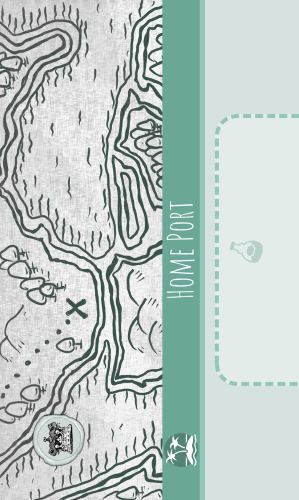
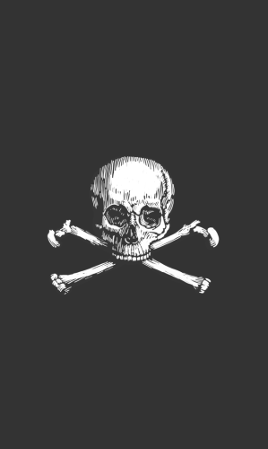
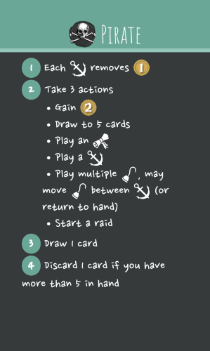
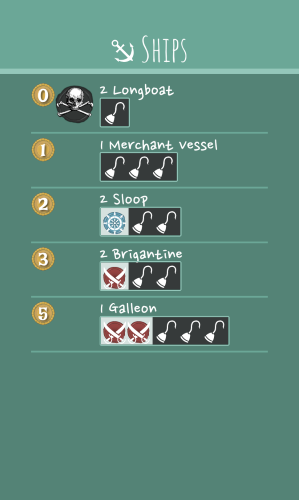
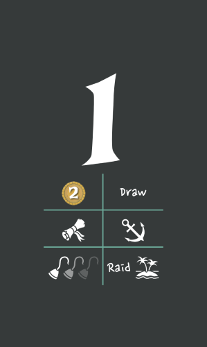
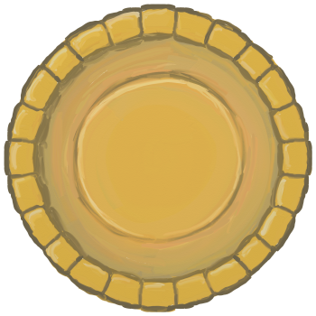
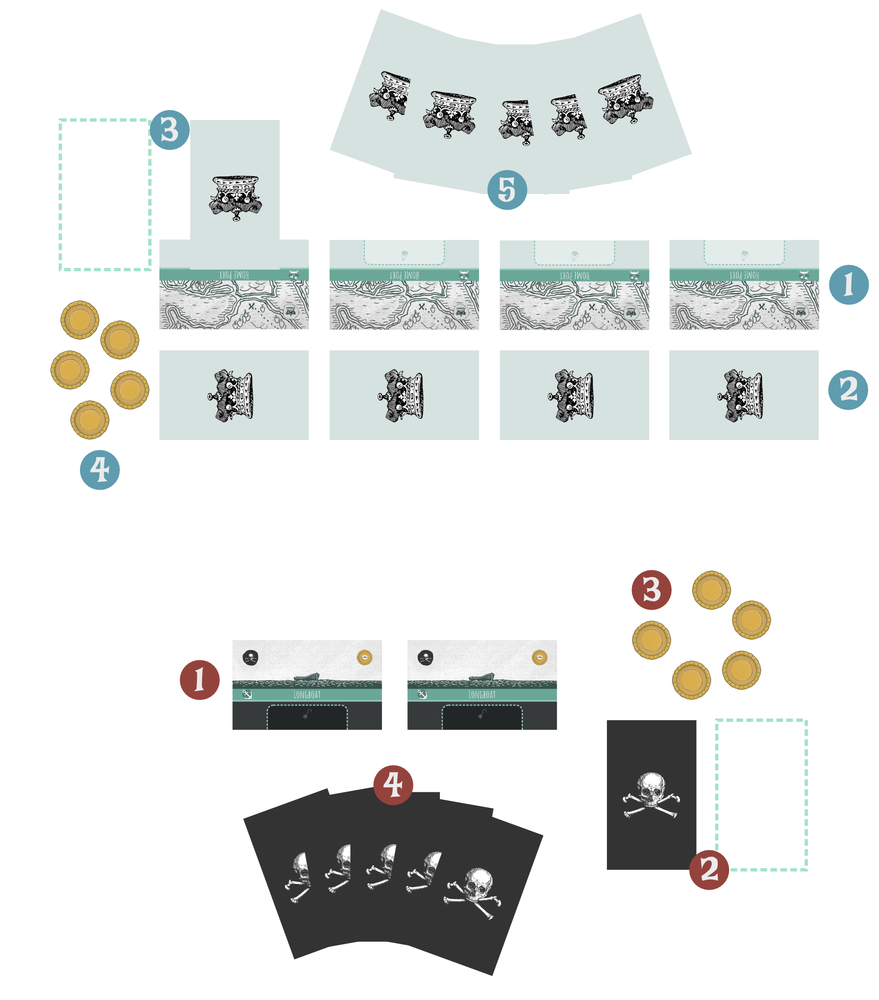
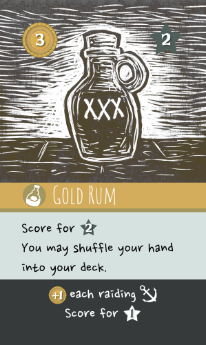

This is a succinct version of the rules you need to play _Rum Runner_. If you are seeking clarifications or more examples, try the [rules reference](rules.html).

# COMPONENTS
<table class="noBorder components">
<tr><td></td><td></td><td></td><td></td></tr>
<tr><td class="componentDescription">38 crown cards 13🍾, 11🌊, 3📜</td><td class="componentDescription">1 crown rules summary</td><td class="componentDescription">4 starting hazards 🌊</td><td class="componentDescription">4 islands 🏝️</td></tr>
<tr><td></td><td></td><td></td><td></td></tr>
<tr><td class="componentDescription">25 pirate cards 6⚓, 11🪝, 5📜</td><td class="componentDescription">1 pirate rules summary</td><td class="componentDescription">2 starting ships ⚓</td><td></td></tr>
<tr><td></td><td></td><td> </td><td></td></tr>
<tr><td class="componentDescription">2 decklist cards</td><td class="componentDescription">3 action cards</td><td class="componentDescription">40 coins 🟡</td><td></td></tr>
</table>

# SETUP
1. Place the coins 🟡 somewhere in reach of both players. This is the bank.
1. Determine who will play the **crown** 👑 and who will play the **pirate** ☠️. To assign roles randomly you can flip a coin, or you can shuffle the 2 rules reminder cards and hand 1 to each player.

## CROWN 👑
1. Take the 4 island 🏝️ cards (including _Home Port_) and place them in front of you in a row.
1. Find the 4 starting hazard 🌊 cards (they will have a 👑 icon on them), shuffle them, then place one face-down in front of each island (between the island cards and the pirate player). You may look at these cards after they are all placed.
1. Shuffle the crown cards into a face-down deck and place it on the _Home Port_ island. It may be convenient to place the _Home Port_ island either to the far right or far left, depending on your handedness. Leave room near the island for a face-up discard pile.
1. Take 5 🟡 to start your personal supply.
1. Draw a hand of 5 cards from your deck.

## PIRATE ☠️
1. Find the 2 starting ship cards ⚓ (they will have a ☠️ icon on them) and play them front of you.
1. Shuffle the pirate cards into a face-down deck. Leave room near the deck for a face-up discard pile.
1. Take 5 🟡 to start your personal supply.
1. Draw a hand of 5 cards from your deck.

# GOAL
Both players want **rum**. The crown wins if they **fund** 4 points ⭐ worth of rum (where different bottles will have different point values). The pirate wins if they **raid** 4 points ⭐ worth of rum (where each bottle is always worth 1 point ⭐ when raided; when it comes to rum pirates only care about quantity, not quality). Each player will track their score by accumulating scored rum cards in a personal score pile.

The two players play differently.
- The crown 👑 will primarily play cards face-down as information hidden from the pirate. The crown will start **investments** (including rum) across their various islands and raise **hazards** to defend them.
- The pirate ☠️ will play their cards face-up. They will buy **ships** and hire **crew** that together will raid the crown's islands in hopes of finding rum.

There are a total of 7 rum cards in the crown's deck. Either the crown will score 2-4 of those rum cards to score 4 points ⭐, or the pirate will raid 4 of those rum cards to get their 4 points ⭐.

# ICONOGRAPHY & TERMS
<table class="splitTable">
<tr><th>Icon</th><th>Meaning</th><th class="splitColumn" width="20px"></th><th>Icon</th><th>Card Type</th></tr>
<tr><td>👑</td><td>Crown</td><td class="splitColumn"></td><td>📜</td><td>Event card</td></tr>
<tr><td>☠️</td><td>Pirate</td><td class="splitColumn"></td><td>🍾</td><td>Investment card</td></tr>
<tr><td>🟡</td><td>Coin</td><td class="splitColumn"></td><td>🌊</td><td>Hazard card</td></tr>
<tr><td>🧭</td><td>Navigation skill</td><td class="splitColumn"></td><td>🏝️</td><td>Island card</td></tr>
<tr><td>⚔</td><td>Combat skill</td><td class="splitColumn"></td><td>⚓</td><td>Ship card</td></tr>
<tr><td>⭐</td><td>Victory point</td><td class="splitColumn"></td><td>🪝</td><td>Crew card</td></tr>
</table>

### Cards: Trash, Discard, and Score
- To **trash** a card place it in the owner's face-up discard pile. If there were any 🟡 on it, those are returned to the bank.
- To **discard** a card take a card of your hand and place it in your face-up discard pile.
- To **score** a card remove it from play (return any 🟡 on it to the bank) and add it to the player's score pile. If the total points ⭐ on cards in the player's score pile is 4 or more, they win the game.

### Coins: Add, Pay, and Remove
- To +1🟡 (**add**) a card take a coin from the bank and place it on top of the card.
- To **pay** 🟡 those coins must come from your personal supply. 
- To **remove** 🟡 those coins are removed from a card and returned to the bank. 

# TURN
Each player alternates taking turns, with the crown always taking the first turn.

The turn phases are as follows:
- Upkeep
  - 👑 Reveal funded investments
  - ☠️ Ready ships
- Take 3 actions
- End of turn

## UPKEEP
The two players start their turn differently.

### 👑 Reveal funded investments
At the start the crown's turn they may flip any face-down investment cards that are **funded** to their face-up side. An investment is funded if it has 🟡 on it greater than or equal to the investment's price (shown in the top left of the card).
- The coins remain on the investment after it is flipped face-up.
- The crown may choose to not flip an investment, even if has funded.
- The top half of the text on an investment card (black text on a light background) is the "funded text" and is for the crown. That is executed when the card is funded and face-up. The text immediate applies and may indicate effects that triggers every turn.
- The bottom half of the text on an investment card (white text on a black background) is “raid text” and is for the pirate. It is only executed when the card is raided (see "The Raid" below).
- If a funded card says to score the card, remove it from play (return any 🟡 on it to the bank) and add it to the crown's score pile. If the total points ⭐ on cards in the crown's score pile is 4 or more, they win the game.

<table>
<tr><th colspan="2">Example 1</th></tr>
<tr>
<td style="min-height: 250px;">

This investment requires 3 🟡 on it to be funded. When revealed as funded it will give the crown 2 of the 4 points needed to win the game, and then they may choose to shuffle their hand into their deck. If raided the pirate will score 1 point, and add 1 🟡 to each ship ⚓ that participated in the raid.
</td>
</tr>
</table>

<table>
<tr><th colspan="2">Example 2</th></tr>
<tr>
<td style="min-height: 250px;">

This investment requires 1 🟡 on it to be funded. While funded it gives the crown an effect each turn where they can +1 🟡 on of their cards. If raided the pirate must pay 🟡 equal to the amount of 🟡 on the card or they may not trash it.
</td>
</tr>
</table>

### ☠️ Ready ships
At the start of the pirate's turn they remove 1 🟡 from each ship ⚓ in play (returning the 🟡 to the bank).

## ACTIONS
The rest of your turn (whether crown or pirate) functions largely the same. You will take 3 **actions**. Some of the available actions are shared, while some are only for the crown and some are only for the pirate (as indicated below with 👑 or ☠️).

You make take the same action type multiple times, and you make take actions in any order.

### Gain coins
Take 2 🟡 from the bank and add it to your supply.

### Draw
Draw cards from your deck until you have 5 cards in your hand.

### Play an event
Play an event 📜 card from your hand into your discard pile face-up. You must pay its 🟡 cost (shown in the top left of the card) from your supply to the bank. Execute the text on the card.

### 👑 Play investments
Play any number of investment 🍾 cards from your hand face-down on any islands in play that do not already have any cards on them
### 👑 Play a hazard
Play a hazard 🌊 card from your hand face-down in front of one of your islands. If there are already hazard cards in front of the island, the new card goes in the position furthest away from the island (closest to the pirate player).

### 👑 Recall
Return one of your cards that is in play (investment 🍾 or hazard 🌊) to your hand. Any 🟡 on that card are moved to your supply.
### 👑 Invest
Pay any number of 🟡 from your supply. Add a single 🟡 to the same number of your cards in play (hazards or investments).

### ☠️ Play a ship
Play a ship ⚓ card from your hand in front of you. You must pay its 🟡 cost (shown in the top left of the card) from your supply to the bank.

### ☠️ Play crew
Play any number of crew 🪝 cards from your hand into available slots on ships ⚓ in play. For each crew card you play must pay its 🟡 cost (shown in the top left of the card) from your supply to the bank.

When you take this action you may also rearrange crew 🪝 in play between crew slots on ships ⚓ in play, and you may recall any crew in play to your hand.

### ☠️ Raid
The details of how a raid works are covered below in "The Raid" section.

## END OF TURN
After taking your 3 actions, draw 1 card from your deck.

If you have more than 5 cards in your hand, discard 1 card from your hand into your face-up discard pile.

### Discarded cards are raided cards

👑 If the crown player discards a card (through this or any other game effect), treat it as if that card had been raided. See "Raiding a card" below for details.

### When your deck runs out
👑 When the crown's deck runs out, that's it. They must make do with the cards in their hand and already in play.

☠️ When the pirate's deck runs out, nothing happens until they need to draw more cards. As soon as the pirate needs to draw 1 or more cards then they flip their discard pile face-down, shuffle it, and form a new draw deck. After doing so they remove the top 5 cards of their deck from the game (return to the game box). Then (if any cards remain), they resume drawing cards.

# THE RAID
At the center of the game is the act of the pirate raiding the crown's islands. If the pirate does not raid, the crown will eventually win.

Generally, a raid is started by the pirate taking an action to do so, although there are event cards that will also start a raid as part of their action (e.g. _Treasure Map_).

The steps to resolve a raid are as follows:
1. ☠️ Choose a target island
1. ☠️ Form the raiding party
1. 👑 Raise hazards
1. ☠️ Face hazards
1. ☠️ Raid the island
1. ☠️ Trigger crew effects

For a detailed example, see "Example of a Raid" in the full rules reference.

## 1. ☠️ CHOOSE A TARGET ISLAND
The pirate chooses and announces one of the crown's islands as the target for the raid.

## 2. ☠️ FORM THE RAIDING PARTY
The pirate then chooses 1 or more ships ⚓ that will join the raid. The pirate may not choose a ship that has any 🟡 on it, or a ship that has no crew 🪝 slotted into it. For each ship chosen the pirate must then place a 🟡 from their supply on the chosen ship.

The ships that are joined to the raid and the crew on those ships are called the **raiding party**.

## 3. 👑 RAISE HAZARDS
The crown can then raise any number of face-down hazards 🌊 that have been played in front of the target island. For each face-down hazard the crown may pay its 🟡 cost (shown in the top left of the card) to flip it face-up. This cost may be paid using any combination of 🟡 from the crown's supply or 🟡 on the face-down hazard card. Any 🟡 on the hazard not used to pay its cost remain on the card after it is flipped face-up.

Immediately after flipping a card face-up the crown may add any additional 🟡 from their supply to the face-up hazard. The number of 🟡 on a hazard will generally affect how many uses that hazard has.

## 4. ☠️ FACE HAZARDS
The pirate then encounters the face-up hazards 🌊 (if any) one at a time, starting with the furthest away from the island that is being raided.

Each hazard has one or more costs listed at the bottom of the card. The pirate checks to see if they can fulfill each of these costs. If they could pay multiple, then they choose one to pay. If they cannot pay _any_ of the hazard's costs then the raid will be unsuccessful.

Some details on hazard costs:
- If the pirate can pay one of a hazard's costs then they must, _even if they don't want to_. 
- Hazard costs are read from the pirate's perspective, and any choices are made by the pirate. For example, if the pirate player is asked to trash crew, the pirate player would choose which crew.
- Only members of the raiding party can be affected by the hazard. You may not pay hazard costs with other ships or crew (unless specified otherwise by the cards in play).
- Many hazards require skills like **navigation** (🧭) or **combat** (⚔). These are resources that are provided by the raiding party. To meet a requirement for 🧭🧭, for example, the pirate player could source that from a combination of a ship (their _Sloop_) and one of its crew (_Stinky Pete_). Each ship or crew skill icon can only be used once per raid, so if a second hazard is encountered in the same raid then those costs will need to be met by different members of the raiding party. 

<table>
<tr><th colspan="2">Example 1</th></tr>
<tr>
<td style="min-height: 150px;">

This hazard may be overcome by providing 3 🧭 across the raiding party's crew 🪝 and ships ⚓. For example, a raiding party containing a <em>Sloop</em>, <em>Cuthroat Carlie</em>, and <em>Enric Cursemaker</em>, from the "Example of a Raid" section below could meet this cost. If the requirement cannot be met, the raid is stopped and is unsuccessful.
</td>
</tr>
</table>

<table>
<tr><th colspan="2">Example 2</th></tr>
<tr>
<td style="min-height: 150px;">

This hazard may be overcome by either discarding 2 cards or by trashing a crew 🪝 (from the raiding party). If either cost can be paid, the raid continues (assuming there are crewed ships remaining in the raid). Note that this particular cost can always be paid, as a raiding party will always have at least one crew. However if after paying the cost there are new crewed ships remaining in the raiding party then the raid will be stopped and will be unsuccessful.
</td>
</tr>
</table>

After a hazard has been evaluated (either successfully or unsuccessfully) check if the hazard has any 🟡 on it.
- If it has one or more 🟡, return one of its 🟡 to the bank.
- If it has no 🟡, trash the hazard card.

The hazard is now resolved.
- If the pirate was unable to pay one of the hazard's costs then the raid is stopped (and is **unsuccessful**).
- If one of the ships in the raiding party no longer has any crew then that ship is no longer part of the raiding party.
- If there are no ships in the raiding party then the raid is stopped (and is **unsuccessful**).

If the raid has not been stopped this process continues with the next face-up hazard closest to the island, then the next, until no more remain.

When all face-up hazards have been resolved and the raid was not stopped the raid is considered **successful**.

## 5. ☠️ RAIDING THE ISLAND
If the raid was unsuccessful, this step is skipped.

- If there is a single card on the island, raid that card.
- If there are multiple cards in a deck on the island (e.g. _Home Port_), then raid the top card of that deck.
- If there are no cards on the island, and it is _Home Port_, and the crown has 1 more cards in their hand, then raid a card chosen randomly from the crown’s hand.
- Otherwise, no card is raided (but the raid is still considered successful).

### Raiding a card
When raiding a card reveal it to both players.

If the card has "raid text" listed at the bottom of the card, the pirate resolves it. This may add a cost or side effect to raiding the card.

Then trash the card (unless prevented by the raid effect text).

<table>
<tr><th colspan="2">Example</th></tr>
<tr>
<td style="min-height: 250px;">
The raid text at the bottom of this card requires that the pirate pay 🟡 equal to the number of 🟡 on the investment to trash it, otherwise it remains in play.
</td>
</tr>
</table>

## 6. ☠️ TRIGGER CREW EFFECTS
After a raid has ended, whether successful or not, execute the game text of all crew in the raiding party. If there are multiple crew the effects may be resolved in the order of the pirate's choosing.

# END GAME
The game ends as soon as the crown scores 4 points ⭐ of rum (via funding) or the pirate scores 4 points ⭐ cards (via raiding). Whoever hit 4 points first wins.