# SUMMARY
It's the Age of Sail! The **crown** is distilling rum on colonized islands for enormous profit. Meanwhile **pirates** intend to sail in, steal that rum, and drink it all. These two factions (crown 👑 and pirate ☠️) play their conflict out over a two player asymmetric card game. Each player has a deck, a hand of cards, coins, and a menu of actions to choose from each turn. But what each does from there varies substantially.

👑 The **crown** player will work in secret, laying traps and pushing for an economic victory. They score rum by founding it on an island and investing coins into it over time. They protect that investment by placing hazards in front of the island face-down. When the pirate player tries to raid that island the crown can decide to spend their coin to raise those hazards against the pirate, stopping them or making them pay a terrible price. The crown may alternatively place traps or economic investments on their islands, luring the pirate to certain doom or increasing the momentum of the crown's victory. If the crown manages to hold out and score four points of rum, they win the game.

☠️ The **pirate** player will assemble ships and crew. These will hopefully raid their way to where the rum is with a combination of deduction and perseverance. But regardless they will trigger and combo together unique crew's abilities to gain an advantage. If the pirate finds four bottles of rum (quality doesn't matter), they win the game.

# COMPONENTS
<table class="noBorder components">
<tr><td>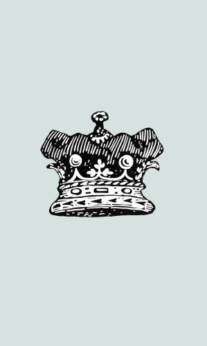</td><td>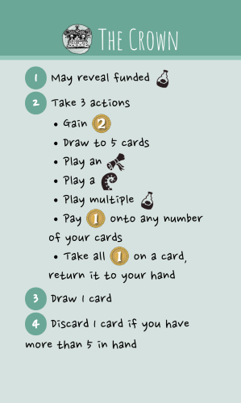</td><td>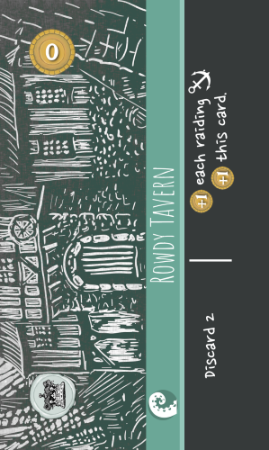</td><td></td></tr>
<tr><td class="componentDescription">38 crown cards 13🍾, 11🌊, 3📜</td><td class="componentDescription">1 crown rules summary</td><td class="componentDescription">4 starting hazards 🌊</td><td class="componentDescription">4 islands 🏝️</td></tr>
<tr><td></td><td></td><td>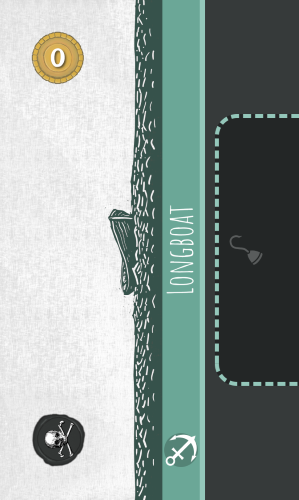</td><td></td></tr>
<tr><td class="componentDescription">25 pirate cards 6⚓, 11🪝, 5📜</td><td class="componentDescription">1 pirate rules summary</td><td class="componentDescription">2 starting ships ⚓</td><td></td></tr>
<tr><td></td><td></td><td> </td><td></td></tr>
<tr><td class="componentDescription">2 decklist cards</td><td class="componentDescription">3 action cards</td><td class="componentDescription">40 coins 🟡</td><td></td></tr>
</table>

# SETUP
1. Place the coins 🟡 somewhere in reach of both players. This is the bank.
1. Determine who will play the **crown** 👑 and who will play the **pirate** ☠️. To assign roles randomly you can flip a coin, or you can shuffle the 2 rules reminder cards and hand 1 to each player.

## CROWN 👑
1. Take the 4 island 🏝️ cards (including _Home Port_) and place them in front of you in a row.
1. Find the 4 starting hazard 🌊 cards (they will have a 👑 icon on them), shuffle them, then place one face-down in front of each island (between the island cards and the pirate player). You may look at these cards after they are all placed.
1. Shuffle the crown cards into a face-down deck and place it on the _Home Port_ island. It may be convenient to place the _Home Port_ island either to the far right or far left, depending on your handedness. Leave room near the island for a face-up discard pile.
1. Take 5 🟡 to start your personal supply.
1. Draw a hand of 5 cards from your deck.

## PIRATE ☠️
1. Find the 2 starting ship cards ⚓ (they will have a ☠️ icon on them) and play them front of you.
1. Shuffle the pirate cards into a face-down deck. Leave room near the deck for a face-up discard pile.
1. Take 5 🟡 to start your personal supply.
1. Draw a hand of 5 cards from your deck.

# GOAL
Both players want **rum**. The crown wins if they **fund** 4 points ⭐ worth of rum (where different bottles will have different point values). The pirate wins if they **raid** 4 bottles worth of rum (each bottle is always worth 1 point ⭐ to them). When it comes to rum, pirates only care about quantity, not quality.

The two players play differently.
- The crown 👑 will primarily play cards face-down as information hidden from the pirate. The crown will start **investments** (including rum) across their various islands and raise **hazards** to defend them.
- The pirate ☠️ will play their cards face-up. They will buy **ships** and hire **crew** that together will raid the crown's islands in hopes of finding rum.

There are a total of 7 rum cards in the crown's deck. Either the crown will score 2-4 of those rum cards to score 4 points ⭐, or the pirate will raid 4 of those rum cards.

# ICONOGRAPHY & TERMS
<table class="splitTable">
<tr><th>Icon</th><th>Meaning</th><th class="splitColumn" width="20px"></th><th>Icon</th><th>Card Type</th></tr>
<tr><td>👑</td><td>Crown</td><td class="splitColumn"></td><td>📜</td><td>Event card</td></tr>
<tr><td>☠️</td><td>Pirate</td><td class="splitColumn"></td><td>🍾</td><td>Investment card</td></tr>
<tr><td>🟡</td><td>Coin</td><td class="splitColumn"></td><td>🌊</td><td>Hazard card</td></tr>
<tr><td>🧭</td><td>Navigation skill</td><td class="splitColumn"></td><td>🏝️</td><td>Island card</td></tr>
<tr><td>⚔</td><td>Combat skill</td><td class="splitColumn"></td><td>⚓</td><td>Ship card</td></tr>
<tr><td>⭐</td><td>Victory point</td><td class="splitColumn"></td><td>🪝</td><td>Crew card</td></tr>
</table>

### Cards: Trash and Discard
- To **trash** a card place it in the owner's face-up discard pile. If there were any 🟡 on it, those are returned to the bank.
- To **discard** a card take a card of your hand and place it in your face-up discard pile.

### Coins: Add, Pay, and Remove
- To +1🟡 (**add**) a card take a coin from the bank and place it on top of the card.
- To **pay** 🟡 those coins must come from your personal supply. 
- To **remove** 🟡 those coins are removed from a card and returned to the bank. 

# TURN
Each player alternates taking turns, with the crown always taking the first turn.

The turn phases are as follows:
- Upkeep
  - 👑 Reveal funded investments
  - ☠️ Ready ships
- Take 3 actions
- End of turn

## UPKEEP
The two players start their turn differently.

### 👑 Reveal funded investments
At the start the crown's turn they may flip any face-down investment cards that are **funded** to their face-up side. An investment is funded if it has 🟡 on it greater than or equal to the investment's price (shown in the top left of the card).
- The coins remain on the investment after it is flipped face-up.
- The crown may choose to not flip an investment, even if has funded.
- The top half of the text on an investment card (black text on a light background) is the "funded text" and is for the crown. That is executed when the card is funded and face-up. The text immediate applies and may indicate effects that triggers every turn.
- The bottom half of the text on an investment card (white text on a black background) is “raid text” and is for the pirate. It is only executed when the card is raided (see "The Raid" below).
- If a funded card says to score the card, remove it from play (return any 🟡 on it to the bank) and add it to the crown's score pile. If the total points ⭐ on cards in the crown's score pile is 4 or more, they win the game.

<table>
<tr><th colspan="2">Example 1</th></tr>
<tr>
<td style="min-height: 250px;">

This investment requires 3 🟡 on it to be funded. When revealed as funded it will give the crown 2 of the 4 points needed to win the game, and then they may choose to shuffle their hand into their deck. If raided the pirate will score 1 point, and add 1 🟡 to each ship ⚓ that participated in the raid.
</td>
</tr>
</table>

<table>
<tr><th colspan="2">Example 2</th></tr>
<tr>
<td style="min-height: 250px;">
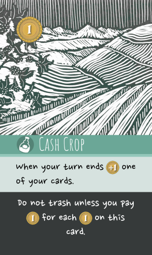
This investment requires 1 🟡 on it to be funded. While funded it gives the crown an effect each turn where they can +1 🟡 on of their cards. If raided the pirate must pay 🟡 equal to the amount of 🟡 on the card or they may not trash it.
</td>
</tr>
</table>

### ☠️ Ready ships
At the start of the pirate's turn they remove 1 🟡 from each ship ⚓ in play (returning the 🟡 to the bank).

<table>
<tr><th colspan="2">Example</th></tr>
<tr>
<td style="min-height: 150px;">
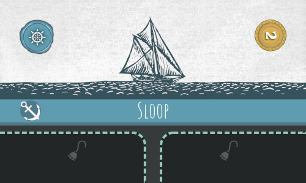
If this ship ⚓ had 3 🟡 on it at the start of the turn, 1 🟡 would return to the bank, leaving 2 🟡 still on the ship.
</td>
</tr>
</table>

## ACTIONS
The rest of your turn (whether crown or pirate) functions largely the same. You will take 3 **actions**. Some of the available actions are shared, while some are only for the crown and some are only for the pirate.

| Crown 👑 | Pirate ☠️ | Action |
| --- | --- | --- |
| ✔ | ✔ | Gain coins 🟡 |
| ✔ | ✔ | Draw |
| ✔ | ✔ | Play an event 📜 |
| ✔ | - | Play investments 🍾 |
| ✔ | - | Play a hazard 🌊 |
| ✔ | - | Recall |
| ✔ | - | Invest |
| - | ✔ | Play a ship ⚓ |
| - | ✔ | Play/Rearrange crew 🪝 |
| - | ✔ | Raid |

You make take the same action type multiple times, and you make take actions in any order.

| Example | |
| --- | --- |
| On their turn the ☠️ player chooses these 3 actions: 1. Draw 2. Gain coins 🟡 3. Raid | On their turn the 👑 player chooses these 3 actions: 1. Gain coins 🟡 2. Invest 3. Gain coins 🟡 |

### Gain coins
Take 2 🟡 from the bank and add it to your supply.

### Draw
Draw cards from your deck until you have 5 cards in your hand.
- If your deck is out of cards you may be able to replenish your deck. See "When your deck runs out" below.

### Play an event
Play an event 📜 card from your hand into your discard pile face-up. You must pay its 🟡 cost (shown in the top left of the card) from your supply to the bank. Execute the text on the card.

### 👑 Play investments
Play any number of investment 🍾 cards from your hand face-down on available islands in play.
- If an island already has a card on it (either face-up or face-down), you may not add a second investment card.
- If the *Home Port* island has no cards on it (your deck is empty) you may play investment cards to it.
- Although most investment cards have a 🟡 cost, that cost is not paid now.
- Only investment cards may be placed face-down. It is invalid to play other card types (e.g. event 📜 or hazard 🌊 cards) as face-down investments. See "Invalid face-down cards" below.

### 👑 Play a hazard
Play a hazard 🌊 card from your hand face-down in front of one of your islands.
- If there are already hazard cards in front of the island, the new card goes in the position furthest away from the island (closest to the pirate player).
- Although most hazard cards have a 🟡 cost, that cost is not paid now.
- There is no limit to how many cards may be placed in front of a single island.
- Only hazard cards may be placed face-down. It is invalid to play other card types (e.g. event 📜 or investment 🍾 cards) as face-down hazards. See "Invalid face-down cards" below.

### 👑 Recall
Return one of your cards that is in play (investment 🍾 or hazard 🌊) to your hand. Any 🟡 on that card are moved to your supply.
- If the card was face-down you do not need to reveal what it was to the pirate player.

### 👑 Invest
Pay any number of 🟡 from your supply. Add a single 🟡 to the same number of your cards in play (hazards or investments).
- This means that for each investment action you can place 🟡 on as many cards as you like, but a maximum of one 🟡 per card.
- You may only place 🟡 on your own cards.

### ☠️ Play a ship
Play a ship ⚓ card from your hand in front of you. You must pay its 🟡 cost (shown in the top left of the card) from your supply to the bank.

### ☠️ Play crew
Play any number of crew 🪝 cards from your hand into available slots on ships ⚓ in play. For each crew card you play must pay its 🟡 cost (shown in the top left of the card) from your supply to the bank.
- Each ship has a fixed number of crew slots. You may not add a crew to a ship if all of its slots are filled.

When you take this action you may also rearrange crew 🪝 in play between crew slots on ships ⚓ in play, and you may recall any crew in play to your hand.
- You may move crew even if their source or destination ship has 🟡 on it.
- You may take this action to rearrange crew even if you play no new crew.
- You may rearrange or recall crew before playing new crew (e.g. to open up a slot on a ship).

### ☠️ Raid
The details of how a raid works are covered below in "The Raid" section.

## END OF TURN
After taking your 3 actions, draw 1 card from your deck.

If you have more than 5 cards in your hand, discard 1 card from your hand into your face-up discard pile.

- You only need to discard 1 card even if you still have more than 5 cards in your hand.

### Discarded cards are raided cards

👑 If the crown player discards a card (through this or any other game effect), treat it as if that card had been raided. See "Raiding a card" below for details.

- Most importantly, this means that if the crown player discards rum, the pirate player will score that rum.

### When your deck runs out
👑 When the crown's deck runs out, that's it. They must make do with the cards in their hand and already in play.

- As called out in the "Play investments" action, *Home Port* is now available for playing investments, just like other islands.

☠️ When the pirate's deck runs out, nothing happens until they need to draw more cards. As soon as the pirate needs to draw 1 or more cards then they flip their discard pile face-down, shuffle it, and form a new draw deck. After doing so they remove the top 5 cards of their deck from the game (return to the game box). Then (if any cards remain), they resume drawing cards.
- Both players may look at the cards that were removed from the game.
- If there were fewer than 5 cards, remove as many as there were available.

# THE RAID
At the center of the game is the act of the pirate raiding the crown's islands. If the pirate does not raid, the crown will eventually win.

Generally, a raid is started by the pirate taking an action to do so, although there are event cards that will also start a raid as part of their action (e.g. _Treasure Map_).

The steps to resolve a raid are as follows:
1. ☠️ Choose a target island
1. ☠️ Form the raiding party
1. 👑 Raise hazards
1. ☠️ Face hazards
1. ☠️ Raid the island
1. ☠️ Trigger crew effects

For a detailed example, see "Example of a Raid" below.

## 1. ☠️ CHOOSE A TARGET ISLAND
The pirate chooses and announces one of the crown's islands as the target for the raid.

## 2. ☠️ FORM THE RAIDING PARTY
The pirate then chooses 1 or more ships ⚓ that will join the raid. The pirate may not choose a ship that has any 🟡 on it, or a ship that has no crew 🪝 slotted into it. For each ship chosen the pirate must then place a 🟡 from their supply on the chosen ship.
- The ships that are joined to the raid and the crew on those ships are called the **raiding party**.

## 3. 👑 RAISE HAZARDS
The crown can then raise any number of face-down hazards 🌊 that have been played in front of the target island. For each face-down hazard the crown may pay its 🟡 cost (shown in the top left of the card) to flip it face-up. This cost may be paid using any combination of 🟡 from the crown's supply or 🟡 on the face-down hazard card. Any 🟡 on the hazard not used to pay its cost remain on the card after it is flipped face-up.

Immediately after flipping a card face-up the crown may add any additional 🟡 from their supply to the face-up hazard. The number of 🟡 on a hazard will generally affect how many uses that hazard has.

- If the crown opts to not raise an individual hazard, that card remains face-down. Likewise any hazards that were already face-up remain face-up.
- As part of this step the crown may not pay 🟡 onto hazards that were already face-up. Those can only be added later by taking the invest action or through resolving other card effects (e.g. _Royal Decree_).

## 4. ☠️ FACE HAZARDS
The pirate then encounters the face-up hazards 🌊 (if any) one at a time, starting with the furthest away from the island that is being raided.

Each hazard has one or more costs listed at the bottom of the card. The pirate checks to see if they can fulfill each of these costs. If they could pay multiple, then they choose one to pay. If they cannot pay _any_ of the hazard's costs then the raid will be unsuccessful.

Some details on hazard costs:
- If they pirate can pay one of a hazard's costs then they must, _even if they don't want to_. 
- Hazard costs are read from the pirate's perspective, and any choices are made by the pirate. For example, if the pirate player is asked to trash crew, the pirate player would choose which crew.
- Only members of the raiding party can be affected by the hazard. You may not pay hazard costs with other ships or crew (unless specified otherwise by the cards in play).
- Many hazards require skills like **navigation** (🧭) or **combat** (⚔). These are resources that are provided by the raiding party. To meet a requirement for 🧭🧭, for example, the pirate player could source that from a combination of a ship (their _Sloop_) and one of its crew (_Stinky Pete_). Each ship or crew skill icon can only be used once per raid, so if a second hazard is encountered in the same raid then those costs will need to be met by different members of the raiding party. 

<table>
<tr><th colspan="2">Example 1</th></tr>
<tr>
<td style="min-height: 150px;">

This hazard may be overcome by providing 3 🧭 across the raiding party's crew 🪝 and ships ⚓. For example, a raiding party containing a <em>Sloop</em>, <em>Cuthroat Carlie</em>, and <em>Enric Cursemaker<em>, from the "Example of a Raid" section below could meet this cost. If the requirement cannot be met, the raid is stopped and is unsuccessful.
</td>
</tr>
</table>

<table>
<tr><th colspan="2">Example 2</th></tr>
<tr>
<td style="min-height: 150px;">
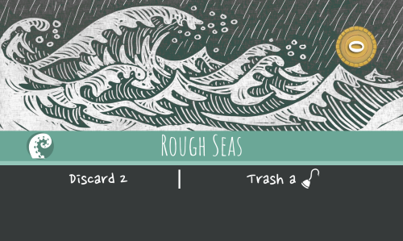
This hazard may be overcome by either discarding 2 cards or by trashing a crew 🪝 (from the raiding party). If either cost can be paid, the raid continues (assuming there are crewed ships remaining in the raid). Note that this particular cost can always be paid, as a raiding party will always have at least one crew. However if after paying the cost there are new crewed ships remaining in the raiding party then the raid will be stopped and will be unsuccessful.
</td>
</tr>
</table>

After a hazard has been evaluated (either successfully or unsuccessfully) check if the hazard has any 🟡 on it.
- If it has one or more 🟡, return one of its 🟡 to the bank.
- If it has no 🟡, trash the hazard card.

The hazard is now resolved.
- If the pirate was unable to pay one of the hazard's costs then the raid is stopped (and is **unsuccessful**).
- If one of the ships in the raiding party no longer has any crew then that ship is no longer part of the raiding party.
- If there are no ships in the raiding party then the raid is stopped (and is **unsuccessful**).

If the raid has not been stopped this process continues with the next face-up hazard closest to the island, then the next, until no more remain.

When all face-up hazards have been resolved and the raid was not stopped the raid is considered **successful**.

## 5. ☠️ RAIDING THE ISLAND
If the raid was stopped, this step is skipped.

- When raiding the _Home Port_ island, the pirate will raid the top card of the crown’s deck. If _Home Port_ has no cards on it then instead the pirate will raid a card chosen randomly from the crown’s hand. If there are no cards in the crown's hand then no card is raided (but the raid is still considered successful).
- When raiding any other island, the pirate raids the investment (face-up or face-down) on that island. If there is no investment on the island then no card is raided (but the raid is still considered successful).

### Raiding a card
When raiding a card reveal it to both players.

If the card has a "raid" effect listed at the bottom of the card, resolve it. This may add a cost or side effect to raiding the card.

Then trash the card (unless prevented by the raid effect text).

- If a card has 🟡 on it, those coins remain on it while the raid effect is resolved. If a card is raided from the deck or the hand, it will naturally have zero 🟡 on it. 
- Hazard 🌊 cards have costs that may occur during a raid, but these are not the same as "raid text" on investment 🍾 cards. When raided hazard cards will simply be trashed with no additional effects.
- If the raid text says to score the card, remove it from play (return any 🟡 on it to the bank) and add it to the pirate's score pile. If there are 4 total cards in the pirates's score pile, they win the game.

<table>
<tr><th colspan="2">Example</th></tr>
<tr>
<td style="min-height: 250px;">
The raid text at the bottom of this card requires that the pirate pay 🟡 equal to the number of 🟡 on the investment to trash it, otherwise it remains in play.
</td>
</tr>
</table>

## 6. ☠️ TRIGGER CREW EFFECTS
After a raid has ended, whether successful or not, execute the game text of all crew in the raiding party. If there are multiple crew the effects may be resolved in the order of the pirate's choosing.

- Any other effects that trigger off a successful raid (such as that of _Treasure Map_) happen after all crew effects.

<table>
<tr><th>Crew effect</th><th>Event effect</th></tr>
<tr>
<td width="150px">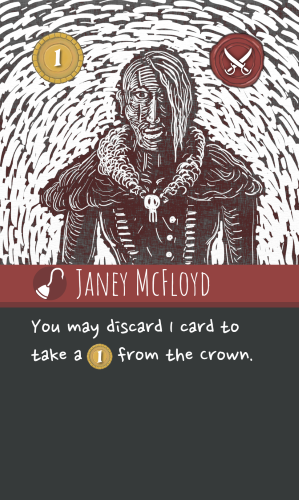</td>
<td width="150px">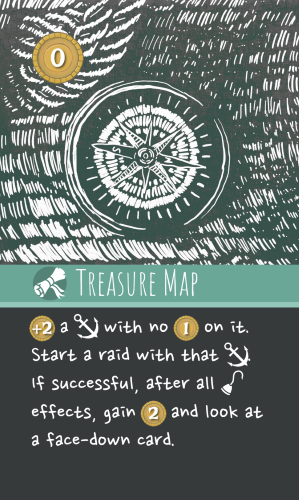</td>
</tr>
</table>

# END GAME
The game ends as soon as the crown scores 4 points of rum (via funding) or the pirate scores 4 rum cards (via raiding). Whoever hit 4 (or more) points first wins.

# CLARIFICATIONS

### Face-down cards
The crown player may look at their face-down cards at any point. They do not need to memorize what they have placed down (or what started the game face-down, in their starting hazards).

### Invalid face-down cards
The crown player operates in secret, playing most of their cards face-down. That does mean it is possible (particularly for a learning player) to unintentionally place the wrong card type in the wrong place (e.g. an investment 🍾 in front of an island where only Hazards should go, or an event 📜 on an island where only Investments should go). This is an invalid play state. In a friendly game, find an agreeable way to roll back the mistake as soon as it's uncovered. Learning new games is hard; be generous!

However, if a crown player intentionally does this, it's cheating. There is bluffing in this game, but not this kind of bluffing. 

# EXAMPLE OF A RAID
The pirate has decided to raid the player. The pirate has 3 ships in play:
- A _Longboat_ with one crew (_Peg-Leg Paul_)
- A _Sloop_ with two crew (_Cutthroat Carlie_ and _Doug Doubloon_)
- A _Brigantine_ with one crew (_Enric Cursemaker_) and one 🟡 on it

| The raiding party |
| --- |
| 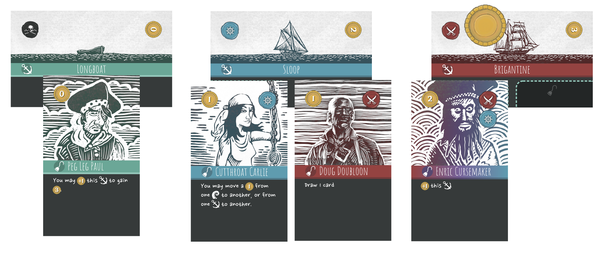 |

The pirate decides _Privateer Point_ is the target of their raid.

The pirate forms a raiding party of 2 ships, the _Longboat_ and the _Sloop_. They may not select the _Brigantine_ because it has a 🟡 on it. They pay 2 🟡 from their personal supply, placing 🟡 on the _Longboat_ and 🟡 on the _Sloop_.

Now the crown has decisions to make. They have 1 face-up hazard and 2 face-down hazards in front of _Privateer Point_:
- _Port Taxes_, face-up
- _Reef_, face-down
- _Privateers_, face-down

The investment face-down on _Privateer Point_ is _Light Rum_, and has 2 on it 🟡.

| ☠️ What the pirate sees | 👑 What the crown knows is there |
| --- | --- |
| 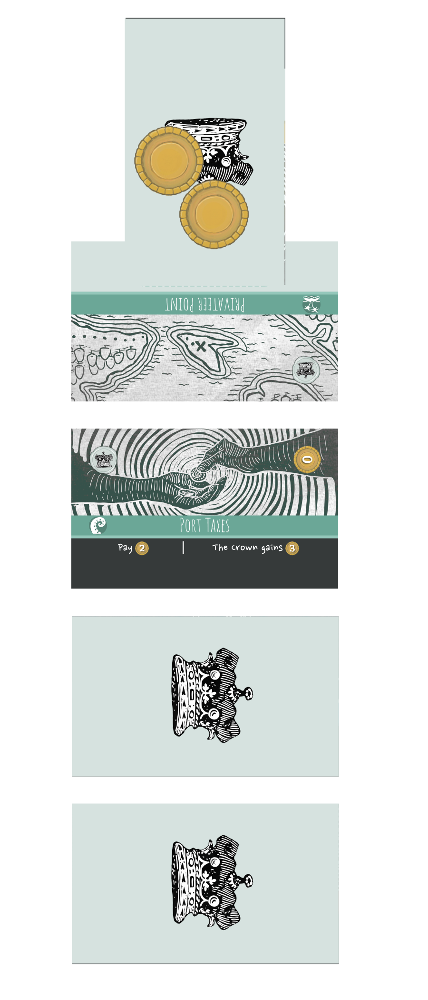 | 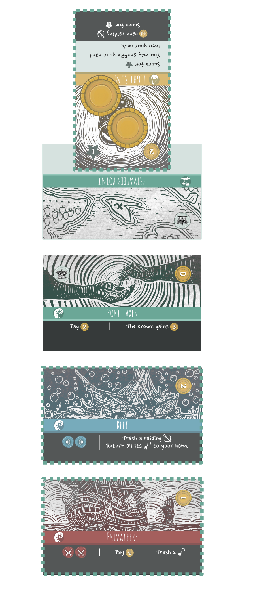 |

The crown reviews the raiding party of 2 ships, noting they can muster 2 navigation 🧭 (from the _Sloop_ and from _Cuthroat Carlie_) and 1 combat ⚔️ (from _Doug Doubloon_). They decide to raise the _Privateers_ hazard, spending its 1 🟡 cost to the bank and flipping the card face-up. They pay 2 additional 🟡 from their supply and place them on the now face-up hazard. The crown could also raise "Reef" at this point, but they decide not to (known that this raiding party could bypass it).

Now that the crown is done raising hazards, the raiding party faces them. They start with the outermost hazard from the island, <em>Privateers</em>. This hazard has 3 choices: 2 combat ⚔️⚔️, pay 4 🟡, or trash a crew 🪝. The raiding party only has 1 ⚔️, so they can't pay the first cost. They only have 3 🟡, so they can't pay the second cost. They have 3 raiding crew 🪝 that they could choose from for the third cost, so they must choose that option. They decide to pay the third cost by trashing <em>Peg-Leg Paul</em> to their discard pile. Now that the hazard is faced, they removes 1 🟡 from the card (leaving 1 🟡 still on the card).

As that there are no more crew on that _Longboat_, it is no longer considered part of the raiding party, leaving the _Sloop_ to continue on alone. The next hazard would be the _Reef_, but it's face-down so it's skipped.

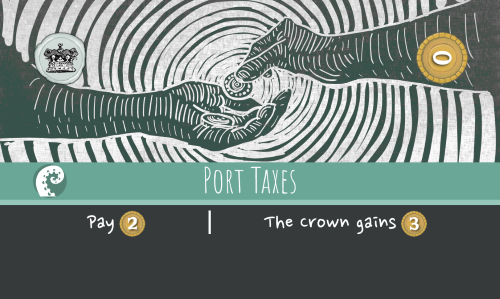
The raiding party now moves onto <em>Port Taxes</em>. As it's already face-up there is no opportunity for the crown to add addtional 🟡 to it. This hazard has 2 choices: Pay 2 🟡, or the crown gains 3 🟡. The pirate has enough 🟡 in their supply, so either is an option. They opt to pay 2 🟡 to the bank. Now that the hazard is faced, there are no 🟡 on the hazard card so it is trashed to the crown's discard pile.

There are no hazards left to face, so the pirates raid the face-down investment on the island. They flip it over, and it's <em>Light Rum</em>. The raid text says "+1 🟡 each rading ship. Score for 1 ⭐". The pirate adds 1 🟡 from the bank to the <em>Sloop</em>, and keeps the <em>Light Rum</em> card to track that they have 1 of the 4 bottles they need to win the game. The 2 🟡 that had been on the card are returned to the bank.

Finally, the pirate triggers their crew 🪝 effects. They choose to resolve _Doug Doubloon_'s effect first, drawing 1 card. Secondly, they resolve _Cutthroat Carlie_'s ability and move 1 🟡 from the _Brigantine_ to the _Longboat_.

| The aftermath |
| --- |
|  |

# TIPS

## Pirate ☠️
- You aren't going to know what you're up against until it's too late. Thus is the pirate's life. You will often have to go with your gut rather than wait for perfect information.
- Rum can't score for the crown unless there are 🟡 on it. And the higher point values require many 🟡. Knowing this will help you gauge whether you need to "all in" now, or whether you can afford to wait a turn.
- It can be useful to have multiple ships for different purposes. One big powerful ship can generally only raid once per turn, so keep around something cheap and disposable to probe for information.
- Put pressure on *Home Port* if there aren't any investments in play (or any that you can reach). You can raid and score rum off the top of the deck, or at the very least eliminate cards that the crown was hoping to use later. Forcing the crown to defend *Home Port* diverts their resources from what they want to be doing, which is funding investments.
- You can brute force your way through most hazards. Remember that after facing a hazard it is trashed when it has no 🟡, whether you were successful or not. A broad fleet of cheap ships and disposable crew can spend raids softening up the defenses to clear the way for your real raid. 
- Learn the 4 starting hazards that the crown starts with. If you can produce 🧭 and ⚔ then you can survive any of the starting hazards (although there may be side effects if you have few cards in hand and/or few 🟡).
- Your crew action also allows you to rearrange crew across your ships. Even if you have no/few crew to play, it can be worth it to align the right crew traits/effects before you raid.

## Crown 👑
- Remember that they are afraid of you as much as you are of them. They don't know what your face-down cards are, and generally they will assume the worst.
- You can place multiple investments as one action, and you can invest 🟡 in multiple cards as one action. Use this to present multiple threats and keep the pirate player guessing. If you put down a pair of 2 point rum cards and they successfully raid one but you fund the other, you're ahead as they scored 1 point and you scored 2 points.
- Don't be afraid to take your turn earning 🟡. Since you generally don't need to spend your 🟡 until asked to, having a large supply will keep you flexible.
- The most efficient time to leave 🟡 on a hazard is when you raise it (rather than spending invest actions later). Set aside extra 🟡 for raising hazards that the pirate likely can't overcome (or are costly for them to overcome). 
- Remember that you can return cards to your hand. This enables you to over multiple actions move a hazard from one island to the island where you actually want it. It also enables you to get back 🟡 that have pooled on a hazard that doesn't actually need it.

# OPTIONAL RULES

## Mulligan
After reviewing their starting hand of 5 cards, each player my opt to draw a new starting hand by shuffling those cards back into the deck and drawing 5 cards. To do so they must pay 🟡 (reducing their starting total). They may repeat this as many times as they like as long as they still have 🟡 to pay.

## Action Cards
The provided 3 action cards can be useful for tracking how many actions each player has taken in a turn. They are not a required component for play.