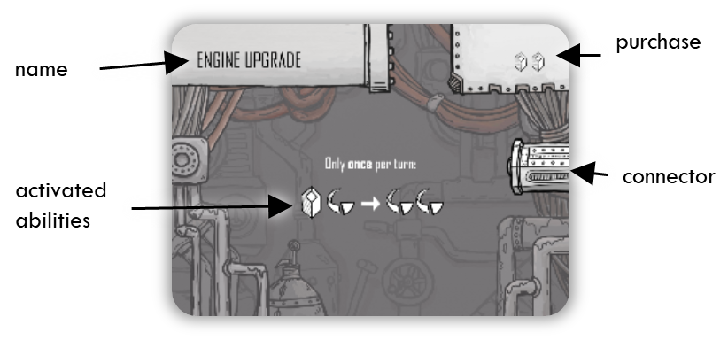
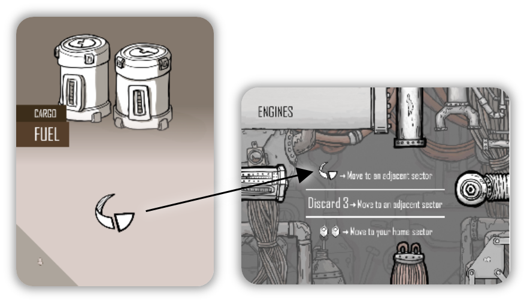
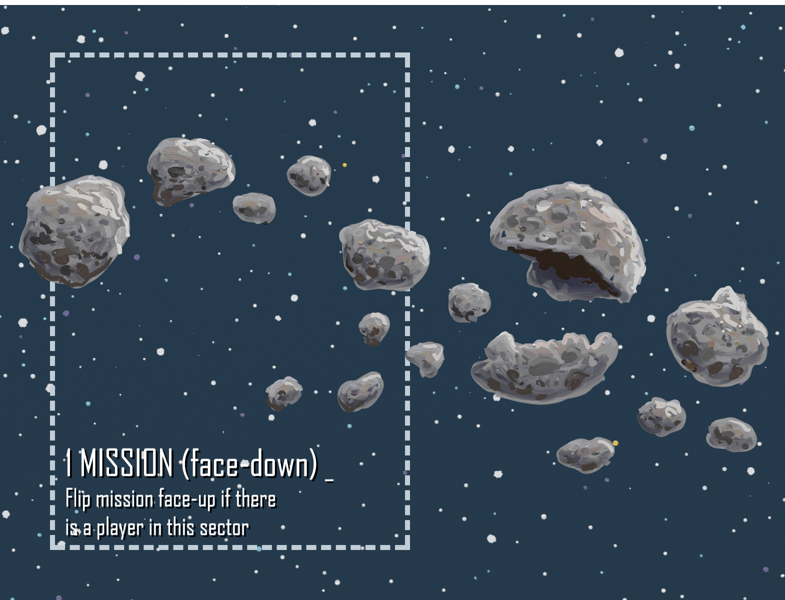
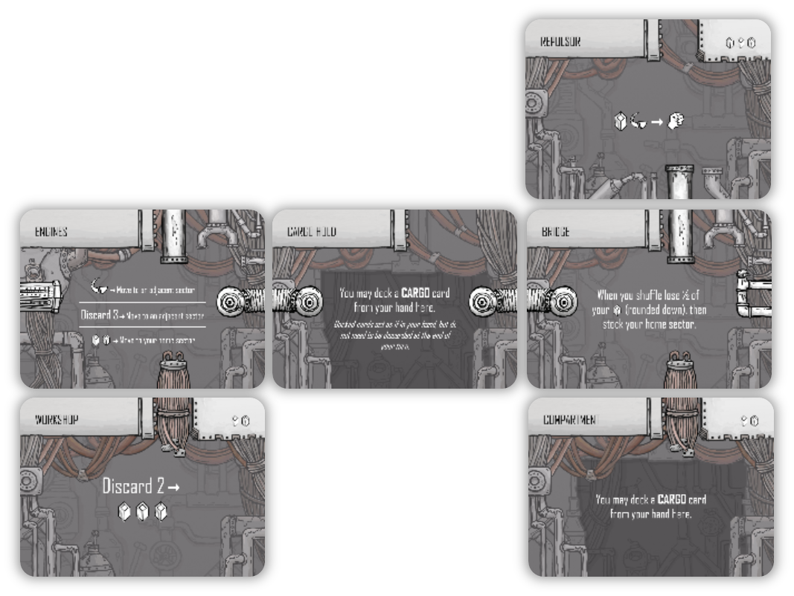

# SUMMARY
You are a spaceship captain with ambition to explore the galaxy for fame, glory, and profit. You start with a junker of a ship, a meager crew, and some cargo filling up your hold. With an eye for opportunity you will win the game by exploring space and outperforming other players in various missions spread throughout the cosmos.
Mechanically the game has three major components:
- Your **deck** is a bustle of **crew** members and **cargo** moving about, providing immediate but variable effects. Predicting and scheduling your hand is essential to having a smoothly running ship. 
- Your **ship** itself can be customized with **parts** that grant abilities that are always available to you. But how to balance your systems is its own little puzzle.
- You will move around space, but initially everything outside your home planet is unknown. As you explore **sectors** of space you will new crew, cargo, and parts to customize your deck and your ship. But more importantly you’ll encounter challenging **missions** that can award you the **victory points** needed to win the game.
 
# COMPONENTS
### RESOURCE CARDS

Most of the cards in this game share the same back, but they fall into two categories: ship parts (shown left), or crew and cargo cards (show right).

### RARE GOODS CARD

This card is used to help differentiate two separate decks of cards in the game: rare and common goods. Both types share the same card back (since they can both go into your personal deck).

You can differentiate rare resource cards by the icon shown in the lower left corner:

### SECTOR TILES

Sectors are placed in a grid to form the game board. They start face-down (unexplored) but later can be turned face-up (explored).

### EXPLORATION CARDS
These have an unexplored side (shown left) and an explored side (shown right).

### MISSION CARDS
The primary path to victory in the game, these cards are worth victory points and will challenge your ship and crew in various different ways.

### OTHER COMPONENTS:
- 4 player ship pawns in 4 different colors
- 48 mission markers (🟢) in 4 different colors
- 40 credit cubes (🟨)
- 4 rules reminder cards
 
# SETUP

1. Each player selects a color and takes their starting components:
  - A rules reminder card
  - A pawn of their color that represents their position in space
  - 12 mission markers (🟢) of their color
  - A home planet sector tile of their color (these are double sided to be easier to find)
  - A set of starter ship parts: "Engines", “Cargo Hold", and “Bridge” (these are also double sided).

  - A deck of 9 starter resource cards:

Each player’s starter deck can be found by gathering up all cards with the same player icon in the corner (🙍‍♂️, 👨‍👧, 👨‍👨‍👦, 👨‍👩‍👧‍👦). They have differences that are only cosmetic.

Note that the starter cards have the same back as other cards but have an icon in the lower left corner and do not have a cost. Do not shuffle them into the common goods deck.

2. Return any remaining unused starter cards, player pawns, mission markers, rules reminder cards, and home sectors to the game box.

3. Separate all of the resource cards into two decks based on the indicator in the lower left corner. Those marked with the rare icon will go together to form the “rare goods” deck; the rest will be the “common goods” deck.

> For your first game if you have experience with deck building games or collectible card games you’ll jump into all this no problem. But if you don’t, or if any of this sounds intimidating, for a simpler experience we recommend you return the rare goods cards back to the game box. Whenever a card refers to the “rare goods” deck use the common goods deck instead.

4. Shuffle cards to create these face-down decks:
  - The common goods deck
  - The rare goods deck (place the “RARE GOODS” two-sided card on top of this deck to differentiate it from the common goods deck)
  - The mission deck
  - The exploration deck
  - Each player's starting deck

5. Create the galaxy
  - **2 player game**: Separate the remaining (non-home) sector tiles into two face-down piles: ones labeled “mission” and ones labeled anything else. Deal 3 from the “mission” pile and deal 4 from the other pile. Shuffle these together to form a sector draw pile.
  - **3 player game**: Separate the remaining (non-home) sector tiles into two face-down piles: ones labeled “mission” and ones labeled anything else. Deal 4 from the “mission” pile and deal 6 from the other pile. Shuffle these together to form a sector draw pile.
  - **4 player game**: Shuffle all remaining (non-home) sector tiles together to form a sector draw pile.
  - Place each player's home sector and a deal out a number of other random sectors face-down from the sector draw pile according to the number of players (see below). Return any remaining sector tiles to the game box. 

<table>
<tr><th>2 PLAYERS</th><th>3 PLAYERS</th></tr>

<tr>

<td>
<table>
<tr><td>____</td><td>____</td><td>____</td></tr>
<tr><td>Home</td><td>____</td><td>Home</td></tr>
<tr><td>____</td><td>____</td><td>____</td></tr>
</table>
</td>

<td>
<table>
<tr><td>____</td><td>Home</td><td>____</td></tr>
<tr><td>____</td><td>____</td><td>____</td></tr>
<tr><td>Home</td><td>____</td><td>Home</td></tr>
<tr><td>____</td><td>____</td><td>____</td></tr>
</table>
</td>

</tr>
</table>

<table>
<tr><th>4 PLAYERS</th></tr>
<tr>

<td>
<table>
<tr><td>____</td><td>Home</td><td>____</td><td>____</td></tr>
<tr><td>____</td><td>____</td><td>____</td><td>Home</td></tr>
<tr><td>Home</td><td>____</td><td>____</td><td>____</td></tr>
<tr><td>____</td><td>____</td><td>Home</td><td>____</td></tr>
</table>
</td>

</tr>
</table>

  - Place an exploration card on each non-home sector with the reward side face-down (without looking at the reward side). Return any remaining exploration cards to the game box. 
  - Stock each home planet sector with face-down cards (6 cards from the common goods deck). 

6. Each player:
  - Receives 6 credit cubes (🟨) to form their personal stash
  - Places their pawn on their home sector
  - Draws 3 cards

7. Put the remaining credit cubes (🟨) somewhere within reach of all players to create a credit bank.

8. Randomly determine a starting player.

> Optional: The rules reminder cards can be shuffled to determine the 1st, 2nd, 3rd, and 4th players.

# THE ROUND
The game is played as a sequence of individual player turns, taken in clockwise order, which in total comprise one round. If any player has 8 victory points (🏆) when a round has completed the game is over. The player with the most victory points wins. If there is a tie the player with the most expensive ship wins.

> If all of the players are experienced with the game we recommend a 10 victory points target to allow players to explore deeper strategies.

# YOUR TURN 
## SUMMARY
On your turn you may in any order, and as many times as you like, do the following:
- **Play** cards from your hand
- **Purchase** cards in your current sector using 🟨
- **Activate** abilities (Cost➡️Effect) of your ship parts or missions in your current sector
- **Dock** cards from your hand on your ship
- **Peek** at cards in your home sector

When you're done:
1. **Discard** any cards you didn’t play
2. **Stock** unoccupied non-home sectors
3. **Draw** 3 cards
4. Trigger any **end of turn** effects

The details of these various actions and steps follow.

### PLAY CARDS

Cards in your hand can be played to generate effects. You must fully resolve the effects of a card top to bottom before you play any other cards, activate abilities, or do anything else. Once resolved a played card is immediately placed face-up in your discard pile.

Some cards generate **credits** (🟨), and will tell you this by showing the 🟨 icon. You resolve that effect by immediately taking a credit cube from the credit bank for each 🟨 symbol and adding it to your personal stash.

Some cards generate **resources** (✊, 🌀). These are used to activate ship part abilities and contribute to missions. These resources are available for the duration of your turn until spent.

Other than the big icons that generate credits or resources, do whatever the text of the card instructs you to do, top to bottom.

If a card has two options separated by the text “OR”, you must choose one option when playing the card and ignore the other text entirely.

Note that purchase cost displayed in the top right of a card is not part of the card text, and is not relevant after a card is acquired.

### ACTIVATE ABILITIES
Some cards in play will have an **activated ability** phrased in the form:

COST➡️EFFECT

The text preceding the “➡️” represents a **cost** that must be paid before resolving the **effect**. The costs and effects can vary wildly, but here are some examples:

🌀➡️✊ 
Discard 2➡️🟨🟨🟨 
🟨🟨🟨➡️Move to any sector

On your turn you may activate abilities on any of your ship parts by paying their cost. You may not activate the ability of a ship part in your current sector if you have not installed that card into your ship. You may activate abilities on missions or exploration cards in your current sector, but not cards in other sectors.

Unless otherwise specified, you may activate an ability as many times as you want (provided you can pay the cost each time).

If the cost of an ability is 🟨, you pay a credit from your personal stash. You don’t need a card in hand with a 🟨 symbol on it.

If the cost of an ability is “Discard” and a number (e.g. “Discard 2”), you choose that number of cards from your hand and add them to your discard pile. When you discard a card as part of the cost of an ability that card’s effects are not resolved (it is not the same as "playing" that card).

### MOVING YOUR SHIP

Your ship exists on one sector at a time (that sector is referred to as “your current sector”). There’s no innate ability to move your ship to other sectors; that comes through the activated abilities on your ship parts combined with cards you play from your hand. Most commonly you will move your ship by combining the “Engines” ship part you start with and the “Fuel” card that produces the 🌀 resource. These together allow you to move to an adjacent sector.

Two sectors are considered **adjacent** if they share an edge or a corner, so you are allowed to move diagonally when moving to an adjacent sector.

### PURCHASE CARDS
Ship parts or resource cards may be purchased if they are in your current sector. If there are face-down cards in your current sector, you may look at them without revealing them to other players. You may look at them even if it is not your turn.

The purchase cost of a card is listed in the top-right corner. You pay that many credit cubes (🟨) from your personal stash back to the bank. Once a card's purchase price has been paid you **acquire** it.
- When you acquire a resource card you add it your discard pile.
- When you acquire a ship part you install it in your ship. The rules for ship construction are covered below.

Your **home sector** is special in that you may look at face-down cards on your home sector even if you are not currently in that sector. However you still must be in the same sector to purchase cards.

### EXPLORING A SECTOR

Early in the game there will be exploration cards on most sectors. These all have an activated ability and will give out rewards to the player that activates them first. That reward is unknown until the card is activated.

As the exploration card says, flip it over when its ability is activated. About half of the time this will be a victory point (🏆), and the player will take the card in a set aside score area to keep track of this. Otherwise they gain the described reward and return the exploration card to the game box. All exploration cards will flip over the sector underneath.

When a sector is revealed, immediately **stock** it.

### STOCKING A SECTOR

Sector tiles will specify cards that will go on them (Mission or Rare Good). When stocking draw a card from the corresponding deck.

The sector will specify if the cards are dealt face-up or face-down. Do not look at face-down cards before placing them on the sector.

As stated on the sector tile, mission cards are stocked face-down but are revealed (flipped face-up) whenever a player enters that sector. This means when the sector is first explored the mission will immediately become face-up.

### MISSIONS

You may activate the abilities of mission cards in your current sector (as with ship  parts, described above). Generally the effect of a mission's ability will be to add a  mission marker (🟢) of your color to the mission card to track progress.

The mission card will be completed when there are 🟢 equal or greater to its printed **threshold**. The player who has contributed the most 🟢 wins the mission. If there is a tie the mission will not score and remain active until there is no longer a tie. A player who has any 🟢 on a mission but does not win that mission is considered a **runner up**.

When completed, most missions will generate rewards for any runner up players. Evaluate the resolution text of the mission when it is completed.

A completed mission is worth the victory points (🏆) listed on the card. After resolving the resolution text add the mission card to the winning player’s score area to track their total 🏆.

Many missions have multiple activated abilities and state that you can only activate one of them per turn. If you activate ability “A” on a turn you cannot later activate “B” on the same turn.

Some missions have a banner at the top that indicates there is an effect that may apply to players even if they are not in the mission’s sector. For example a mission may trigger some effect when any player shuffles, regardless of their current location.

### DOCKING

Some ship parts are able to **dock** other cards on them. On your turn you may move a card from your hand to a ship part that states it can dock it.

If there is already a card docked on a ship part you may not dock a second.

A docked card is considered to be in your hand and may be played as if it was in your hand. It may even be discarded to pay for activated abilities, just like any other card in your hand. But unlike cards in your hand, un-played docked cards don't need to be discarded at the end of your turn.

Note that docking a card does not trigger any of the effects of that card (it is not the same as "playing" that card). 

## THE END OF YOUR TURN
When you are done with your turn the following happens in this order:
1. **Discard** any remaining cards still in your hand into your discard pile. Note that docked cards do not need to be discarded. 
2. **Stock** each non-home sector that has no players in it. 
3. **Draw** 3 cards

If at any point you need to draw a card but your draw pile is empty first shuffle your discard pile and place it face-down as your new draw pile.

4. Trigger any “when your turn ends” effects.

# SHIP CONSTRUCTION
Ship parts are placed face-up in front of the player and represent the various systems and upgrades on that player's ship. These cards have connectors on some or all of their edges, showing how they can fit together. Like connectors can only attach to like connectors.

When you acquire a ship part you must find a place to **install** it. You may rearrange your existing ship parts. You may also voluntarily remove any of your installed ship parts from the game to make room for a new ship part.

The ship parts that you start with (“Engines”, “Cargo Hold”, and “Bridge”) may never be removed from the game.

# ADVANCED RULES
After a game or two with the rules above you may want to play with these additional rules:

## DRAFT
To put players more in control of their own initial ship and crew you can draft the cards on your home sector.

Set up the game as usual, except do not deal any cards to each player’s home sector. Instead deal those cards directly to the player. Each player looks at these 6 cards, selects one of them to place face-down on their home sector, then passes the remaining 5 cards to the player to their left. The same process continues with those 5 cards passed from the player to the right: select 1 card and pass the other 4 to the left. Continue until there are no more cards to pass. 

#### RARE DRAFT
For a bit more variance perform the draft as above, but deal out 1 card from the rare goods deck and 5 from the common goods deck.

# FAQ
#### Can I move diagonally? 
Yes. Sectors are considered adjacent if they share and edge or a corner.

#### Can I move into someone else's home sector?
Yes! You may move to and purchase cards from another player’s home sector just like any other.

#### Can I move a docked card from one ship part to another?
Docked cards are considered to be part of your hand, so you may move a resource card docked on one ship part to dock under a new card, assuming you meet all restrictions on the new target ship part.

#### What does “X” mean?
If a card refers to "X" with a cost then the value of X can be whatever number you choose. So if it says X✊ you can pay ✊, ✊✊✊, or even zero. Any "X" in the effect will have the same value you chose when paying the cost.

Some activated values will tell you what "X" evaluates to, in which case you use that value, not one of your choice.

#### Can I overpay on a mission's activated ability with an X cost?
Yes. This may cause you to add more 🟢 to the mission than is necessary to complete the mission.

#### This mission has an activated ability with a weird cost…
Sometimes activated abilities will allow you do something you couldn't normally do as part of the cost. You do what the cost indicates, then execute the effect.

#### Are the cards in my discard pile face-up or face-down?
Face-up, and the order doesn't matter. Any other player may look at your discard pile if they want to.

#### Can I choose to resolve only part of the text on a resource card when I play it?
You must resolve all effects on the card top to bottom. The only exceptions are when the effect is phrased as a choice (“you may”) or part of a modal choice (the card will state “or” between two options).

Some cards may have a condition in the text (e.g. “Pay 🟨🟨 to remove a 🟢 from a mission in your current sector”). You must meet the condition before the “to” in order for the rest to resolve. 

#### What does “removed from the game” mean?
When a card is removed from the game you may put it back in the game box. It no longer has any gameplay effect and can never come back.

#### Moving sectors
Some card effects may cause you to move entire sectors. When you do all cards, 🟢, and player ships on that sector move with the sector to its new location.

# CREDITS

### GAME DESIGN
Chris Glein

### GRAPHIC DESIGN
Chris Glein

### ART
Chris Glein

### PLAYTESTERS
MaLora Ann, Kevin Barnes, Drew Bogdan, Jeff Bogdan, Iris Bristol, Logan Buesching, Jack Caron, Joseph Z Chen, Alex Deakin, Curly Dimmick, Nathan DiPietro, Lauren Duran, Chuck Erikson, Dana Fujimoto, Elizabeth Glein, Jessica Glein, Linda Glein, Peter Glein, Tobi Grünthal, Malia Guerrero, Brian Halbert, Lane Haury, Ben Hendrickson, Edward Highfield, Phil Hoffman, Jan Karachale, Ian Kettlewell, Neil Kronlage, Emma Larkins, Jamie Littlejohn, Sarra Loew, David Lowe, Ethan Lowe, Brandon Miller, Rob Nash, Molly Nixon, Marc Paine, Tammy Paine, Brianna Potvin, Justin Pranger, Mike Roberts, Phillip Schmitte, Shawn Stankewich,  Cynthia Totten, Tom Totten, Ethan Trooskin-Zoller, Jenna Udren, Jason Vincent

